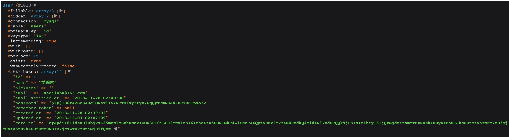
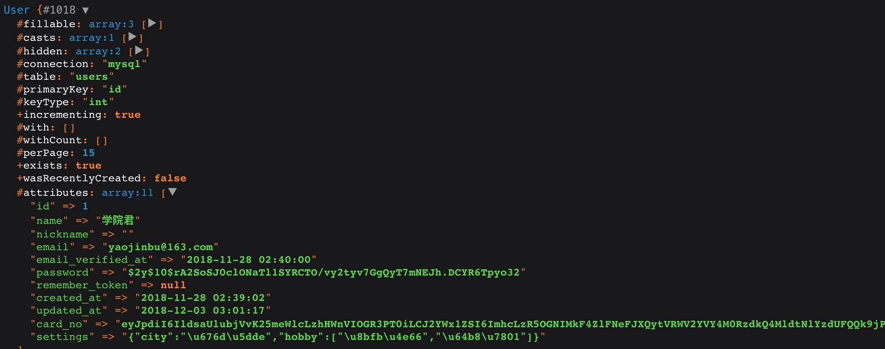
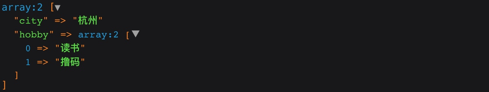

# 在 Eloquent 模型类上设置访问器和修改器

### 问题引出

前面两篇教程我们陆续为大家介绍了模型类的基本增删改查操作，以及如何通过模型类进行批量赋值和软删除，今天我们继续为大家介绍模型类的高级特性 —— 访问器和修改器。

在讲访问器和修改器之前，我们先来看一个例子，在带有用户功能的系统中，除了用户注册时使用的用户名之外，我们有时候还允许用户设置昵称，这个昵称是可选的，我们在页面上显示用户名时，会优先展示用户昵称，如果该用户没有设置昵称，则使用注册时的用户名。

对于这样的需求，我们可以在每次获取用户信息后通过这段代码进行设置：

```php
if ($user->nickname) {
    $user->display_name = $user->nickname;  // 显示用户名为用户昵称
} else {
    $user->display_name = $user->name;  // 显示用户名为注册时的用户名
}
```

你要知道，我们的系统中有大量显示用户名的地方，如果每次都这么设置，是件很让人崩溃的事情，而且可维护性很差，万一要修改用户名显示逻辑，每个地方都要修改。更有甚者，还有些新手甚至会将这段逻辑写到视图里面：

```php
@if ($user->nickname)
    {{ $user->nickname }}    
@else
    {{ $user->name }}
@endif
```

写在后台的代码还可以通过将相应的逻辑收敛到服务类代码中进行优化，写到视图中就完全无解了。所以，今天我们要介绍的访问器可以一劳永逸的解决这个问题。

### 访问器

访问器用于从数据库获取对应字段值后进行一定处理满足指定需求再返回给调用方。

要定义访问器很简单，在相应模型类中设置对应方法即可。以上面的 `$user->display_name` 为例，我们可以在 `User` 模型类中添加相应的方法 `getDisplayNameAttribute`（注意这里的转化方式，将小写字母+短划线格式属性转化为驼峰格式方法，后面的修改器也是这样）：

```php
public function getDisplayNameAttribute()
{
    return $this->nickname ? $this->nickname : $this->name;
}
```

这样，我们就可以在代码中直接通过 `$user->display_name` 访问期望的用户名了，以后如果你想要修改用户名显示逻辑，直接改这个方法里的代码就好了，非常方便。

```php
注：访问器方法名中包含的字段尽量不要和数据库字段名同名，否则会覆盖数据库字段，导致通过模型属性将永远无法访问该数据库字段；另外，如果访问器内部访问了某个数据库字段，则不能将访问器和该数据库字段同名，否则会导致循环引用而报错。比如此例中，就不能将访问器方法名设置为 getNameAttribute 或 getNickNameAttribute。
```

### 修改器

有了访问器，相对的，就有修改器，修改器用于在字段值保存到数据库之前进行一定处理满足需求后再存到数据库。比如做金融的同学可能比较熟悉，在保存用户银行卡号的时候需要加密后才能保存，显示时需要对银行卡号进行脱敏处理。

我们先定义一个加密银行卡号的修改器（在此之前可以通过[数据库迁移](https://laravelacademy.org/post/9693.html)为 `users` 表新增一个 `card_no` 字段）：

```php
public function setCardNoAttribute($value)
{
    $value = str_replace(' ', '', $value);  // 将所有空格去掉
    $this->attributes['card_no'] = encrypt($value);
}
```

注意修改器传入形参 `$value` 不能漏掉，否则无法正常设置属性值。下面，我们通过模型类保存一个银行卡号到数据库：

```php
$user = User::find(1);
$user->card_no = '6222020903001483077';
$user->save();
```

这样，就会将银行卡加密后保存到数据库了：



但是这样的数据回显给用户肯定是不行的，所以我们还要定义一个访问器将加密数据解密，但是银行卡号一般都是脱敏后显示给用户（脱敏是为了安全考虑，避免银行卡号被爬取或劫持），比如支付宝「我的银行卡」页面看到的银行卡号都是脱敏后显示给用户的：

这里我们以支付宝为参照，将银行卡后四位显示，其它数字隐藏，并将不同银行卡号位数统一为 16 位。所以我们为银行卡号字段编写访问器如下：

```php
public function getCardNumAttribute()
{
    if (!$this->card_no) {
        return '';
    }
    $cardNo = decrypt($this->card_no);
    $lastFour = mb_substr($cardNo, -4);
    return '**** **** **** ' . $lastFour;
}
```

> 注：由于我们在访问器内部访问了 `card_no` 属性，所以需要将访问器方法名调整为 `getCardNumAttribute`。

这样，当我们查询并获取到对应模型实例后，访问 `$user->card_num` 属性，返回的就是脱敏后的银行卡号了：

```php
**** **** **** 3077
```

类似这种场景，使用访问器和修改器非常方便，推荐使用。

### 数组 & JSON 转化

你有一定有过这种经历，数据以 JSON 格式在数据库中存取时，每次存储时都要通过 `json_encode` 对数据进行编码，读取时都要通过 `json_decode` 对数据进行解码。我们当然可以通过上述访问器和修改器完成这种操作，但是 Laravel 提供了更加快捷的方法，对于一个在数据库中类型为 `JSON` 或 `TEXT` 的字段，我们可以在模型类中将字段对应属性类型转化设置为数组，这样在保存字段到数据库时，会自动将数组数据转化为 JSON 格式，在从数据库读取该字段时，会自动将 JSON 数据转化为数组格式，方便操作。

还是以 `users` 表为例，我们为其新增一个类型为 `JSON` 格式的字段 `settings`，用于保存用户设置信息（MySQL 5.7 以下版本设置字段类型为 `TEXT` 格式）。然后在 `users` 表中设置 `settings` 类型转化格式为 `array`：

```php
protected $casts = [
    'settings' => 'array'
];
```

接下来，我们来测试下保存操作：

```php
$user = User::find(1);
$user->settings = ['city' => '杭州', 'hobby' => ['读书','撸码']];
$user->save();
```



可以看到 `settings` 字段确实是以 JSON 格式保存到数据库了，然后我们来看下数据读取，获取到模型实例后，打印 `$user->settings` 数据，可以看到已经是数组格式：



这个功能还是很赞的。

### 其它操作

Eloquent 模型类还为我们提供了诸如日期修改器、其它属性转化等功能，但是没有高频应用场景，我一般就是用默认日期设置，至于除数组/JSON之外的其它属性转化可以通过良好的数据库设计和业务逻辑来实现，没有什么配置的需要。不过确实有这方面需求的同学可以自行查看[官方文档](https://laravelacademy.org/post/9586.html#toc-4)了解明细，这里就不一一展开了。


