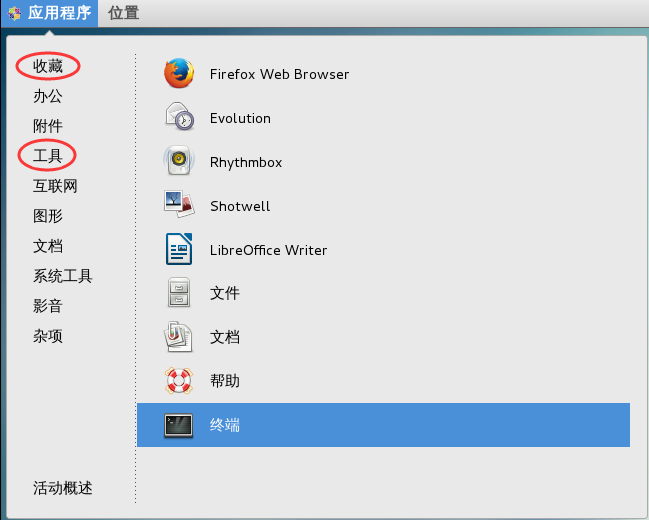

# 几种常见的Shell

Linux 是一个开源的操作系统，由分布在世界各地的多个组织机构或个人共同开发完成，每个组织结构或个人负责一部分功能，最后组合在一起，就构成了今天的 Linux。例如：

- Linux 内核最初由芬兰黑客 Linus Torvalds 开发，后来他组建了团队，Linux 内核由这个团队维护。
- GNU 组织开发了很多核心软件和基础库，例如 GCC 编译器、C语言标准库、文本编辑器 Emacs、进程管理软件、Shell 以及 GNOME 桌面环境等。
- VIM 编辑器由荷兰人 Bram Moolenaar 开发。


Windows、Mac OS、Android 等操作系统不一样，它们都由一家公司开发，所有的核心软件和基础库都由一家公司做决定，容易形成统一的标准，一般不会开发多款功能类似的软件。

而 Linux 不一样，它是“万国牌”，由多个组织机构开发，不同的组织机构为了发展自己的 Linux 分支可能会开发出功能类似的软件，它们各有优缺点，用户可以自由选择。Shell 就是这样的一款软件，不同的组织机构开发了不同的 Shell，它们各有所长，有的占用资源少，有的支持高级编程功能，有的兼容性好，有的重视用户体验。

> **Shell 既是一种脚本编程语言，也是一个连接内核和用户的软件。**

常见的 Shell 有 sh、bash、csh、tcsh、ash 等。

## sh

sh 的全称是 Bourne shell，由 AT&T 公司的 Steve Bourne开发，为了纪念他，就用他的名字命名了。

sh 是 UNIX 上的标准 shell，很多 UNIX 版本都配有 sh。sh 是第一个流行的 Shell。

## csh

sh 之后另一个广为流传的 shell 是由柏克莱大学的 Bill Joy 设计的，这个 shell 的语法有点类似C语言，所以才得名为 C shell ，简称为 csh。

Bill Joy 是一个风云人物，他创立了 BSD 操作系统，开发了 vi 编辑器，还是 Sun 公司的创始人之一。

> BSD 是 UNIX 的一个重要分支，后人在此基础上发展出了很多现代的操作系统，最著名的有 FreeBSD、OpenBSD 和 NetBSD，就连 Mac OS X 在很大程度上也基于BSD。

## tcsh

tcsh 是 csh 的增强版，加入了命令补全功能，提供了更加强大的语法支持。

## ash

一个简单的轻量级的 Shell，占用资源少，适合运行于低内存环境，但是与下面讲到的 bash shell 完全兼容。

## bash

bash shell 是 Linux 的默认 shell，本教程也基于 bash 编写。

bash 由 GNU 组织开发，保持了对 sh shell 的兼容性，是各种 Linux 发行版默认配置的 shell。

> bash 兼容 sh 意味着，针对 sh 编写的 Shell 代码可以不加修改地在 bash 中运行。

尽管如此，bash 和 sh 还是有一些不同之处：

- 一方面，bash 扩展了一些命令和参数；

- 另一方面，bash 并不完全和 sh 兼容，它们有些行为并不一致，但在大多数企业运维的情况下区别不大，特殊场景可以使用 bash 代替 sh。

   

## 查看 Shell

Shell 是一个程序，一般都是放在`/bin`或者`/user/bin`目录下，当前 Linux 系统可用的 Shell 都记录在`/etc/shells`文件中。`/etc/shells`是一个纯文本文件，你可以在图形界面下打开它，也可以使用 cat 命令查看它。

通过 cat 命令来查看当前 Linux 系统的可用 Shell：

```shell
$ cat /etc/shells
/bin/sh
/bin/bash
/sbin/nologin
/usr/bin/sh
/usr/bin/bash
/usr/sbin/nologin
/bin/tcsh
/bin/csh
```

在现代的 Linux 上，sh 已经被 bash 代替，`/bin/sh`往往是指向`/bin/bash`的符号链接。

如果你希望查看当前 Linux 的默认 Shell，那么可以输出 SHELL 环境变量：

$ echo $SHELL
/bin/bash

输出结果表明默认的 Shell 是 bash。

`echo`是一个 Shell 命令，用来输出变量的值，我们将在《[Shell echo命令](http://c.biancheng.net/cpp/view/7003.html)》中详细介绍它的用法。`SHELL`是 Linux 系统中的环境变量，它指明了当前使用的 Shell 程序的位置，也就是使用的哪个 Shell。


# 如何进入Shell

在 Linux 发展的早期，唯一能用的工具就是 Shell，Linux 用户都是在 Shell 中输入文本命令，并查看文本输出；如果有必要的话，Shell 也能显示一些基本的图形。

而如今 Linux 的环境已经完全不同，几乎所有的 Linux 发行版都使用某种图形桌面环境（例如 GNOME、KDE、Unity 等），这使得原生的 Shell 入口被隐藏了，进入 Shell 仿佛变得困难起来。

## 进入 Linux 控制台

一种进入 Shell 的方法是让 Linux 系统退出图形界面模式，进入控制台模式，这样一来，显示器上只有一个简单的带着白色文字的“黑屏”，就像图形界面出现之前的样子。这种模式称为 Linux 控制台（Console）。

现代 Linux 系统在启动时会自动创建几个虚拟控制台（Virtual Console），其中一个供图形桌面程序使用，其他的保留原生控制台的样子。虚拟控制台其实就是 Linux 系统内存中运行的虚拟终端（Virtual Terminal）。

从图形界面模式进入控制台模式也很简单，往往按下`Ctrl + Alt + Fn(n=1,2,3,4,5...)`快捷键就能够来回切换。

例如，CentOS 在启动时会创建 6 个虚拟控制台，按下快捷键`Ctrl + Alt + Fn(n=2,3,4,5,6)`可以从图形界面模式切换到控制台模式，按下`Ctrl + Alt + F1`可以从控制台模式再切换回图形界面模式。可以发现，1号控制台被图形桌面程序占用了。

下图就是进入了控制台模式：


输入用户名和密码，登录成功后就可以进入 Shell 了。`$`是命令提示符，我们可以在它后面输入 Shell 命令。

> 在图形界面模式下，输入密码时往往会显示为\*，密码有几个字符就显示几个*；而在控制台模式下，输入密码什么都不会显示，好像按键无效一样，这一点请大家不要惊慌，只要输入的密码正确就能够登录。

图形界面也是一个程序，会占用CPU时间和内存空间，当 Linux 作为服务器系统时，安装调试完毕后，应该让 Linux 运行在控制台模式下，以节省服务器资源。正是由于这个原因，很多服务器甚至不安装图形界面程序，管理员只能使用命令来完成各项操作。

## 使用终端

进入 Shell 的另外一种方法是使用 Linux 桌面环境中的终端模拟包（Terminal emulation package），也就是我们常说的终端（Terminal），这样在图形桌面中就可以使用 Shell。

以 CentOS 为例，可以在“应用程序”菜单中找到终端，如下图所示：


图：在“收藏”和“工具”分类中都可以找到终端


打开终端后，就可以输入 Shell 命令了：


CentOS 默认的图形界面程序是 GNOME，该终端模拟包也是 GNOME 自带的。

除了 GNOME 终端，Linux 还有其他的终端模拟包，例如：

- #### xterm 终端

   最古老最基础的 X Windows 桌面程序自带的终端模拟包就是 xterm。xterm 在 X Windows 出现之前便已经存在了，默认包含在大多数 X Windows 中。xterm 虽然没有太多炫目的特性，但是运行它不需要太多的资源，所以 xterm 在针对老硬件设计的 Linux 发行版中仍然很常见，比如 fluxbox 图形桌面环境就用它作为默认的终端模拟包。

- #### Konsole 终端

   KDE 桌面项目也开发了自己的终端模拟包，名为 Konsole。Konsole 整合了基本的 xterm 特性以及一些更高级的类似 Windows 应用程序的特性。


# Shell提示符

启动终端模拟包或者从 Linux 控制台登录后，便可以看到 Shell 提示符。提示符是通往 Shell 的大门，是输入 Shell 命令的地方。

对于普通用户，Base shell 默认的提示符是美元符号`$`；对于超级用户（root 用户），Bash Shell 默认的提示符是井号`#`。该符号表示 Shell 等待输入命令。

不同的 Linux 发行版使用的提示符格式不同。例如在 CentOS 中，默认的提示符格式为：

[mozhiyan@localhost ~]$

这种格式包含了以下三个方面的信息：

- 启动 Shell 的用户名，也即 mozhiyan；
- 本地主机名称，也即 localhost；
- 当前目录，波浪号`~`是主目录的简写表示法。


Shell 通过`PS1`和`PS2`两个环境变量来控制提示符格式：

- PS1 控制最外层命令行的提示符格式。
- PS2 控制第二层命令行的提示符格式。


在 Shell 中初次输入命令，使用的是 PS1 指定的提示符格式；如果输入一个命令后还需要输入附加信息，Shell 就使用 PS2 指定的提示符格式。请看下面的例子：

```shell
[mozhiyan@localhost ~]$ echo "C语言中文网"C语言中文网
[mozhiyan@localhost ~]$ echo "http://c.biancheng.net"http://c.biancheng.net
[mozhiyan@localhost ~]$ echo "
> yan
> chang
> sheng
> "

yan
chang
sheng

[mozhiyan@localhost ~]$ 
```

echo 是一个输出命令，可以用来输出数字、变量、字符串等；本例中，我们使用 echo 来输出字符串。

字符串是一组由`" "`包围起来的字符序列，echo 将第一个`"`作为字符串的开端，将第二个`"`作为字符串的结尾。此处的字符串就可以看做 echo 命令的附加信息。

本例中，前两次使用 echo 命令时都是在后面紧跟字符串，一行之内输入了完整的附加信息。第三次使用 echo 时，将字符串分成多行，echo 遇到第一个`"`认为是不完整的附加信息，所以会继续等待用户输入，直到遇见第二个`"`。输入的附加信息就是第二层命令，所以使用`>`作为提示符。

要显示提示符的当前格式，可以使用 echo 输出 PS1 和 PS2：

```shell
[mozhiyan@localhost ~]$ echo $PS1
[\u@\h \W]\$
[mozhiyan@localhost ~]$ echo $PS2
>
[mozhiyan@localhost ~]$ 
```

Shell 使用以`\`为前导的特殊字符来表示命令提示符中包含的要素，这使得 PS1 和 PS2 的格式看起来可能有点奇怪。下表展示了可以在 PS1 和 PS2 中使用的特殊字符。

| 字符 | 描述                                                         |
| ---- | ------------------------------------------------------------ |
| \a   | 铃声字符                                                     |
| \d   | 格式为“日 月 年”的日期                                       |
| \e   | ASCII转义字符                                                |
| \h   | 本地主机名                                                   |
| \H   | 完全合格的限定域主机名                                       |
| \j   | shell当前管理的作业数                                        |
| \1   | shell终端设备名的基本名称                                    |
| \n   | ASCII换行字符                                                |
| \r   | ASCII回车                                                    |
| \s   | shell的名称                                                  |
| \t   | 格式为“小时:分钟:秒”的24小时制的当前时间                     |
| \T   | 格式为“小时:分钟:秒”的12小时制的当前时间                     |
| \@   | 格式为am/pm的12小时制的当前时间                              |
| \u   | 当前用户的用户名                                             |
| \v   | bash shell的版本                                             |
| \V   | bash shell的发布级别                                         |
| \w   | 当前工作目录                                                 |
| \W   | 当前工作目录的基本名称                                       |
| \!   | 该命令的bash shell历史数                                     |
| \#   | 该命令的命令数量                                             |
| \$   | 如果是普通用户，则为美元符号`$`；如果超级用户（root 用户），则为井号`#`。 |
| \nnn | 对应于八进制值 nnn 的字符                                    |
| \\   | 斜杠                                                         |
| \[   | 控制码序列的开头                                             |
| \]   | 控制码序列的结尾                                             |


注意，所有的特殊字符均以反斜杠`\`开头，目的是与普通字符区分开来。您可以在命令提示符中使用以上任何特殊字符的组合。

我们可以通过修改 PS1 变量来修改提示符格式，例如：

```shell
[mozhiyan@localhost ~]$ PS1="[\t][\u]\$ "
[17:27:34][mozhiyan]$ 
```

新的 Shell 提示符现在可以显示当前的时间和用户名。不过这个新定义的 PS1 变量只在当前 Shell 会话期间有效，再次启动 Shell 时将重新使用默认的提示符格式。


# 第一个Shell脚本

打开文本编辑器，新建一个文件，扩展名为sh（sh代表shell），扩展名并不影响脚本执行，见名知意就好，如果你用php写shell 脚本，扩展名就用php好了。

输入一些代码：

```shell
#!/bin/bash
echo "Hello World !"
```

“#!” 是一个约定的标记，它告诉系统这个脚本需要什么解释器来执行，即使用哪一种Shell。echo命令用于向窗口输出文本。

运行Shell脚本有两种方法。

## 作为可执行程序

将上面的代码保存为test.sh，并 cd 到相应目录：

```shell
chmod +x ./test.sh  #使脚本具有执行权限
./test.sh  #执行脚本
```

注意，一定要写成./test.sh，而不是test.sh。运行其它二进制的程序也一样，直接写test.sh，linux系统会去PATH里寻找有没有叫test.sh的，而只有/bin, /sbin, /usr/bin，/usr/sbin等在PATH里，你的当前目录通常不在PATH里，所以写成test.sh是会找不到命令的，要用./test.sh告诉系统说，就在当前目录找。

通过这种方式运行bash脚本，第一行一定要写对，好让系统查找到正确的解释器。

这里的"系统"，其实就是shell这个应用程序（想象一下Windows Explorer），但我故意写成系统，是方便理解，既然这个系统就是指shell，那么一个使用/bin/sh作为解释器的脚本是不是可以省去第一行呢？是的。

## 作为解释器参数

这种运行方式是，直接运行解释器，其参数就是shell脚本的文件名，如：

```shell
/bin/sh test.sh
/bin/php test.php
```

这种方式运行的脚本，不需要在第一行指定解释器信息，写了也没用。

再看一个例子。下面的脚本使用 **read** 命令从 stdin 获取输入并赋值给 PERSON 变量，最后在 stdout 上输出：

```shell
#!/bin/bash
# Author : mozhiyan
# Copyright (c) http://see.xidian.edu.cn/cpp/linux/
# Script follows here:
echo "What is your name?"
read PERSON
echo "Hello, $PERSON"
```

运行脚本：

```shell
chmod +x ./test.sh
$./test.sh
What is your name?
mozhiyan
Hello, mozhiyan
$
```


# Shell变量

变量是任何一种编程语言都必不可少的组成部分，变量用来存放各种数据。脚本语言在定义变量时通常不需要指明类型，直接赋值就可以，Shell 变量也遵循这个规则。

在 Bash shell 中，每一个变量的值都是字符串，无论你给变量赋值时有没有使用引号，值都会以字符串的形式存储。

这意味着，Bash shell 在默认情况下不会区分变量类型，即使你将整数和小数赋值给变量，它们也会被视为字符串，这一点和大部分的编程语言不同。

> 例如在 C/C++ 中，变量分为整数、小数、字符串、布尔等多种类型。

当然，如果有必要，你也可以使用 declare 关键字显式定义变量的类型，但在一般情况下没有这个需求，Shell 开发者在编写代码时自行注意值的类型即可。

## 定义变量

Shell 支持以下三种定义变量的方式：

variable=value
variable='value'
variable="value"

variable 是变量名，value 是赋给变量的值。如果 value 不包含任何空白符（例如空格、Tab缩进等），那么可以不使用引号；如果 value 包含了空白符，那么就必须使用引号包围起来。使用单引号和使用双引号也是有区别的，稍后我们会详细说明。

注意，赋值号的周围不能有空格，这可能和你熟悉的大部分编程语言都不一样。

Shell 变量的命名规范和大部分编程语言都一样：

- 变量名由数字、字母、下划线组成；
- 必须以字母或者下划线开头；
- 不能使用 Shell 里的关键字（通过 help 命令可以查看保留关键字）。


变量定义举例：

```shell
url=http://c.biancheng.net
echo $url
name='C语言中文网'
echo $name
author="严长生"
echo $author
```

## 使用变量

使用一个定义过的变量，只要在变量名前面加美元符号`$`即可，如：

```shell
author="严长生"
echo $author
echo ${author}
```

变量名外面的花括号`{ }`是可选的，加不加都行，加花括号是为了帮助解释器识别变量的边界，比如下面这种情况：

```shell
skill="Java"
echo "I am good at ${skill}Script"
```

如果不给 skill 变量加花括号，写成`echo "I am good at $skillScript"`，解释器就会把 $skillScript 当成一个变量（其值为空），代码执行结果就不是我们期望的样子了。

推荐给所有变量加上花括号`{ }`，这是个良好的编程习惯。

## 修改变量的值

已定义的变量，可以被重新赋值，如：

```shell
url="http://c.biancheng.net"
echo ${url}
url="http://c.biancheng.net/cpp/shell/"
echo ${url}
```

第二次对变量赋值时不能在变量名前加`$`，只有在使用变量时才能加`$`。

## 单引号和双引号的区别

前面我们还留下一个疑问，定义变量时，变量的值可以由单引号' '包围，也可以由双引号" "包围，它们到底有什么区别呢？不妨以下面的代码为例来说明：

```shell
#!/bin/bash
url="http://c.biancheng.net"
website1='C语言中文网：${url}'
website2="C语言中文网：${url}"
echo $website1
echo $website2
```

运行结果：
C语言中文网：${url}
C语言中文网：http://c.biancheng.net

以单引号`' '`包围变量的值时，单引号里面是什么就输出什么，即使内容中有变量和命令（命令需要反引起来）也会把它们原样输出。这种方式比较适合定义显示纯字符串的情况，即不希望解析变量、命令等的场景。

以双引号" "包围变量的值时，输出时会先解析里面的变量和命令，而不是把双引号中的变量名和命令原样输出。这种方式比较适合字符串中附带有变量和命令并且想将其解析后再输出的变量定义。

严长生的建议：如果变量的内容是数字，那么可以不加引号；如果真的需要原样输出就加单引号；其他没有特别要求的字符串等最好都加上双引号，定义变量时加双引号是最常见的使用场景。

## 将命令的结果赋值给变量

Shell 也支持将命令的执行结果赋值给变量，常见的有以下两种方式：

variable=`command`
variable=$(command)

第一种方式把命令用反引号包围起来，反引号和单引号非常相似，容易产生混淆，所以不推荐使用这种方式；第二种方式把命令用`$()`包围起来，区分更加明显，所以推荐使用这种方式。

例如，我在 code 目录中创建了一个名为 log.txt 的文本文件，用来记录我的日常工作。下面的代码中，使用 cat 命令将 log.txt 的内容读取出来，并赋值给一个变量，然后使用 echo 命令输出。

```shell
[mozhiyan@localhost ~]$ cd code
[mozhiyan@localhost code]$ log=$(cat log.txt)
[mozhiyan@localhost code]$ echo $log
[2017-09-10 06:53:22] 严长生正在编写Shell教程
[mozhiyan@localhost code]$ log=`cat log.txt`
[mozhiyan@localhost code]$ echo $log
[2017-09-10 06:53:22] 严长生正在编写Shell教程
[mozhiyan@localhost code]$ 
```

## 只读变量

使用 **readonly** 命令可以将变量定义为只读变量，只读变量的值不能被改变。

下面的例子尝试更改只读变量，结果报错：

```shell
#!/bin/bash
myUrl="http://see.xidian.edu.cn/cpp/shell/"
readonly myUrl
myUrl="http://see.xidian.edu.cn/cpp/danpianji/"
```

运行脚本，结果如下：

```
/bin/sh: NAME: This variable is read only.
```

## 删除变量

使用 **unset** 命令可以删除变量。语法：

```shell
unset variable_name
```

变量被删除后不能再次使用；unset 命令不能删除只读变量。

举个例子：

```shell
#!/bin/sh
myUrl="http://see.xidian.edu.cn/cpp/u/xitong/"
unset myUrl
echo $myUrl
```

上面的脚本没有任何输出。

## 变量类型

运行shell时，会同时存在三种变量：

### 1) 局部变量

局部变量在脚本或命令中定义，仅在当前shell实例中有效，其他shell启动的程序不能访问局部变量。

### 2) 环境变量

所有的程序，包括shell启动的程序，都能访问环境变量，有些程序需要环境变量来保证其正常运行。必要的时候shell脚本也可以定义环境变量。

### 3) shell变量

shell变量是由shell程序设置的特殊变量。shell变量中有一部分是环境变量，有一部分是局部变量，这些变量保证了shell的正常运行


# Shell特殊变量

前面已经讲到，变量名只能包含数字、字母和下划线，因为某些包含其他字符的变量有特殊含义，这样的变量被称为特殊变量。

例如，$ 表示当前Shell进程的ID，即pid，看下面的代码：

```
$echo $$
```

运行结果

```
29949
```


| 变量 | 含义                                                         |
| ---- | ------------------------------------------------------------ |
| $0   | 当前脚本的文件名                                             |
| $n   | 传递给脚本或函数的参数。n 是一个数字，表示第几个参数。例如，第一个参数是$1，第二个参数是$2。 |
| $#   | 传递给脚本或函数的参数个数。                                 |
| $*   | 传递给脚本或函数的所有参数。                                 |
| $@   | 传递给脚本或函数的所有参数。被双引号(" ")包含时，与 $* 稍有不同，下面将会讲到。 |
| $?   | 上个命令的退出状态，或函数的返回值。                         |
| $$   | 当前Shell进程ID。对于 Shell 脚本，就是这些脚本所在的进程ID。 |

## 命令行参数

运行脚本时传递给脚本的参数称为命令行参数。命令行参数用 $n 表示，例如，$1 表示第一个参数，$2 表示第二个参数，依次类推。

请看下面的脚本：

```shell
#!/bin/bash
echo "File Name: $0"
echo "First Parameter : $1"
echo "First Parameter : $2"
echo "Quoted Values: $@"
echo "Quoted Values: $*"
echo "Total Number of Parameters : $#"
```

运行结果：

```shell
$./test.sh Zara Ali
File Name : ./test.sh
First Parameter : Zara
Second Parameter : Ali
Quoted Values: Zara Ali
Quoted Values: Zara Ali
Total Number of Parameters : 2
```

## $* 和 $@ 的区别

$* 和 $@ 都表示传递给函数或脚本的所有参数，不被双引号(" ")包含时，都以"$1" "$2" … "$n" 的形式输出所有参数。

但是当它们被双引号(" ")包含时，"$*" 会将所有的参数作为一个整体，以"$1 $2 … $n"的形式输出所有参数；"$@" 会将各个参数分开，以"$1" "$2" … "$n" 的形式输出所有参数。

下面的例子可以清楚的看到 $* 和 $@ 的区别：

```shell
#!/bin/bash
echo "\$*=" $*
echo "\"\$*\"=" "$*"
echo "\$@=" $@
echo "\"\$@\"=" "$@"
echo "print each param from \$*"
for var in $*
do
    echo "$var"
done
echo "print each param from \$@"
for var in $@
do
    echo "$var"
done
echo "print each param from \"\$*\""
for var in "$*"
do
    echo "$var"
done
echo "print each param from \"\$@\""
for var in "$@"
do
    echo "$var"
done
```

执行 ./test.sh "a" "b" "c" "d"，看到下面的结果：

```shell
$*=  a b c d
"$*"= a b c d
$@=  a b c d
"$@"= a b c d
print each param from $*
a
b
c
d
print each param from $@
a
b
c
d
print each param from "$*"
a b c d
print each param from "$@"
a
b
c
d
```

## 退出状态

$? 可以获取上一个命令的退出状态。所谓退出状态，就是上一个命令执行后的返回结果。

退出状态是一个数字，一般情况下，大部分命令执行成功会返回 0，失败返回 1。

不过，也有一些命令返回其他值，表示不同类型的错误。

下面例子中，命令成功执行：

```shell
$./test.sh Zara Ali
File Name : ./test.sh
First Parameter : Zara
Second Parameter : Ali
Quoted Values: Zara Ali
Quoted Values: Zara Ali
Total Number of Parameters : 2
$echo $?
0
$
```


$? 也可以表示函数的返回值，后续将会讲解。


# Shell替换

如果表达式中包含特殊字符，Shell 将会进行替换。例如，在双引号中使用变量就是一种替换，转义字符也是一种替换。

举个例子：

```shell
#!/bin/bash
a=10
echo -e "Value of a is $a \n"
```

运行结果：

```
Value of a is 10
```

这里 -e 表示对转义字符进行替换。如果不使用 -e 选项，将会原样输出：

```
Value of a is 10\n
```


下面的转义字符都可以用在 echo 中：

| 转义字符 | 含义                             |
| -------- | -------------------------------- |
| \\       | 反斜杠                           |
| \a       | 警报，响铃                       |
| \b       | 退格（删除键）                   |
| \f       | 换页(FF)，将当前位置移到下页开头 |
| \n       | 换行                             |
| \r       | 回车                             |
| \t       | 水平制表符（tab键）              |
| \v       | 垂直制表符                       |

可以使用 echo 命令的 -E 选项禁止转义，默认也是不转义的；使用 -n 选项可以禁止插入换行符。

## 命令替换

命令替换是指Shell可以先执行命令，将输出结果暂时保存，在适当的地方输出。

命令替换的语法：

```shell
`command`
```

注意是反引号，不是单引号，这个键位于 Esc 键下方。

下面的例子中，将命令执行结果保存在变量中：

```shell
#!/bin/bash
DATE=`date`
echo "Date is $DATE"
USERS=`who | wc -l`
echo "Logged in user are $USERS"
UP=`date ; uptime`
echo "Uptime is $UP"
```

运行结果：

```
Date is Thu Jul  2 03:59:57 MST 2009
Logged in user are 1
Uptime is Thu Jul  2 03:59:57 MST 2009
03:59:57 up 20 days, 14:03,  1 user,  load avg: 0.13, 0.07, 0.15
```

## 变量替换

变量替换可以根据变量的状态（是否为空、是否定义等）来改变它的值

可以使用的变量替换形式：

| 形式            | 说明                                                         |
| --------------- | ------------------------------------------------------------ |
| ${var}          | 变量本来的值                                                 |
| ${var:-word}    | 如果变量 var 为空或已被删除(unset)，那么返回 word，但不改变 var 的值。 |
| ${var:=word}    | 如果变量 var 为空或已被删除(unset)，那么返回 word，并将 var 的值设置为 word。 |
| ${var:?message} | 如果变量 var 为空或已被删除(unset)，那么将消息 message 送到标准错误输出，可以用来检测变量 var 是否可以被正常赋值。 若此替换出现在Shell脚本中，那么脚本将停止运行。 |
| ${var:+word}    | 如果变量 var 被定义，那么返回 word，但不改变 var 的值。      |


请看下面的例子：

```shell
#!/bin/bash

echo ${var:-"Variable is not set"}
echo "1 - Value of var is ${var}"

echo ${var:="Variable is not set"}
echo "2 - Value of var is ${var}"

unset var
echo ${var:+"This is default value"}
echo "3 - Value of var is $var"

var="Prefix"
echo ${var:+"This is default value"}
echo "4 - Value of var is $var"

echo ${var:?"Print this message"}
echo "5 - Value of var is ${var}"
```

运行结果：

```shell
Variable is not set
1 - Value of var is
Variable is not set
2 - Value of var is Variable is not set
3 - Value of var is
This is default value
4 - Value of var is Prefix
Prefix
5 - Value of var is Prefix
```


# Shell运算符

Bash 支持很多运算符，包括算数运算符、关系运算符、布尔运算符、字符串运算符和文件测试运算符。

原生bash不支持简单的数学运算，但是可以通过其他命令来实现，例如 awk 和 expr，expr 最常用。

expr 是一款表达式计算工具，使用它能完成表达式的求值操作。

例如，两个数相加：

```shell
#!/bin/bash
val=`expr 2 + 2`
echo "Total value : $val"
```

运行脚本输出：

```
Total value : 4
```

两点注意：

- 表达式和运算符之间要有空格，例如 2+2 是不对的，必须写成 2 + 2，这与我们熟悉的大多数编程语言不一样。
- 完整的表达式要被 ` ` 包含，注意这个字符不是常用的单引号，在 Esc 键下边。

## 算术运算符

先来看一个使用算术运算符的例子：

```shell
#!/bin/sh
a=10
b=20
val=`expr $a + $b`
echo "a + b : $val"
val=`expr $a - $b`
echo "a - b : $val"
val=`expr $a \* $b`
echo "a * b : $val"
val=`expr $b / $a`
echo "b / a : $val"
val=`expr $b % $a`
echo "b % a : $val"
if [ $a == $b ]
then
   echo "a is equal to b"
fi
if [ $a != $b ]
then
   echo "a is not equal to b"
fi
```

运行结果：

```shell
a + b : 30
a - b : -10
a * b : 200
b / a : 2
b % a : 0
a is not equal to b
```

注意：

- 乘号(*)前边必须加反斜杠(\)才能实现乘法运算；
- if...then...fi 是条件语句，后续将会讲解。


| 运算符 | 说明                                          | 举例                          |
| ------ | --------------------------------------------- | ----------------------------- |
| +      | 加法                                          | `expr $a + $b` 结果为 30。    |
| -      | 减法                                          | `expr $a - $b` 结果为 10。    |
| *      | 乘法                                          | `expr $a \* $b` 结果为  200。 |
| /      | 除法                                          | `expr $b / $a` 结果为 2。     |
| %      | 取余                                          | `expr $b % $a` 结果为 0。     |
| =      | 赋值                                          | a=$b 将把变量 b 的值赋给 a。  |
| ==     | 相等。用于比较两个数字，相同则返回 true。     | [ $a == $b ] 返回 false。     |
| !=     | 不相等。用于比较两个数字，不相同则返回 true。 | [ $a != $b ] 返回 true。      |


注意：条件表达式要放在方括号之间，并且要有空格，例如 [$a==$b] 是错误的，必须写成 [ $a == $b ]。

## 关系运算符

关系运算符只支持数字，不支持字符串，除非字符串的值是数字。

先来看一个关系运算符的例子：

```shell
#!/bin/sh
a=10
b=20
if [ $a -eq $b ]
then
   echo "$a -eq $b : a is equal to b"
else
   echo "$a -eq $b: a is not equal to b"
fi
if [ $a -ne $b ]
then
   echo "$a -ne $b: a is not equal to b"
else
   echo "$a -ne $b : a is equal to b"
fi
if [ $a -gt $b ]
then
   echo "$a -gt $b: a is greater than b"
else
   echo "$a -gt $b: a is not greater than b"
fi
if [ $a -lt $b ]
then
   echo "$a -lt $b: a is less than b"
else
   echo "$a -lt $b: a is not less than b"
fi
if [ $a -ge $b ]
then
   echo "$a -ge $b: a is greater or  equal to b"
else
   echo "$a -ge $b: a is not greater or equal to b"
fi
if [ $a -le $b ]
then
   echo "$a -le $b: a is less or  equal to b"
else
   echo "$a -le $b: a is not less or equal to b"
fi
```

运行结果：

```shell
10 -eq 20: a is not equal to b
10 -ne 20: a is not equal to b
10 -gt 20: a is not greater than b
10 -lt 20: a is less than b
10 -ge 20: a is not greater or equal to b
10 -le 20: a is less or  equal to b
```


| 运算符 | 说明                                                  | 举例                       |
| ------ | ----------------------------------------------------- | -------------------------- |
| -eq    | 检测两个数是否相等，相等返回 true。                   | [ $a -eq $b ] 返回 true。  |
| -ne    | 检测两个数是否相等，不相等返回 true。                 | [ $a -ne $b ] 返回 true。  |
| -gt    | 检测左边的数是否大于右边的，如果是，则返回 true。     | [ $a -gt $b ] 返回 false。 |
| -lt    | 检测左边的数是否小于右边的，如果是，则返回 true。     | [ $a -lt $b ] 返回 true。  |
| -ge    | 检测左边的数是否大等于右边的，如果是，则返回 true。   | [ $a -ge $b ] 返回 false。 |
| -le    | 检测左边的数是否小于等于右边的，如果是，则返回 true。 | [ $a -le $b ] 返回 true。  |

## 布尔运算符

先来看一个布尔运算符的例子：

```shell
#!/bin/sh

a=10
b=20

if [ $a != $b ]
then
   echo "$a != $b : a is not equal to b"
else
   echo "$a != $b: a is equal to b"
fi

if [ $a -lt 100 -a $b -gt 15 ]
then
   echo "$a -lt 100 -a $b -gt 15 : returns true"
else
   echo "$a -lt 100 -a $b -gt 15 : returns false"
fi

if [ $a -lt 100 -o $b -gt 100 ]
then
   echo "$a -lt 100 -o $b -gt 100 : returns true"
else
   echo "$a -lt 100 -o $b -gt 100 : returns false"
fi

if [ $a -lt 5 -o $b -gt 100 ]
then
   echo "$a -lt 100 -o $b -gt 100 : returns true"
else
   echo "$a -lt 100 -o $b -gt 100 : returns false"
fi
```

运行结果：

```
10 != 20 : a is not equal to b
10 -lt 100 -a 20 -gt 15 : returns true
10 -lt 100 -o 20 -gt 100 : returns true
10 -lt 5 -o 20 -gt 100 : returns false
```


| 运算符 | 说明                                                | 举例                                     |
| ------ | --------------------------------------------------- | ---------------------------------------- |
| !      | 非运算，表达式为 true 则返回 false，否则返回 true。 | [ ! false ] 返回 true。                  |
| -o     | 或运算，有一个表达式为 true 则返回 true。           | [ $a -lt 20 -o $b -gt 100 ] 返回 true。  |
| -a     | 与运算，两个表达式都为 true 才返回 true。           | [ $a -lt 20 -a $b -gt 100 ] 返回 false。 |

## 字符串运算符

先来看一个例子：

```shell
#!/bin/sh
a="abc"
b="efg"
if [ $a = $b ]
then
   echo "$a = $b : a is equal to b"
else
   echo "$a = $b: a is not equal to b"
fi
if [ $a != $b ]
then
   echo "$a != $b : a is not equal to b"
else
   echo "$a != $b: a is equal to b"
fi
if [ -z $a ]
then
   echo "-z $a : string length is zero"
else
   echo "-z $a : string length is not zero"
fi
if [ -n $a ]
then
   echo "-n $a : string length is not zero"
else
   echo "-n $a : string length is zero"
fi
if [ $a ]
then
   echo "$a : string is not empty"
else
   echo "$a : string is empty"
fi
```

运行结果：

```
abc = efg: a is not equal to b
abc != efg : a is not equal to b
-z abc : string length is not zero
-n abc : string length is not zero
abc : string is not empty
```


| 运算符 | 说明                                      | 举例                     |
| ------ | ----------------------------------------- | ------------------------ |
| =      | 检测两个字符串是否相等，相等返回 true。   | [ $a = $b ] 返回 false。 |
| !=     | 检测两个字符串是否相等，不相等返回 true。 | [ $a != $b ] 返回 true。 |
| -z     | 检测字符串长度是否为0，为0返回 true。     | [ -z $a ] 返回 false。   |
| -n     | 检测字符串长度是否为0，不为0返回 true。   | [ -z $a ] 返回 true。    |
| str    | 检测字符串是否为空，不为空返回 true。     | [ $a ] 返回 true。       |

## 文件测试运算符

文件测试运算符用于检测 Unix 文件的各种属性。

例如，变量 file 表示文件“/var/www/tutorialspoint/unix/test.sh”，它的大小为100字节，具有 rwx 权限。下面的代码，将检测该文件的各种属性：

```shell
#!/bin/sh
file="/var/www/tutorialspoint/unix/test.sh"
if [ -r $file ]
then
   echo "File has read access"
else
   echo "File does not have read access"
fi
if [ -w $file ]
then
   echo "File has write permission"
else
   echo "File does not have write permission"
fi
if [ -x $file ]
then
   echo "File has execute permission"
else
   echo "File does not have execute permission"
fi
if [ -f $file ]
then
   echo "File is an ordinary file"
else
   echo "This is sepcial file"
fi
if [ -d $file ]
then
   echo "File is a directory"
else
   echo "This is not a directory"
fi
if [ -s $file ]
then
   echo "File size is zero"
else
   echo "File size is not zero"
fi
if [ -e $file ]
then
   echo "File exists"
else
   echo "File does not exist"
fi
```

运行结果：

```
File has read access
File has write permission
File has execute permission
File is an ordinary file
This is not a directory
File size is zero
File exists
```


| 操作符  | 说明                                                         | 举例                      |
| ------- | ------------------------------------------------------------ | ------------------------- |
| -b file | 检测文件是否是块设备文件，如果是，则返回 true。              | [ -b $file ] 返回 false。 |
| -c file | 检测文件是否是字符设备文件，如果是，则返回 true。            | [ -b $file ] 返回 false。 |
| -d file | 检测文件是否是目录，如果是，则返回 true。                    | [ -d $file ] 返回 false。 |
| -f file | 检测文件是否是普通文件（既不是目录，也不是设备文件），如果是，则返回 true。 | [ -f $file ] 返回 true。  |
| -g file | 检测文件是否设置了 SGID 位，如果是，则返回 true。            | [ -g $file ] 返回 false。 |
| -k file | 检测文件是否设置了粘着位(Sticky Bit)，如果是，则返回 true。  | [ -k $file ] 返回 false。 |
| -p file | 检测文件是否是具名管道，如果是，则返回 true。                | [ -p $file ] 返回 false。 |
| -u file | 检测文件是否设置了 SUID 位，如果是，则返回 true。            | [ -u $file ] 返回 false。 |
| -r file | 检测文件是否可读，如果是，则返回 true。                      | [ -r $file ] 返回 true。  |
| -w file | 检测文件是否可写，如果是，则返回 true。                      | [ -w $file ] 返回 true。  |
| -x file | 检测文件是否可执行，如果是，则返回 true。                    | [ -x $file ] 返回 true。  |
| -s file | 检测文件是否为空（文件大小是否大于0），不为空返回 true。     | [ -s $file ] 返回 true。  |
| -e file | 检测文件（包括目录）是否存在，如果是，则返回 true。          | [ -e $file ] 返回 true。  |


# Shell注释

以“#”开头的行就是注释，会被解释器忽略。

sh里没有多行注释，只能每一行加一个#号。只能像这样：

```
#--------------------------------------------# 这是一个自动打ipa的脚本，基于webfrogs的ipa-build书写：# https://github.com/webfrogs/xcode_shell/blob/master/ipa-build# 功能：自动为etao ios app打包，产出物为14个渠道的ipa包# 特色：全自动打包，不需要输入任何参数#--------------------------------------------##### 用户配置区 开始 ######## 项目根目录，推荐将此脚本放在项目的根目录，这里就不用改了# 应用名，确保和Xcode里Product下的target_name.app名字一致###### 用户配置区 结束  #####
```

如果在开发过程中，遇到大段的代码需要临时注释起来，过一会儿又取消注释，怎么办呢？每一行加个#符号太费力了，可以把这一段要注释的代码用一对花括号括起来，定义成一个函数，没有地方调用这个函数，这块代码就不会执行，达到了和注释一样的效果。


# Shell字符串

字符串是shell编程中最常用最有用的数据类型（除了数字和字符串，也没啥其它类型好用了），字符串可以用单引号，也可以用双引号，也可以不用引号。单双引号的区别跟PHP类似。

## 单引号

```shell
str='this is a string'
```

单引号字符串的限制：

- 单引号里的任何字符都会原样输出，单引号字符串中的变量是无效的；
- 单引号字串中不能出现单引号（对单引号使用转义符后也不行）。

## 双引号

```shell
your_name='qinjx'
str="Hello, I know your are \"$your_name\"! \n"
```

双引号的优点：

- 双引号里可以有变量
- 双引号里可以出现转义字符

## 拼接字符串

```shell
your_name="qinjx"
greeting="hello, "$your_name" !"
greeting_1="hello, ${your_name} !"
echo $greeting $greeting_1
```

## 获取字符串长度

```shell
string="abcd"
echo ${#string} #输出 4
```

## 提取子字符串

```shell
string="alibaba is a great company"
echo ${string:1:4} #输出liba
```

## 查找子字符串

```sh
string="alibaba is a great company"
echo `expr index "$string" is`
```


# Shell数组

Shell在编程方面比Windows批处理强大很多，无论是在循环、运算。

bash支持一维数组（不支持多维数组），并且没有限定数组的大小。类似与C语言，数组元素的下标由0开始编号。获取数组中的元素要利用下标，下标可以是整数或算术表达式，其值应大于或等于0。

## 定义数组

在Shell中，用括号来表示数组，数组元素用“空格”符号分割开。定义数组的一般形式为：
  array_name=(value1 ... valuen)
例如：

```shell
array_name=(value0 value1 value2 value3)
```

或者

```shell
array_name=(
value0
value1
value2
value3
)
```


还可以单独定义数组的各个分量：

```shell
array_name[0]=value0
array_name[1]=value1
array_name[2]=value2
```

可以不使用连续的下标，而且下标的范围没有限制。

## 读取数组

读取数组元素值的一般格式是：
  ${array_name[index]}
例如：

```shell
valuen=${array_name[2]}
```

举个例子：

```shell
#!/bin/sh
NAME[0]="Zara"
NAME[1]="Qadir"
NAME[2]="Mahnaz"
NAME[3]="Ayan"
NAME[4]="Daisy"
echo "First Index: ${NAME[0]}"
echo "Second Index: ${NAME[1]}"
```

运行脚本，输出：

```shell
$./test.sh
First Index: Zara
Second Index: Qadir
```

使用@ 或 * 可以获取数组中的所有元素，例如：

```shell
${array_name[*]}
${array_name[@]}
```

举个例子：

```shell
#!/bin/sh
NAME[0]="Zara"
NAME[1]="Qadir"
NAME[2]="Mahnaz"
NAME[3]="Ayan"
NAME[4]="Daisy"
echo "First Method: ${NAME[*]}"
echo "Second Method: ${NAME[@]}"
```

运行脚本，输出：

```shell
$./test.sh
First Method: Zara Qadir Mahnaz Ayan Daisy
Second Method: Zara Qadir Mahnaz Ayan Daisy
```

## 获取数组的长度

获取数组长度的方法与获取字符串长度的方法相同，例如：

```shell
# 取得数组元素的个数
length=${#array_name[@]}
# 或者
length=${#array_name[*]}
# 取得数组单个元素的长度
lengthn=${#array_name[n]}
```


# Shell echo命令

echo是Shell的一个内部指令，用于在屏幕上打印出指定的字符串。命令格式：

```
echo arg
```

您可以使用echo实现更复杂的输出格式控制。

## 显示转义字符

```
echo "\"It is a test\""
```

结果将是：
"It is a test"

双引号也可以省略。

## 显示变量

```shell
name="OK"echo "$name It is a test"
```

结果将是：
OK It is a test

同样双引号也可以省略。

如果变量与其它字符相连的话，需要使用大括号（{ }）：

```shell
mouth=8
echo "${mouth}-1-2009"
```

结果将是：
8-1-2009

## 显示换行

```shell
echo "OK!\n"
echo "It is a test"
```

输出：
OK!
It is a test

## 显示不换行

```shell
echo "OK!\c"
echo "It is a test"
```

输出：
OK!It si a test

## 显示结果重定向至文件

```shell
echo "It is a test" > myfile
```

## 原样输出字符串

若需要原样输出字符串（不进行转义），请使用单引号。例如：

```shell
echo '$name\"'
```

## 显示命令执行结果

```shell
echo `date`
```

结果将显示当前日期

从上面可看出，双引号可有可无，单引号主要用在原样输出中。


# Shell printf命令

printf 命令用于格式化输出， 是echo命令的增强版。它是C语言printf()库函数的一个有限的变形，并且在语法上有些不同。

注意：printf 由 POSIX 标准所定义，移植性要比 echo 好。

如同 echo 命令，printf 命令也可以输出简单的字符串：

```
$printf "Hello, Shell\n"Hello, Shell$
```

printf 不像 echo 那样会自动换行，必须显式添加换行符(\n)。

printf 命令的语法：

```
printf  format-string  [arguments...]
```

format-string 为格式控制字符串，arguments 为参数列表。

printf()在C语言入门教程中已经讲到，功能和用法与 printf 命令类似，请查看：[C语言格式输出函数printf()详解](http://c.biancheng.net/cpp/html/33.html)

这里仅说明与C语言printf()函数的不同：

- printf 命令不用加括号
- format-string 可以没有引号，但最好加上，单引号双引号均可。
- 参数多于格式控制符(%)时，format-string 可以重用，可以将所有参数都转换。
- arguments 使用空格分隔，不用逗号。


请看下面的例子：

```shell
# format-string为双引号
$ printf "%d %s\n" 1 "abc"
1 abc
# 单引号与双引号效果一样 
$ printf '%d %s\n' 1 "abc" 
1 abc
# 没有引号也可以输出
$ printf %s abcdef
abcdef
# 格式只指定了一个参数，但多出的参数仍然会按照该格式输出，format-string 被重用
$ printf %s abc def
abcdef
$ printf "%s\n" abc def
abc
def
$ printf "%s %s %s\n" a b c d e f g h i j
a b c
d e f
g h i
j
# 如果没有 arguments，那么 %s 用NULL代替，%d 用 0 代替
$ printf "%s and %d \n" 
and 0
# 如果以 %d 的格式来显示字符串，那么会有警告，提示无效的数字，此时默认置为 0
$ printf "The first program always prints'%s,%d\n'" Hello Shell
-bash: printf: Shell: invalid number
The first program always prints 'Hello,0'
$
```


注意，根据POSIX标准，浮点格式%e、%E、%f、%g与%G是“不需要被支持”。这是因为awk支持浮点预算，且有它自己的printf语句。这样Shell程序中需要将浮点数值进行格式化的打印时，可使用小型的awk程序实现。然而，内建于bash、ksh93和zsh中的printf命令都支持浮点格式。


# Shell if else语句

if 语句通过关系运算符判断表达式的真假来决定执行哪个分支。Shell 有三种 if ... else 语句：

- if ... fi 语句；
- if ... else ... fi 语句；
- if ... elif ... else ... fi 语句。

## 1) if ... else 语句

if ... else 语句的语法：

```shell
if [ expression ]
then
   Statement(s) to be executed if expression is true
fi
```

如果 expression 返回 true，then 后边的语句将会被执行；如果返回 false，不会执行任何语句。

最后必须以 fi 来结尾闭合 if，fi 就是 if 倒过来拼写，后面也会遇见。

注意：expression 和方括号([ ])之间必须有空格，否则会有语法错误。

举个例子：

```shell
#!/bin/sh
a=10
b=20
if [ $a == $b ]
then
   echo "a is equal to b"
fi
if [ $a != $b ]
then
   echo "a is not equal to b"
fi
```

运行结果：

```shell
a is not equal to b
```

## 2) if ... else ... fi 语句

if ... else ... fi 语句的语法：

```shell
if [ expression ]
then
   Statement(s) to be executed if expression is true
else
   Statement(s) to be executed if expression is not true
fi
```

如果 expression 返回 true，那么 then 后边的语句将会被执行；否则，执行 else 后边的语句。

举个例子：

```shell
#!/bin/sh
a=10
b=20
if [ $a == $b ]
then
   echo "a is equal to b"
else
   echo "a is not equal to b"
fi
```

执行结果：

```
a is not equal to b
```

## 3) if ... elif ... fi 语句

if ... elif ... fi 语句可以对多个条件进行判断，语法为：

```shell
if [ expression 1 ]
then
   Statement(s) to be executed if expression 1 is true
elif [ expression 2 ]
then
   Statement(s) to be executed if expression 2 is true
elif [ expression 3 ]
then
   Statement(s) to be executed if expression 3 is true
else
   Statement(s) to be executed if no expression is true
fi
```

哪一个 expression 的值为 true，就执行哪个 expression 后面的语句；如果都为 false，那么不执行任何语句。

举个例子：

```shell
#!/bin/sh
a=10
b=20
if [ $a == $b ]
then
   echo "a is equal to b"
elif [ $a -gt $b ]
then
   echo "a is greater than b"
elif [ $a -lt $b ]
then
   echo "a is less than b"
else
   echo "None of the condition met"
fi
```

运行结果：

```shell
a is less than b
```


if ... else 语句也可以写成一行，以命令的方式来运行，像这样：

```shell
if test $[2*3] -eq $[1+5]; then echo 'The two numbers are equal!'; fi;
```


if ... else 语句也经常与 test 命令结合使用，如下所示：

```shell
num1=$[2*3]
num2=$[1+5]
if test $[num1] -eq $[num2]
then
    echo 'The two numbers are equal!'
else
    echo 'The two numbers are not equal!'
finum1=$[2*3]num2=$[1+5]if test $[num1] -eq $[num2]then    echo 'The two numbers are equal!'else    echo 'The two numbers are not equal!'fi
```

输出：

```shell
The two numbers are equal!
```

test 命令用于检查某个条件是否成立，与方括号([ ])类似。


# Shell test命令

Shell中的 test 命令用于检查某个条件是否成立，它可以进行数值、字符和文件三个方面的测试。

## 数值测试

| 参数 | 说明           |
| ---- | -------------- |
| -eq  | 等于则为真     |
| -ne  | 不等于则为真   |
| -gt  | 大于则为真     |
| -ge  | 大于等于则为真 |
| -lt  | 小于则为真     |
| -le  | 小于等于则为真 |


例如：

```shell
num1=100
num2=100
if test $[num1] -eq $[num2]
then
    echo 'The two numbers are equal!'
else
    echo 'The two numbers are not equal!'
fi
```

输出：
The two numbers are equal!

## 字符串测试

| 参数      | 说明                 |
| --------- | -------------------- |
| =         | 等于则为真           |
| !=        | 不相等则为真         |
| -z 字符串 | 字符串长度伪则为真   |
| -n 字符串 | 字符串长度不伪则为真 |


例如：

```shell
num1=100
num2=100
if test num1=num2
then
    echo 'The two strings are equal!'
else
    echo 'The two strings are not equal!'
fi
```

输出：
The two strings are equal!

## 文件测试

| 参数      | 说明                                 |
| --------- | ------------------------------------ |
| -e 文件名 | 如果文件存在则为真                   |
| -r 文件名 | 如果文件存在且可读则为真             |
| -w 文件名 | 如果文件存在且可写则为真             |
| -x 文件名 | 如果文件存在且可执行则为真           |
| -s 文件名 | 如果文件存在且至少有一个字符则为真   |
| -d 文件名 | 如果文件存在且为目录则为真           |
| -f 文件名 | 如果文件存在且为普通文件则为真       |
| -c 文件名 | 如果文件存在且为字符型特殊文件则为真 |
| -b 文件名 | 如果文件存在且为块特殊文件则为真     |

例如：

```shell
cd /bin
if test -e ./bash
then
    echo 'The file already exists!'
else
    echo 'The file does not exists!'
fi
```

输出：
The file already exists!

另外，Shell还提供了与( ! )、或( -o )、非( -a )三个逻辑操作符用于将测试条件连接起来，其优先级为：“!”最高，“-a”次之，“-o”最低。例如：

```shell
cd /bin
if test -e ./notFile -o ./bash
then
    echo 'One file exists at least!'
else
    echo 'Both dose not exists!'
fi
```

输出：
One file exists at least!


# Shell case esac语句

case ... esac 与其他语言中的 switch ... case 语句类似，是一种多分枝选择结构。

case 语句匹配一个值或一个模式，如果匹配成功，执行相匹配的命令。case语句格式如下：

```shell
case 值 in
模式1)
    command1
    command2
    command3
    ;;
模式2）
    command1
    command2
    command3
    ;;
*)
    command1
    command2
    command3
    ;;
esac
```

case工作方式如上所示。取值后面必须为关键字 in，每一模式必须以右括号结束。取值可以为变量或常数。匹配发现取值符合某一模式后，其间所有命令开始执行直至 ;;。;; 与其他语言中的 break 类似，意思是跳到整个 case 语句的最后。

取值将检测匹配的每一个模式。一旦模式匹配，则执行完匹配模式相应命令后不再继续其他模式。如果无一匹配模式，使用星号 * 捕获该值，再执行后面的命令。

下面的脚本提示输入1到4，与每一种模式进行匹配：

```shell
echo 'Input a number between 1 to 4'
echo 'Your number is:\c'
read aNum
case $aNum in
    1)  echo 'You select 1'
    ;;
    2)  echo 'You select 2'
    ;;
    3)  echo 'You select 3'
    ;;
    4)  echo 'You select 4'
    ;;
    *)  echo 'You do not select a number between 1 to 4'
    ;;
esac
```

输入不同的内容，会有不同的结果，例如：

```
Input a number between 1 to 4
Your number is:3
You select 3
```


再举一个例子：

```shell
#!/bin/bash
option="${1}"
case ${option} in
   -f) FILE="${2}"
      echo "File name is $FILE"
      ;;
   -d) DIR="${2}"
      echo "Dir name is $DIR"
      ;;
   *) 
      echo "`basename ${0}`:usage: [-f file] | [-d directory]"
      exit 1 # Command to come out of the program with status 1
      ;;
esac
```

运行结果：

```shell
$./test.sh
test.sh: usage: [ -f filename ] | [ -d directory ]
$ ./test.sh -f index.htm
$ vi test.sh
$ ./test.sh -f index.htm
File name is index.htm
$ ./test.sh -d unix
Dir name is unix
$
```


# Shell for循环

与其他编程语言类似，Shell支持for循环。

for循环一般格式为：

```
for 变量 in 列表
do
    command1
    command2
    ...
    commandN
done
```

列表是一组值（数字、字符串等）组成的序列，每个值通过空格分隔。每循环一次，就将列表中的下一个值赋给变量。

in 列表是可选的，如果不用它，for 循环使用命令行的位置参数。

例如，顺序输出当前列表中的数字：

```shell
for loop in 1 2 3 4 5
do
    echo "The value is: $loop"
done
```

运行结果：

```
The value is: 1
The value is: 2
The value is: 3
The value is: 4
The value is: 5
```


顺序输出字符串中的字符：

```shell
for str in 'This is a string'
do
    echo $str
done
```

运行结果：

```
This is a string
```


显示主目录下以 .bash 开头的文件：

```shell
#!/bin/bash
for FILE in $HOME/.bash*
do
   echo $FILE
done
```

运行结果：

```
/root/.bash_history
/root/.bash_logout
/root/.bash_profile
/root/.bashrc
```


# Shell while循环

while循环用于不断执行一系列命令，也用于从输入文件中读取数据；命令通常为测试条件。其格式为：

```
while command
do
   Statement(s) to be executed if command is true
done
```

命令执行完毕，控制返回循环顶部，从头开始直至测试条件为假。

以下是一个基本的while循环，测试条件是：如果COUNTER小于5，那么返回 true。COUNTER从0开始，每次循环处理时，COUNTER加1。运行上述脚本，返回数字1到5，然后终止。

```shell
COUNTER=0
while [ $COUNTER -lt 5 ]
do
    COUNTER='expr $COUNTER+1'
    echo $COUNTER
done
```

运行脚本，输出：

```
1
2
3
4
5
```


while循环可用于读取键盘信息。下面的例子中，输入信息被设置为变量FILM，按<Ctrl-D>结束循环。

```shell
echo 'type <CTRL-D> to terminate'
echo -n 'enter your most liked film: '
while read FILM
do
    echo "Yeah! great film the $FILM"
done
```

运行脚本，输出类似下面：

```
type <CTRL-D> to terminate
enter your most liked film: Sound of Music
Yeah! great film the Sound of Music
```


# Shell until循环

until 循环执行一系列命令直至条件为 true 时停止。until 循环与 while 循环在处理方式上刚好相反。一般while循环优于until循环，但在某些时候，也只是极少数情况下，until 循环更加有用。

until 循环格式为：

```
until command
do
   Statement(s) to be executed until command is true
done
```

command 一般为条件表达式，如果返回值为 false，则继续执行循环体内的语句，否则跳出循环。

例如，使用 until 命令输出 0 ~ 9 的数字：

```shell
#!/bin/bash
a=0
until [ ! $a -lt 10 ]
do
   echo $a
   a=`expr $a + 1`
done
```

运行结果：

```
0
1
2
3
4
5
6
7
8
9
```


# Shell 跳出循环

在循环过程中，有时候需要在未达到循环结束条件时强制跳出循环，像大多数编程语言一样，Shell也使用 break 和 continue 来跳出循环。

## break命令

break命令允许跳出所有循环（终止执行后面的所有循环）。

下面的例子中，脚本进入死循环直至用户输入数字大于5。要跳出这个循环，返回到shell提示符下，就要使用break命令。

```shell
#!/bin/bash
while :
do
    echo -n "Input a number between 1 to 5: "
    read aNum
    case $aNum in
        1|2|3|4|5) echo "Your number is $aNum!"
        ;;
        *) echo "You do not select a number between 1 to 5, game is over!"
            break
        ;;
    esac
done
```

在嵌套循环中，break 命令后面还可以跟一个整数，表示跳出第几层循环。例如：

```
break n
```

表示跳出第 n 层循环。

下面是一个嵌套循环的例子，如果 var1 等于 2，并且 var2 等于 0，就跳出循环：

```
#!/bin/bashfor var1 in 1 2 3do   for var2 in 0 5   do      if [ $var1 -eq 2 -a $var2 -eq 0 ]      then         break 2      else         echo "$var1 $var2"      fi   donedone
```

如上，break 2 表示直接跳出外层循环。运行结果：

```shell
1 0
1 5
```

## continue命令

continue命令与break命令类似，只有一点差别，它不会跳出所有循环，仅仅跳出当前循环。

对上面的例子进行修改：

```shell
#!/bin/bash
for var1 in 1 2 3
do
   for var2 in 0 5
   do
      if [ $var1 -eq 2 -a $var2 -eq 0 ]
      then
         break 2
      else
         echo "$var1 $var2"
      fi
   done
done
```

运行代码发现，当输入大于5的数字时，该例中的循环不会结束，语句

```shell
echo "Game is over!"
```

永远不会被执行。

同样，continue 后面也可以跟一个数字，表示跳出第几层循环。

再看一个 continue 的例子：

```shell
#!/bin/bash
NUMS="1 2 3 4 5 6 7"
for NUM in $NUMS
do
   Q=`expr $NUM % 2`
   if [ $Q -eq 0 ]
   then
      echo "Number is an even number!!"
      continue
   fi
   echo "Found odd number"
done
```

运行结果：

```
Found odd number
Number is an even number!!
Found odd number
Number is an even number!!
Found odd number
Number is an even number!!
Found odd number
```


# Shell函数

函数可以让我们将一个复杂功能划分成若干模块，让程序结构更加清晰，代码重复利用率更高。像其他编程语言一样，Shell 也支持函数。Shell 函数必须先定义后使用。

Shell 函数的定义格式如下：

```
function_name () {
    list of commands
    [ return value ]
}
```

如果你愿意，也可以在函数名前加上关键字 function：

```
function function_name () {
    list of commands
    [ return value ]
}
```

函数返回值，可以显式增加return语句；如果不加，会将最后一条命令运行结果作为返回值。

Shell 函数返回值只能是整数，一般用来表示函数执行成功与否，0表示成功，其他值表示失败。如果 return 其他数据，比如一个字符串，往往会得到错误提示：“numeric argument required”。

如果一定要让函数返回字符串，那么可以先定义一个变量，用来接收函数的计算结果，脚本在需要的时候访问这个变量来获得函数返回值。

先来看一个例子：

```shell
#!/bin/bash
# Define your function here
Hello () {
   echo "Url is http://see.xidian.edu.cn/cpp/shell/"
}
# Invoke your function
Hello
```

运行结果：

```
$./test.sh
Hello World
$
```

调用函数只需要给出函数名，不需要加括号。

再来看一个带有return语句的函数：

```shell
#!/bin/bash
funWithReturn(){
    echo "The function is to get the sum of two numbers..."
    echo -n "Input first number: "
    read aNum
    echo -n "Input another number: "
    read anotherNum
    echo "The two numbers are $aNum and $anotherNum !"
    return $(($aNum+$anotherNum))
}
funWithReturn
# Capture value returnd by last command
ret=$?
echo "The sum of two numbers is $ret !"
```

运行结果：

```
The function is to get the sum of two numbers...
Input first number: 25
Input another number: 50
The two numbers are 25 and 50 !
The sum of two numbers is 75 !
```

函数返回值在调用该函数后通过 $? 来获得。

再来看一个函数嵌套的例子：

```shell
#!/bin/bash
# Calling one function from another
number_one () {
   echo "Url_1 is http://see.xidian.edu.cn/cpp/shell/"
   number_two
}
number_two () {
   echo "Url_2 is http://see.xidian.edu.cn/cpp/u/xitong/"
}
number_one
```

运行结果：

```
Url_1 is http://see.xidian.edu.cn/cpp/shell/
Url_2 is http://see.xidian.edu.cn/cpp/u/xitong/
```

像删除变量一样，删除函数也可以使用 unset 命令，不过要加上 .f 选项，如下所示：

```shell
$unset .f function_name
```

如果你希望直接从终端调用函数，可以将函数定义在主目录下的 .profile 文件，这样每次登录后，在命令提示符后面输入函数名字就可以立即调用。


# Shell函数参数

在Shell中，调用函数时可以向其传递参数。在函数体内部，通过 $n 的形式来获取参数的值，例如，$1表示第一个参数，$2表示第二个参数...

带参数的函数示例：

```shell
#!/bin/bash
funWithParam(){
    echo "The value of the first parameter is $1 !"
    echo "The value of the second parameter is $2 !"
    echo "The value of the tenth parameter is $10 !"
    echo "The value of the tenth parameter is ${10} !"
    echo "The value of the eleventh parameter is ${11} !"
    echo "The amount of the parameters is $# !"  # 参数个数
    echo "The string of the parameters is $* !"  # 传递给函数的所有参数
}
funWithParam 1 2 3 4 5 6 7 8 9 34 73
```

运行脚本：

```
The value of the first parameter is 1 !
The value of the second parameter is 2 !
The value of the tenth parameter is 10 !
The value of the tenth parameter is 34 !
The value of the eleventh parameter is 73 !
The amount of the parameters is 12 !
The string of the parameters is 1 2 3 4 5 6 7 8 9 34 73 !"
```

注意，$10 不能获取第十个参数，获取第十个参数需要${10}。当n>=10时，需要使用${n}来获取参数。

另外，还有几个特殊变量用来处理参数，前面已经提到：

| 特殊变量 | 说明                                                         |
| -------- | ------------------------------------------------------------ |
| $#       | 传递给函数的参数个数。                                       |
| $*       | 显示所有传递给函数的参数。                                   |
| $@       | 与$*相同，但是略有区别，请查看[Shell特殊变量](http://c.biancheng.net/cpp/view/2739.html)。 |
| $?       | 函数的返回值。                                               |


# Shell输入输出重定向

Unix 命令默认从标准输入设备(stdin)获取输入，将结果输出到标准输出设备(stdout)显示。一般情况下，标准输入设备就是键盘，标准输出设备就是终端，即显示器。

## 输出重定向

命令的输出不仅可以是显示器，还可以很容易的转移向到文件，这被称为输出重定向。

命令输出重定向的语法为：

```shell
$ command > file
```

这样，输出到显示器的内容就可以被重定向到文件。

例如，下面的命令在显示器上不会看到任何输出：

```shell
$ who > users
```

打开 users 文件，可以看到下面的内容：

```
$ cat users
oko         tty01   Sep 12 07:30
ai          tty15   Sep 12 13:32
ruth        tty21   Sep 12 10:10
pat         tty24   Sep 12 13:07
steve       tty25   Sep 12 13:03
$
```

输出重定向会覆盖文件内容，请看下面的例子：

```
$ echo line 1 > users
$ cat users
line 1
$
```

如果不希望文件内容被覆盖，可以使用 >> 追加到文件末尾，例如：

```
$ echo line 2 >> users
$ cat users
line 1
line 2
$
```

## 输入重定向

和输出重定向一样，Unix 命令也可以从文件获取输入，语法为：

```shell
command < file
```

这样，本来需要从键盘获取输入的命令会转移到文件读取内容。

注意：输出重定向是大于号(>)，输入重定向是小于号(<)。

例如，计算 users 文件中的行数，可以使用下面的命令：

```
$ wc -l users
2 users
$
```

也可以将输入重定向到 users 文件：

```
$ wc -l < users
2
$
```

注意：上面两个例子的结果不同：第一个例子，会输出文件名；第二个不会，因为它仅仅知道从标准输入读取内容。

## 重定向深入讲解

一般情况下，每个 Unix/Linux 命令运行时都会打开三个文件：

- 标准输入文件(stdin)：stdin的文件描述符为0，Unix程序默认从stdin读取数据。
- 标准输出文件(stdout)：stdout 的文件描述符为1，Unix程序默认向stdout输出数据。
- 标准错误文件(stderr)：stderr的文件描述符为2，Unix程序会向stderr流中写入错误信息。


默认情况下，command > file 将 stdout 重定向到 file，command < file 将stdin 重定向到 file。

如果希望 stderr 重定向到 file，可以这样写：

```shell
$command 2 > file
```

如果希望 stderr 追加到 file 文件末尾，可以这样写：

```shell
$command 2 >> file
```

2 表示标准错误文件(stderr)。

如果希望将 stdout 和 stderr 合并后重定向到 file，可以这样写：

```shell
$command > file 2>&1
```

或

```shell
$command >> file 2>&1
```

如果希望对 stdin 和 stdout 都重定向，可以这样写：

```shell
$command < file1 >file2
```

command 命令将 stdin 重定向到 file1，将 stdout 重定向到 file2。 


| 命令            | 说明                                               |
| --------------- | -------------------------------------------------- |
| command > file  | 将输出重定向到 file。                              |
| command < file  | 将输入重定向到 file。                              |
| command >> file | 将输出以追加的方式重定向到 file。                  |
| n > file        | 将文件描述符为 n 的文件重定向到 file。             |
| n >> file       | 将文件描述符为 n 的文件以追加的方式重定向到 file。 |
| n >& m          | 将输出文件 m 和 n 合并。                           |
| n <& m          | 将输入文件 m 和 n 合并。                           |
| << tag          | 将开始标记 tag 和结束标记 tag 之间的内容作为输入。 |

## Here Document

Here Document 目前没有统一的翻译，这里暂译为”嵌入文档“。Here Document 是 Shell 中的一种特殊的重定向方式，它的基本的形式如下：

```shell
command << delimiter
    document
delimiter
```

它的作用是将两个 delimiter 之间的内容(document) 作为输入传递给 command。

注意：

- 结尾的delimiter 一定要顶格写，前面不能有任何字符，后面也不能有任何字符，包括空格和 tab 缩进。
- 开始的delimiter前后的空格会被忽略掉。


下面的例子，通过 wc -l 命令计算 document 的行数：

```shell
$wc -l << EOF
    This is a simple lookup program
    for good (and bad) restaurants
    in Cape Town.
EOF
3
$
```

也可以 将 Here Document 用在脚本中，例如：

```shell
#!/bin/bash
cat << EOF
This is a simple lookup program
for good (and bad) restaurants
in Cape Town.
EOF
```

运行结果：

```
This is a simple lookup program
for good (and bad) restaurants
in Cape Town.
```


下面的脚本通过 vi 编辑器将 document 保存到 test.txt 文件：

```shell
#!/bin/sh
filename=test.txt
vi $filename <<EndOfCommands
i
This file was created automatically from
a shell script
^[
ZZ
EndOfCommands
```

运行脚本：

```
$ sh test.sh
Vim: Warning: Input is not from a terminal
$
```

打开 test.txt，可以看到下面的内容：

```
$ cat test.txt
This file was created automatically from
a shell script
$
```

## /dev/null 文件

如果希望执行某个命令，但又不希望在屏幕上显示输出结果，那么可以将输出重定向到 /dev/null：

```shell
$ command > /dev/null
```

/dev/null 是一个特殊的文件，写入到它的内容都会被丢弃；如果尝试从该文件读取内容，那么什么也读不到。但是 /dev/null 文件非常有用，将命令的输出重定向到它，会起到”禁止输出“的效果。

如果希望屏蔽 stdout 和 stderr，可以这样写：

```shell
$ command > /dev/null 2>&1
```


# Shell文件包含

像其他语言一样，Shell 也可以包含外部脚本，将外部脚本的内容合并到当前脚本。

Shell 中包含脚本可以使用：

```shell
. filename
```

或

```shell
source filename
```

两种方式的效果相同，简单起见，一般使用点号(.)，但是注意点号(.)和文件名中间有一空格。

例如，创建两个脚本，一个是被调用脚本 subscript.sh，内容如下：

```shell
url="http://see.xidian.edu.cn/cpp/view/2738.html"
```

一个是主文件 main.sh，内容如下：

```shell
#!/bin/bash
. ./subscript.sh
echo $url
```

执行脚本：

```shell
$chomd +x main.sh
./main.sh
http://see.xidian.edu.cn/cpp/view/2738.html
$
```

注意：被包含脚本不需要有执行权限。

