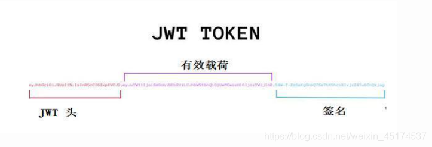
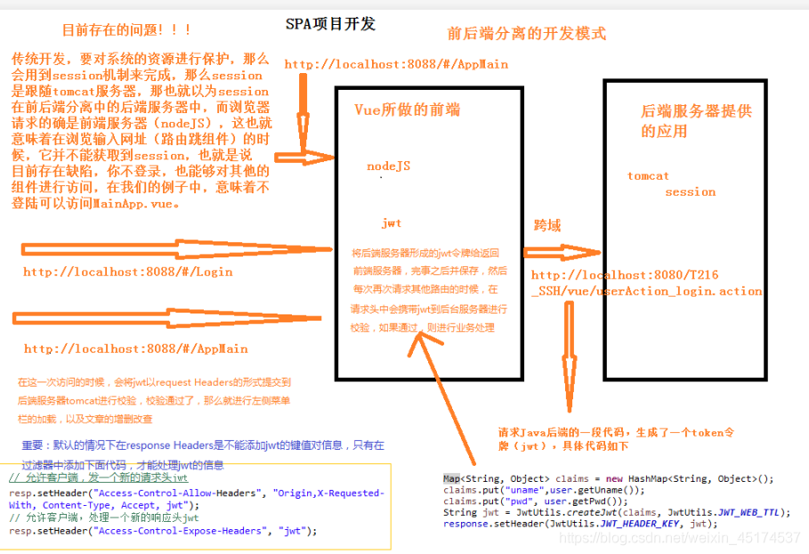

# 1. JWT是什么

JSON Web Token (JWT)，它是目前最流行的跨域身份验证解决方案

JWT的精髓在于：“去中心化”，数据是保存在客户端的。

# 2. JWT的工作原理

1、是在服务器身份验证之后，将生成一个JSON对象并将其发送回用户，示例如下：

```
{"UserName": "Chongchong","Role": "Admin","Expire": "2018-08-08 20:15:56"}
```

2、 之后，当用户与服务器通信时，客户在请求中发回JSON对象

3、 为了防止用户篡改数据，服务器将在生成对象时添加签名，并对发回的数据进行验证

4、JWT组成
一个JWT实际上就是一个字符串，它由三部分组成：头部(Header)、载荷(Payload)与签名(signature)

**JWT结构原理图：**




**JWT实际结构：**

```
#jwt头:
eyJhbGciOiJIUzI1NiJ9.
#有效载荷 :
eyJzdWIiOiJ7fSIsImlzcyI6InpraW5nIiwiZXhwIjoxNTYyODUwMjM3LCJpYXQiOjE1NjI4NDg0MzcsImp0aSI6ImM5OWEyMzRmMDc4NzQyZWE4YjlmYThlYmYzY2VhNjBlIiwidXNlcm5hbWUiOiJ6c3MifQ.
#签名:
WUfqhFTeGzUZCpCfz5eeEpBXBZ8-lYg1htp-t7wD3I4
```

它是一个很长的字符串，中间用点（.）分隔成三个部分。注意，JWT 内部是没有换行的，这里只是为了便于展示，将它写成了几行。
写成一行，就是下面的样子：Header.Payload.Signature

**1 Header**

```javascript
{"typ":"JWT","alg":"HS256"}
```

这个json中的typ属性，用来标识整个token字符串是一个JWT字符串；它的alg属性，用来说明这个JWT签发的时候所使用的签名和摘要算法
typ跟alg属性的全称其实是type跟algorithm，分别是类型跟算法的意思。之所以都用三个字母来表示，也是基于JWT最终字串大小的考虑，
同时也是跟JWT这个名称保持一致，这样就都是三个字符了…typ跟alg是JWT中标准中规定的属性名称

**2 Payload(负荷)**

```javascript
{"sub":"123","name":"Tom","admin":true}
```

payload用来承载要传递的数据，它的json结构实际上是对JWT要传递的数据的一组声明，这些声明被JWT标准称为claims，
它的一个“属性值对”其实就是一个claim(要求)，
每一个claim的都代表特定的含义和作用。

【注1】英文“claim”就是要求的意思
【注2】如上面结构中的sub代表这个token的所有人，存储的是所有人的ID；name表示这个所有人的名字；admin表示所有人是否管理员的角色。
当后面对JWT进行验证的时候，这些claim都能发挥特定的作用
【注3】根据JWT的标准，这些claims可以分为以下三种类型：
**A. Reserved claims(保留)**
它的含义就像是编程语言的保留字一样，属于JWT标准里面规定的一些claim。JWT标准里面定义好的claim有：

iss(Issuser)：代表这个JWT的签发主体；
sub(Subject)：代表这个JWT的主体，即它的所有人；
aud(Audience)：代表这个JWT的接收对象；
exp(Expiration time)：是一个时间戳，代表这个JWT的过期时间；
nbf(Not Before)：是一个时间戳，代表这个JWT生效的开始时间，意味着在这个时间之前验证JWT是会失败的；
iat(Issued at)：是一个时间戳，代表这个JWT的签发时间；
jti(JWT ID)：是JWT的唯一标识。
**B. Public claims，略（不重要）**

**C. Private claims(私有)**
这个指的就是自定义的claim，比如前面那个示例中的admin和name都属于自定的claim。这些claim跟JWT标准规定的claim区别在于：JWT规定的claim，
JWT的接收方在拿到JWT之后，都知道怎么对这些标准的claim进行验证；而private claims不会验证，除非明确告诉接收方要对这些claim进行验证以及规则才行

按照JWT标准的说明：保留的claims都是可选的，在生成payload不强制用上面的那些claim，你可以完全按照自己的想法来定义payload的结构，不过这样搞根本没必要：
第一是，如果把JWT用于认证， 那么JWT标准内规定的几个claim就足够用了，甚至只需要其中一两个就可以了，假如想往JWT里多存一些用户业务信息，
比如角色和用户名等，这倒是用自定义的claim来添加；第二是，JWT标准里面针对它自己规定的claim都提供了有详细的验证规则描述，
每个实现库都会参照这个描述来提供JWT的验证实现，所以如果是自定义的claim名称，那么你用到的实现库就不会主动去验证这些claim

**3 signature**

签名是把header和payload对应的json结构进行base64url编码之后得到的两个串用英文句点号拼接起来，然后根据header里面alg指定的签名算法生成出来的。
算法不同，签名结果不同。以alg: HS256为例来说明前面的签名如何来得到。

按照前面alg可用值的说明，HS256其实包含的是两种算法：HMAC算法和SHA256算法，前者用于生成摘要，后者用于对摘要进行数字签名。这两个算法也可以用HMACSHA256来统称

# JWT的验证

思路图：



它验证的方法其实很简单，只要把header做base64url解码，就能知道JWT用的什么算法做的签名，然后用这个算法，再次用同样的逻辑对header和payload做一次签名，
并比较这个签名是否与JWT本身包含的第三个部分的串是否完全相同，只要不同，就可以认为这个JWT是一个被篡改过的串，自然就属于验证失败了。
接收方生成签名的时候必须使用跟JWT发送方相同的密钥

【 注1】在验证一个JWT的时候，签名认证是每个实现库都会自动做的，但是payload的认证是由使用者来决定的。因为JWT里面可能会包含一个自定义claim，
所以它不会自动去验证这些claim，以jjwt-0.7.0.jar为例

**A 如果签名认证失败会抛出如下的异常：**

```
 io.jsonwebtoken.SignatureException: JWT signature does not match locally computed signature. JWT validity cannot be asserted and should not be trusted.

```

**B JWT过期异常**

```
 io.jsonwebtoken.ExpiredJwtException: JWT expired at 2017-06-13T11:55:56Z. Current time: 2017-06-13T11:55:57Z, a difference of 1608 milliseconds.  Allowed

```

【**注2**】认证失败，返回401 Unauthorized响应

【**注3**】认证服务作为一个Middleware HOOK 对请求进行拦截，首先在cookie中查找Token信息，如果没有找到，则在HTTP Authorization Head中查找

# JWT令牌刷新思路

登陆成功后，将生成的JWT令牌通过响应头返回给客户端

WEB APP项目每次请求后台数据时(将JWT令牌从请求头中带过来)，验证通过，刷新JWT，并保存在响应头返回给客户端，有效时间30分钟 JwtFilter

【注1】修改CorsFilter添加允许的新的请求头“jwt”
【注2】原来在默认的请求上， 浏览器只能访问以下默认的 响应头

```
Cache-Control
Content-Language
Content-Type
Expires
Last-Modified
Pragma

```

如果想让浏览器能访问到其他的 响应头的话 需要在服务器上设置 Access-Control-Expose-Headers Access-Control-Expose-Headers : ‘jwt’

```
// CorsFilter 允许客户端，发一个新的请求头jwt
resp.setHeader("Access-Control-Allow-Headers", "Origin,X-Requested-With, Content-Type, Accept, jwt");

```


# lavarel使用JWT

https://learnku.com/laravel/t/27760
