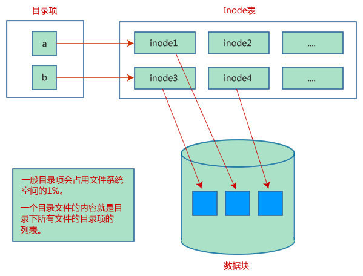

# Linux文件管理

Linux中的所有数据都被保存在文件中，所有的文件被分配到不同的目录。目录是一种类似于树的结构，称为文件系统。

当你使用Linux时，大部分时间都会和文件打交道，通过本节可以了解基本的文件操作，如创建文件、删除文件、复制文件、重命名文件以及为文件创建链接等。


## 文件类型

在Linux中，有三种基本的文件类型：

### 1) 普通文件

普通文件是以字节为单位的数据流，包括文本文件、源码文件、可执行文件等。文本和二进制对Linux来说并无区别，对普通文件的解释由处理该文件的应用程序进行。

### 2) 目录

目录可以包含普通文件和特殊文件，目录相当于Windows和Mac OS中的文件夹。

### 3) 设备文件

有些教程中称特殊文件，是一个含义。Linux 与外部设备（例如光驱，打印机，终端，modern等）是通过一种被称为设备文件的文件来进行通信。Linux 输入输出到外部设备的方式和输入输出到一个文件的方式是相同的。Linux 和一个外部设备通讯之前，这个设备必须首先要有一个设备文件存在。

例如，每一个终端都有自己的设备文件来供 Linux 写数据（出现在终端屏幕上）和读取数据（用户通过键盘输入）。

设备文件和普通文件不一样，设备文件中并不包含任何数据。

设备文件有两种类型：字符设备文件和块设备文件。

- 字符设备文件以字母"c"开头。字符设备文件向设备传送数据时，一次传送一个字符。典型的通过字符传送数据的设备有终端、打印机、绘图仪、modern等。字符设备文件有时也被称为"raw"设备文件。

- 块设备文件以字母"b"开头。块设备文件向设备传送数据时，先从内存中的buffer中读或写数据，而不是直接传送数据到物理磁盘。磁盘和CD-ROMS既可以使用字符设备文件也可以使用块设备文件。

   

## 查看文件

查看当前目录下的文件和目录可以使用 **ls** 命令，例如：

```shell
$ls

bin        hosts  lib     res.03
ch07       hw1    pub     test_results
ch07.bak   hw2    res.01  users
docs       hw3    res.02  work
```

通过 **ls** 命令的 **-l** 选项，你可以获取更多文件信息，例如：

```shell
$ls -l
total 1962188

drwxrwxr-x  2 amrood amrood      4096 Dec 25 09:59 uml
-rw-rw-r--  1 amrood amrood      5341 Dec 25 08:38 uml.jpg
drwxr-xr-x  2 amrood amrood      4096 Feb 15  2006 univ
drwxr-xr-x  2 root   root        4096 Dec  9  2007 urlspedia
-rw-r--r--  1 root   root      276480 Dec  9  2007 urlspedia.tar
drwxr-xr-x  8 root   root        4096 Nov 25  2007 usr
drwxr-xr-x  2    200    300      4096 Nov 25  2007 webthumb-1.01
-rwxr-xr-x  1 root   root        3192 Nov 25  2007 webthumb.php
-rw-rw-r--  1 amrood amrood     20480 Nov 25  2007 webthumb.tar
-rw-rw-r--  1 amrood amrood      5654 Aug  9  2007 yourfile.mid
-rw-rw-r--  1 amrood amrood    166255 Aug  9  2007 yourfile.swf
drwxr-xr-x 11 amrood amrood      4096 May 29  2007 zlib-1.2.3
$
```

每一列的含义如下：

- 第一列：文件类型。
- 第二列：表示文件个数。如果是文件，那么就是1；如果是目录，那么就是该目录中文件的数目。
- 第三列：文件的所有者，即文件的创建者。
- 第四列：文件所有者所在的用户组。在Linux中，每个用户都隶属于一个用户组。
- 第五列：文件大小（以字节计）。
- 第六列：文件被创建或上次被修改的时间。
- 第七列：文件名或目录名。


注意：每一个目录都有一个指向它本身的子目录"." 和指向它上级目录的子目录".."，所以对于一个空目录，第二列应该为 2。

通过 **ls -l** 列出的文件，每一行都是以 a、d、- 或 l 开头，这些字符表示文件类型：

| 前缀 | 描述                                                         |
| ---- | ------------------------------------------------------------ |
| -    | 普通文件。如文本文件、二进制可执行文件、源代码等。           |
| b    | 块设备文件。硬盘可以使用块设备文件。                         |
| c    | 字符设备文件。硬盘也可以使用字符设备文件。                   |
| d    | 目录文件。目录可以包含文件和其他目录。                       |
| l    | 符号链接（软链接）。可以链接任何普通文件，类似于 Windows 中的快捷方式。 |
| p    | 具名管道。管道是进程间的一种通信机制。                       |
| s    | 用于进程间通信的套接字。                                     |


提示：通俗的讲软连接就是windows的快捷方式，原来文件删了，快捷方式虽然在但是不起作用了。

## 元字符

元字符是具有特殊含义的字符。* 和 ? 都是元字符：

- \* 可以匹配 0 个或多个任意字符；
- ? 匹配一个字符。


例如

```shell
$ls ch*.doc
```

可以显示所有以 ch 开头，以 .doc 结尾的文件：

```shell
ch01-1.doc   ch010.doc  ch02.doc    ch03-2.doc
ch04-1.doc   ch040.doc  ch05.doc    ch06-2.doc
ch01-2.doc ch02-1.doc c
```

这里，* 匹配任意一个字符。如果你希望显示所有以 .doc 结尾的文件，可以使用

```shell
$ls *.doc。
```

## 隐藏文件

隐藏文件的第一个字符为英文句号或点号(.)，Linux程序（包括Shell）通常使用隐藏文件来保存配置信息。

下面是一些常见的隐藏文件：
.profile：Bourne shell (sh) 初始化脚本
.kshrc：Korn shell (ksh) 初始化脚本
.cshrc：C shell (csh) 初始化脚本
.rhosts：Remote shell (rsh) 配置文件

查看隐藏文件需要使用 **ls** 命令的 **-a** 选项：

```shell
$ ls -a

.         .profile       docs     lib     test_results
..        .rhosts        hosts    pub     users
.emacs    bin            hw1      res.01  work
.exrc     ch07           hw2      res.02
.kshrc    ch07.bak       hw3      res.03
$
```

一个点号(.)表示当前目录，两个点号(..)表示上级目录

注意：输入密码时，星号(*)作为占位符，代表你输入的字符个数。

## 创建文件

在Linux中，可以使用 vi 编辑器创建一个文本文件，例如：

```shell
$ vi filename
```

上面的命令会创建文件 filename 并打开，按下 i 键即可进入编辑模式，你可以向文件中写入内容。例如：

```shell
This is Linux file....I created it for the first time.....
I'm going to save this content in this file.
```

完成编辑后，可以按 esc 键退出编辑模式，也可以按组合键 Shift + ZZ 完全退出文件。这样，就完成了文件的创建。

```shell
$ vi filename
$
```

## 编辑文件

vi 编辑器可以用来编辑文件。由于篇幅限制，这里仅作简单介绍，将在后面章节进行详细讲解。

如下可以打开一个名为 filename 的文件：

```shell
$ vi filename
```

当文件被打开后，可以按 i 键进入编辑模式，按照自己的方式编辑文件。如果想移动光标，必须先按 esc 键退出编辑模式，然后使用下面的按键在文件内移动光标：

- l 键向右移动
- h 键向左移动
- k 键向上移动
- j 键向下移动


使用上面的按键，可以将光标快速定位到你想编辑的地方。定位好光标后，按 i 键再次进入编辑模式。编辑完成后按 esc 键退出编辑模式或者按组合键 Shift+ZZ 退出当前文件。

## 查看文件内容

可以使用 **cat** 命令来查看文件内容，下面是一个简单的例子：

```shell
$ cat filename
This is Linux file....I created it for the first time.....
I'm going to save this content in this file.
$
```

可以通过 **cat** 命令的 **-b** 选项来显示行号，例如：

```shell
$ cat -b filename
1   This is Linux file....I created it for the first time.....
2   I'm going to save this content in this file.
$
```

## 统计单词数目

可以使用 **wc** 命令来统计当前文件的行数、单词数和字符数，下面是一个简单的例子：

```shell
$ wc filename
2  19 103 filename
$
```

每一列的含义如下：

- 第一列：文件的总行数
- 第二列：单词数目
- 第三列：文件的字节数，即文件的大小
- 第四列：文件名


也可以一次查看多个文件的内容，例如：

```shell
$ wc filename1 filename2 filename3
```

## 复制文件

可以使用 **cp** 命令来复制文件。**cp** 命令的基本语法如下：

```shell
$ cp source_file destination_file
```

下面的例子将会复制 filename 文件：

```shell
$ cp filename copyfile
$
```

现在在当前目录中会多出一个和 filename 一模一样的 copyfile 文件。

## 重命名文件

重命名文件可以使用 **mv** 命令，语法为：

```shell
$ mv old_file new_file
```

下面的例子将会把 filename 文件重命名为 newfile：

```shell
$ mv filename newfile
$
```

现在在当前目录下，只有一个 newfile 文件。

**mv** 命令其实是一个移动文件的命令，不但可以更改文件的路径，也可以更改文件名。

## 删除文件

**rm**命令可以删除文件，语法为：

```shell
$ rm filename
```

注意：删除文件是一种危险的行为，因为文件内可能包含有用信息，建议结合 **-i** 选项来使用 **rm** 命令。

下面的例子会彻底删除一个文件：

```
$ rm filename
$
```

你也可以一次删除多个文件：

```shell
$ rm filename1 filename2 filename3
$
```

## 标准的Linux流

一般情况下，每个Linux程序运行时都会创建三个文件流（三个文件）：

- 标准输入流(stdin)：stdin的文件描述符为0，Linux程序默认从stdin读取数据。
- 标准输出流(stdout)：stdout 的文件描述符为1，Linux程序默认向stdout输出数据。
- 标准错误流(stderr)：stderr的文件描述符为2，Linux程序会向stderr流中写入错误信息。


# Linux目录


## 目录解释

- **/bin: **bin 是 Binaries (二进制文件) 的缩写, 这个目录存放着最经常使用的命令。

- **/boot：**这里存放的是启动 Linux 时使用的一些核心文件，包括一些连接文件以及镜像文件。z`

- **/dev ：**dev 是 Device(设备) 的缩写, 该目录下存放的是 Linux 的外部设备，在 Linux 中访问设备的方式和访问文件的方式是相同的。

- **/etc：**etc 是 Etcetera(等等) 的缩写,这个目录用来存放所有的系统管理所需要的配置文件和子目录。

- **/home**：用户的主目录，在 Linux 中，每个用户都有一个自己的目录，一般该目录名是以用户的账号命名的，如上图中的 alice、bob 和 eve。

- **/lib**：lib 是 Library(库) 的缩写，这个目录里存放着系统最基本的动态连接共享库，其作用类似于 Windows 里的 DLL 文件。几乎所有的应用程序都需要用到这些共享库。

- **/lost+found**：这个目录一般情况下是空的，当系统非法关机后，这里就存放了一些文件。

- **/media**：linux 系统会自动识别一些设备，例如U盘、光驱等等，当识别后，Linux 会把识别的设备挂载到这个目录下。

- **/mnt**：系统提供该目录是为了让用户临时挂载别的文件系统的，我们可以将光驱挂载在 /mnt/ 上，然后进入该目录就可以查看光驱里的内容了。

- **/opt**：opt 是 optional(可选) 的缩写，这是给主机额外安装软件所摆放的目录。比如你安装一个ORACLE数据库则就可以放到这个目录下。默认是空的。

- **/proc**：proc 是 Processes(进程) 的缩写，/proc 是一种伪文件系统（也即虚拟文件系统），存储的是当前内核运行状态的一系列特殊文件，这个目录是一个虚拟的目录，它是系统内存的映射，我们可以通过直接访问这个目录来获取系统信息。

- **/root**：该目录为系统管理员，也称作超级权限者的用户主目录。

- **/sbin**：s 就是 Super User 的意思，是 Superuser Binaries (超级用户的二进制文件) 的缩写，这里存放的是系统管理员使用的系统管理程序。

- **/selinux**：这个目录是 Redhat/CentOS 所特有的目录，Selinux 是一个安全机制，类似于 windows 的防火墙，但是这套机制比较复杂，这个目录就是存放selinux相关的文件的。

- **/srv**：该目录存放一些服务启动之后需要提取的数据。

- **/sys**：这是 Linux2.6 内核的一个很大的变化。该目录下安装了 2.6 内核中新出现的一个文件系统 sysfs 。

   sysfs 文件系统集成了下面3种文件系统的信息：针对进程信息的 proc 文件系统、针对设备的 devfs 文件系统以及针对伪终端的 devpts 文件系统。

   该文件系统是内核设备树的一个直观反映。

   当一个内核对象被创建的时候，对应的文件和目录也在内核对象子系统中被创建。

- **/tmp**：tmp 是 temporary(临时) 的缩写这个目录是用来存放一些临时文件的。

- **/usr**： usr 是 unix shared resources(共享资源) 的缩写，这是一个非常重要的目录，用户的很多应用程序和文件都放在这个目录下，类似于 windows 下的 program files 目录。

- **/usr/bin：**系统用户使用的应用程序。

- **/usr/sbin：**超级用户使用的比较高级的管理程序和系统守护程序。

- **/usr/src：**内核源代码默认的放置目录。

- **/var**：var 是 variable(变量) 的缩写，这个目录中存放着在不断扩充着的东西，我们习惯将那些经常被修改的目录放在这个目录下。包括各种日志文件。

- **/run**：是一个临时文件系统，存储系统启动以来的信息。当系统重启时，这个目录下的文件应该被删掉或清除。如果你的系统上有 /var/run 目录，应该让它指向 run。

   

目录也是一个文件，它的唯一功能是用来保存文件及其相关信息。所有的文件，包括普通文件、设备文件和目录文件，都会被保存到目录中。

## 主目录

登录后，你所在的位置就是你的主目录（或登录目录），接下来你主要是在这个目录下进行操作，如创建文件、删除文件等。

使用下面的命令可以随时进入主目录：

```
$cd ~
$
```

这里 ~ 就表示主目录。如果你希望进入其他用户的主目录，可以使用下面的命令：

```
$cd ~username
$
```

返回进入当前目录前所在的目录可以使用下面的命令：

```
$cd -
$
```

## 绝对路径和相对路径

Linux 的目录有清晰的层次结构，/ 代表根目录，所有的目录都位于 / 下面；文件在层次结构中的位置可以用路径来表示。

如果一个路径以 / 开头，就称为绝对路径；它表示当前文件与根目录的关系。举例如下：

```shell
/etc/passwd
/users/sjones/chem/notes
/dev/rdsk/Os3
```

不以 / 开头的路径称为相对路径，它表示文件与当前目录的关系。例如：

```shell
chem/notes
personal/res
```

获取当前所在的目录可以使用 pwd 命令：

```shell
$pwd
/user0/home/amrood

$
```

查看目录中的文件可以使用 **ls** 命令：

```shell
$ls dirname
```

下面的例子将遍历 /usr/local 目录下的文件：

```shell
$ls /usr/local

X11       bin          gimp       jikes       sbin
ace       doc          include    lib         share
atalk     etc          info       man         ami
```

## 创建目录

可以使用 **mkdir** 命令来创建目录，语法为：

```shell
$mkdir dirname
```

dirname 可以为绝对路径，也可以为相对路径。例如

```shell
$mkdir mydir
$
```

会在当前目录下创建 mydir 目录。又如

```shell
$mkdir /tmp/test-dir
$
```

会在 /tmp 目录下创建 test-dir 目录。**mkdir** 成功创建目录后不会输出任何信息。

也可以使用 **mkdir** 命令同时创建多个目录，例如

```shell
$mkdir docs pub
$
```

会在当前目录下创建 docs 和 pub 两个目录。

## 创建父目录

使用 **mkdir** 命令创建目录时，如果上级目录不存在，就会报错。下面的例子中，mkdir 会输出错误信息：

```shell
$mkdir /tmp/amrood/test
mkdir: Failed to make directory "/tmp/amrood/test";
No such file or directory
$
```

为 **mkdir** 命令增加 **-p** 选项，可以一级一级创建所需要的目录，即使上级目录不存在也不会报错。例如

```shell
$mkdir -p /tmp/amrood/test
$
```

会创建所有不存在的上级目录。

## 删除目录

可以使用 **rmdir** 命令来删除目录，例如：

```shell
$rmdir dirname
$
```

注意：删除目录时请确保目录为空，不会包含其他文件或目录。

也可以使用 **rmdir** 命令同时删除多个目录：

```
$rmdir dirname1 dirname2 dirname3
$
```

如果 dirname1、dirname2、dirname3 为空，就会被删除。**rmdir** 成功删除目录后不会输出任何信息。

## 改变所在目录

可以使用 **cd** 命令来改变当前所在目录，进入任何有权限的目录，语法为：

```shell
$cd dirname
```

dirname 为路径，可以为相对路径，也可以为绝对路径。例如

```shell
$cd /usr/local/bin
$
```

可以进入 /usr/local/bin 目录。可以使用相对路径从这个目录进入 /usr/home/amrood 目录：

```shell
$cd ../../home/amrood
$
```

## 重命名目录

**mv** (move) 命令也可以用来重命名目录，语法为：

```
$mv olddir newdir
```

下面的例子将会把 mydir 目录重命名为 yourdir 目录：

```shell
$mv mydir yourdir
$
```

## 点号(.)

一个点号(.)表示当前目录，两个点号(..)表示上级目录（父目录）。

**ls** 命令的 **-a** 选项可以查看所有文件，包括隐藏文件；**-l** 选项可以查看文件的所有信息，共有7列。例如：

```shell
$ls -la
drwxrwxr-x    4    teacher   class   2048  Jul 16 17.56 .
drwxr-xr-x    60   root              1536  Jul 13 14:18 ..
----------    1    teacher   class   4210  May 1 08:27 .profile
-rwxr-xr-x    1    teacher   class   1948  May 12 13:42 memo
$
```


# Linux文件权限和访问模式

为了更加安全的存储文件，Linux为不同的文件赋予了不同的权限，每个文件都拥有下面三种权限：

- 所有者权限：文件所有者能够进行的操作
- 组权限：文件所属用户组能够进行的操作
- 外部权限（其他权限）：其他用户可以进行的操作。

## 查看文件权限

使用 **ls -l** 命令可以查看与文件权限相关的信息：

```shell
$ls -l /home/amrood
-rwxr-xr--  1 amrood   users 1024  Nov 2 00:10  myfile
drwxr-xr--- 1 amrood   users 1024  Nov 2 00:10  mydir
```

第一列就包含了文件或目录的权限。

第一列的字符可以分为三组，每一组有三个，每个字符都代表不同的权限，分别为读取(r)、写入(w)和执行(x)：

- 第一组字符(2-4)表示文件所有者的权限，-rwxr-xr-- 表示所有者拥有读取(r)、写入(w)和执行(x)的权限。
- 第二组字符(5-7)表示文件所属用户组的权限，-rwxr-xr-- 表示该组拥有读取(r)和执行(x)的权限，但没有写入权限。
- 第三组字符(8-10)表示所有其他用户的权限，rwxr-xr-- 表示其他用户只能读取(r)文件。

## 文件访问模式

文件权限是Linux系统的第一道安全防线，基本的权限有读取(r)、写入(w)和执行(x)：

- 读取：用户能够读取文件信息，查看文件内容。
- 写入：用户可以编辑文件，可以向文件写入内容，也可以删除文件内容。
- 执行：用户可以将文件作为程序来运行。

## 目录访问模式

目录的访问模式和文件类似，但是稍有不同：

- 读取：用户可以查看目录中的文件
- 写入：用户可以在当前目录中删除文件或创建文件
- 执行：执行权限赋予用户遍历目录的权利，例如执行 cd 和 ls 命令。

## 改变权限

可以使用 **chmod** (change mode) 命令来改变文件或目录的访问权限，权限可以使用符号或数字来表示。

### 使用符号表示权限

对于初学者来说最简单的就是使用符号来改变文件或目录的权限，你可以增加(+)和删除(-)权限，也可以指定特定权限。

| 符号 | 说明                 |
| ---- | -------------------- |
| +    | 为文件或目录增加权限 |
| -    | 删除文件或目录的权限 |
| =    | 设置指定的权限       |


下面的例子将会修改 testfile 文件的权限：

```shell
$ls -l testfile
-rwxrwxr--  1 amrood   users 1024  Nov 2 00:10  testfile
$chmod o+wx testfile
$ls -l testfile
-rwxrwxrwx  1 amrood   users 1024  Nov 2 00:10  testfile
$chmod u-x testfile
$ls -l testfile
-rw-rwxrwx  1 amrood   users 1024  Nov 2 00:10  testfile
$chmod g=rx testfile
$ls -l testfile
-rw-r-xrwx  1 amrood   users 1024  Nov 2 00:10  testfile
```

也可以同时使用多个符号：

```shell
$chmod o+wx,u-x,g=rx testfile
$ls -l testfile
-rw-r-xrwx  1 amrood   users 1024  Nov 2 00:10  testfile
```

### 使用数字表示权限

除了符号，也可以使用八进制数字来指定具体权限，如下表所示：

| 数字 | 说明                                         | 权限 |
| ---- | -------------------------------------------- | ---- |
| 0    | 没有任何权限                                 | ---  |
| 1    | 执行权限                                     | --x  |
| 2    | 写入权限                                     | -w-  |
| 3    | 执行权限和写入权限：1 (执行) + 2 (写入) = 3  | -wx  |
| 4    | 读取权限                                     | r--  |
| 5    | 读取和执行权限：4 (读取) + 1 (执行) = 5      | r-x  |
| 6    | 读取和写入权限：4 (读取) + 2 (写入) = 6      | rw-  |
| 7    | 所有权限: 4 (读取) + 2 (写入) + 1 (执行) = 7 | rwx  |


下面的例子，首先使用 **ls -1** 命令查看 testfile 文件的权限，然后使用 **chmod** 命令更改权限：

```shell
$ls -l testfile
-rwxrwxr--  1 amrood   users 1024  Nov 2 00:10  testfile
$ chmod 755 testfile
$ls -l testfile
-rwxr-xr-x  1 amrood   users 1024  Nov 2 00:10  testfile
$chmod 743 testfile
$ls -l testfile
-rwxr---wx  1 amrood   users 1024  Nov 2 00:10  testfile
$chmod 043 testfile
$ls -l testfile
----r---wx  1 amrood   users 1024  Nov 2 00:10  testfile
```

## 更改所有者和用户组

在Linux中，每添加一个新用户，就会为它分配一个用户ID和群组ID，上面提到的文件权限也是基于用户和群组来分配的。

有两个命令可以改变文件的所有者或群组：

- **chown**：chown 命令是"change owner"的缩写，用来改变文件的所有者。
- **chgrp**：chgrp 命令是"change group"的缩写，用来改变文件所在的群组。


**chown** 命令用来更改文件所有者，其语法如下：

```shell
$ chown user filelist
```

user 可以是用户名或用户ID，例如

```shell
$ chown amrood testfile
$
```

将 testfile 文件的所有者改为 amrood。

注意：超级用户 root 可以不受限制的更改文件的所有者和用户组，但是普通用户只能更改所有者是自己的文件或目录。

**chgrp** 命令用来改变文件所属群组，其语法为：

```shell
$ chgrp group filelist
```

group可以是群组名或群组ID，例如

```shell
$ chgrp special testfile
$
```

将文件 testfile 的群组改为 special。

## SUID和SGID位

在Linux中，一些程序需要特殊权限才能完成用户指定的操作。

例如，用户的密码保存在 /etc/shadow 文件中，出于安全考虑，一般用户没有读取和写入的权限。但是当我们使用 **passwd** 命令来更改密码时，需要对 /etc/shadow 文件有写入权限。这就意味着，passwd 程序必须要给我们一些特殊权限，才可以向 /etc/shadow 文件写入内容。

Linux 通过给程序设置SUID(Set User ID)和SGID(Set Group ID)位来赋予普通用户特殊权限。当我们运行一个带有SUID位的程序时，就会继承该程序所有者的权限；如果程序不带SUID位，则会根据程序使用者的权限来运行。

SGID也是一样。一般情况下程序会根据你的组权限来运行，但是给程序设置SGID后，就会根据程序所在组的组权限运行。

如果程序设置了SUID位，就会在表示文件所有者可执行权限的位置上出现's'字母；同样，如果设置了SGID，就会在表示文件群组可执行权限的位置上出现's'字母。如下所示：

```shell
$ ls -l /usr/bin/passwd
-r-sr-xr-x  1   root   bin  19031 Feb 7 13:47  /usr/bin/passwd*
$
```

上面第一列第四个字符不是'x'或'-'，而是's'，说明 /usr/bin/passwd 文件设置了SUID位，这时普通用户会以root用户的权限来执行passwd程序。

注意：小写字母's'说明文件所有者有执行权限(x)，大写字母'S'说明程序所有者没有执行权限(x)。

如果在表示群组权限的位置上出现SGID位，那么也仅有三类用户可以删除该目录下的文件：目录所有者、文件所有者、超级用户 root。

为一个目录设置SUID和SGID位可以使用下面的命令：

```shell
$ chmod ug+s dirname
$ ls -l
drwsr-sr-x 2 root root  4096 Jun 19 06:45 dirname
$
```


# Linux环境变量

在Linux中，环境变量是一个很重要的概念。环境变量可以由系统、用户、Shell以及其他程序来设定。

变量就是一个可以被赋值的字符串，赋值范围包括数字、文本、文件名、设备以及其他类型的数据。

下面的例子，我们将为变量 TEST 赋值，然后使用 **echo** 命令输出：

```shell
$TEST="Linux Programming"
$echo $TEST
Linux Programming
```

注意：变量赋值时前面不能加 $ 符号，变量输出时必须要加 $ 前缀。退出 Shell 时，变量将消失。

登录系统后，Shell会有一个初始化的过程，用来设置环境变量。这个阶段，Shell会读取 /etc/profile 和 .profile 两个文件，过程如下：

- Shell首先检查 /etc/profile 文件是否存在，如果存在，就读取内容，否则就跳过，但是不会报错。
- 然后检查你的主目录（登录目录）中是否存在 .profile 文件，如果存在，就读取内容，否则就跳过，也不会报错。


读取完上面两个文件，Shell就会出现 $ 命令提示符：

```shell
$
```

出现这个提示符，就可以输入命令并调用相应的程序了。

注意：上面是Bourne Shell的初始化过程，bash 和 ksh 在初始化过程中还会检查其他文件。

## .profile文件

/etc/profile文件包含了通用的Shell初始化信息，由Linux管理员维护，一般用户无权修改。

但是你可以修改主目录下的 .profile 文件，增加一些“私人定制”初始化信息，包括：

- 设置默认终端类型和外观样式；
- 设置 Shell 命令查找路径，即PATH变量；
- 设置命令提示符。


找到主目录下的 .profile 文件，使用 vi 编辑器打开并查看内容。

## 设置终端类型

一般情况下，我们使用的终端是由 login 或 getty 程序设置的，可能会不符合我们的习惯。

对于没有使用过的终端，可能会比较生疏，不习惯命令的输出样式，交互起来略显吃力。所以，一般用户会将终端设置成下面的类型：

```shell
$TERM=vt100
$
```

vt100 是 virtual terminate 100 的缩写。虚拟终端是一种假的终端，真正有自己的显示器和键盘的终端，会通过特殊电缆（如串口）连到计算机主机。vt100 是被绝大多数Linux系统所支持的一种虚拟终端规范，常用的还有ansi、xterm等。

## 设置PATH变量

在命令提示符下输入一个命令时，Shell 会根据 PATH 变量来查找该命令对应的程序，PATH变量指明了这些程序所在的路径。

一般情况下PATH变量的设置如下：

```shell
$PATH=/bin:/usr/bin
$
```

多个路径使用冒号(:)分隔。如果用户输入的命令在PATH设置的路径下没有找到，就会报错，例如：

```shell
$hello
hello: not found
$
```

## PS1和PS2变量

PS1变量用来保存命令提示符，可以随意修改，如果你不习惯使用 $ 作为提示符，也可以改成其他字符。PS1变量被修改后，提示符会立即改变。

例如，把命令提示符设置成'=>'：

```shell
$PS1='=>'
=>
=>
=>
```

也可以将提示信息设置成当前目录，例如：

```shell
=>PS1="[\u@\h \w]\$"
[root@ip-72-167-112-17 /var/www/tutorialspoint/Linux]$
[root@ip-72-167-112-17 /var/www/tutorialspoint/Linux]$
```

命令提示信息包含了用户名、主机名和当前目录。

下表中的转义字符可以被用作PS1的参数，丰富命令提示符信息。

| 转义字符 | 描述                                        |
| -------- | ------------------------------------------- |
| \t       | 当前时间，格式为 HH:MM:SS                   |
| \d       | 当前日期，格式为Weekday Month Date          |
| \n       | 换行                                        |
| \W       | 当前所在目录                                |
| \w       | 当前所在目录的完整路径                      |
| \u       | 用户名                                      |
| \h       | 主机名（IP地址）                            |
| #        | 输入的命令的个数，每输入一个新的命令就会加1 |
| \$       | 如果是超级用户 root，提示符为#，否则为$。   |


你可以在每次登录的时候修改提示符，也可以在 .profile 文件中增加 PS1 变量，这样每次登录时会自动修改提示符。

如果用户输入的命令不完整，Shell还会使用第二提示符来等待用户完成命令的输入。默认的第二命令提示符是 >，保存在 PS2 变量，可以随意修改。

下面的例子使用默认的第二命令提示符：

```shell
$ echo "this is a
> test"
this is a
test
$
```

下面的例子通过PS2变量改变提示符：

```shell
$ PS2="secondary prompt->"
$ echo "this is a
secondary prompt->test"
this is a
test
$
```

## 常用环境变量

下表列出了部分重要的环境变量，这些变量可以通过上面提到的方式修改。

| 变量    | 描述                                                         |
| ------- | ------------------------------------------------------------ |
| DISPLAY | 用来设置将图形显示到何处。                                   |
| HOME    | 当前用户的主目录。                                           |
| IFS     | 内部域分隔符。                                               |
| LANG    | LANG可以让系统支持多语言。例如，将LANG设为pt_BR，则可以支持(巴西)葡萄牙语。 |
| PATH    | 指定Shell命令的路径。                                        |
| PWD     | 当前所在目录，即 cd 到的目录。                               |
| RANDOM  | 生成一个介于 0 和 32767 之间的随机数。                       |
| TERM    | 设置终端类型。                                               |
| TZ      | 时区。可以是AST(大西洋标准时间)或GMT(格林尼治标准时间)等。   |
| UID     | 以数字形式表示的当前用户ID，shell启动时会被初始化。          |


下面的例子中使用了部分环境变量：

```shell
$ echo $HOME
/root
]$ echo $DISPLAY

$ echo $TERM
xterm
$ echo $PATH
/usr/local/bin:/bin:/usr/bin:/home/amrood/bin:/usr/local/bin
$
```


# Linux打印文件和发送邮件

通过前面的介绍，相信你对 Linux 的命令和特性有了一个基本的认识，本节将介绍如果打印文件以及发送邮件。

## 文件打印

如果你希望打印文本文件，最好预先处理一下，包括调整边距、设置行高、设置标题等，这样打印出来的文件更加美观，易于阅读。当然，不处理也可以打印，但是可能会比较丑陋。

大部分的Linux自带了 nroff 和 troff 两个强大的文本格式化工具，不过比较老旧，使用的人很少，有兴趣的读者可以可以自行学习，本教程不再进行深入讲解。

### pr命令

**pr** 命令用来将文本文件转换成适合打印的格式，它可以把较大的文件分割成多个页面进行打印，并为每个页面添加标题。

**pr** 命令的语法如下：

```
pr option(s) filename(s)
```

**pr** 命令仅仅改变文件在屏幕上的显示样式和打印输出样式，并不会更改文件本身。下表是 pr 命令的几个选项：

| 选项           | 说明                                                 |
| -------------- | ---------------------------------------------------- |
| -k             | 分成几列打印，默认为1。                              |
| -d             | 两倍行距（并不是所有版本的 pr 都有效）。             |
| -h "header"    | 设置每个页面的标题。                                 |
| -t             | 不打印标题和上下边距。                               |
| -l PAGE_LENGTH | 每页显示多少行。默认是每个页面一共66行，文本占56行。 |
| -o MARGIN      | 每行缩进的空格数。                                   |
| -w PAGE_WIDTH  | 多列输出时，设置页面宽度，默认是72个字符。           |


例如，food 文件包含了很多食品的名字，使用 pr 命令分成两列打印，并设置每页的标题为“Restaurants”。

首先查看文件内容：

```shell
$cat food
Sweet Tooth
Bangkok Wok
Mandalay
Afghani Cuisine
Isle of Java
Big Apple Deli
Sushi and Sashimi
Tio Pepe's Peppers
........
$
```

然后使用 **pr** 命令打印：

```shell
$pr -2 -h "Restaurants" food
Nov  7  9:58 1997  Restaurants   Page 1

Sweet Tooth              Isle of Java
Bangkok Wok              Big Apple Deli
Mandalay                 Sushi and Sashimi
Afghani Cuisine          Tio Pepe's Peppers
........
$
```

### lp和lpr命令

**lp** 和 **lpr** 命令将文件传送到打印机进行打印。使用 pr 命令将文件格式化后就可以使用这两个命令来打印。

打印机一般由系统管理员来设置，下面的例子使用默认的打印机打印food文件：

```shell
$lp food
request id is laserp-525  (1 file)
$
```

命令成功执行会返回一个表示打印任务的ID，通过这个ID可以取消打印或者查看打印状态。

如果你希望打印多份文件，可以使用 lp 的 -n**Num** 选项，或者 lpr 命令的 -**Num** 选项。**Num** 是一个数字，可以随意设置。

如果系统连接了多台打印机，可以使用 lp 命令的 -d**printer** 选项，或者 lpr 命令的 -P**printer** 选项来选择打印机。**printer** 为打印机名称。

### lpstat 和 lpq 命令

**lpstat** 命令可以查看打印机的缓存队列（有多少个文件等待打印），包括任务ID、所有者、文件大小、请求时间和请求状态。

提示：等待打印的文件会被放到打印机的的缓存队列中。

例如，使用 **lpstat -o** 命令查看打印机中所有等待打印的文件，包括你自己的：

```shell
$lpstat -o
laserp-573  john  128865  Nov 7  11:27  on laserp
laserp-574  grace  82744  Nov 7  11:28
laserp-575  john   23347  Nov 7  11:35
$
```

lpstat -o 命令按照打印顺序输出队列中的文件。

**lpq** 命令显示的信息与 lpstat -o 稍有差异：

```shell
$lpq
laserp is ready and printing
Rank   Owner      Job  Files                  Total Size
active john       573  report.ps              128865 bytes
1st    grace      574  ch03.ps ch04.ps        82744 bytes
2nd    john       575  standard input         23347 bytes
$
```

第一行为打印机的状态。如果打印机无法使用或者纸被用完，将会输出其他信息。

### cancel 和 lprm 命令

**cancel** 和 **lprm** 分别用来终止 lp 和 lpr 的打印请求。使用这两个命令，需要指定ID（由 lp 或 lpq 返回）或打印机名称。

例如，通过ID取消打印请求：

```shell
$cancel laserp-575
request "laserp-575" cancelled
$
```

如果希望取消正在打印的文件，那么可以不指定ID，仅仅指定打印机名称即可：

```shell
$cancel laserp
request "laserp-573" cancelled
$
```


lprm 命令用来取消当前用户的正在等待打印的文件，使用任务号作为参数可以取消指定文件，使用横线(-)作为参数可以取消所有文件。

例如，取消575号打印任务：

```shell
$lprm 575
dfA575diamond dequeued
cfA575diamond dequeued
$
```

lprm 会返回被取消的文件名。

## 发送邮件

可以使用**mail**命令发送和接收邮件，语法如下：

```
$mail [-s subject] [-c cc-addr] [-b bcc-addr] to-addr
```

每个选项的含义如下：

| 选项 | 描述                                                |
| ---- | --------------------------------------------------- |
| -s   | 邮件标题。                                          |
| -c   | 要发送的用户，多个用户以逗号(,)分隔。               |
| -b   | 需要密件发送（密送）的用户，多个用户以逗号(,)分隔。 |


例如，向admin@yahoo.com发送邮件：

```shell
$mail -s "Test Message" admin@yahoo.com
Hello everyone, 
this is Linux tutorial and url is http://see.xidian.edu.cn/cpp/linux/.
Cc: 
```

第一行是输入的命令，-s表示邮件的主题，后面的admin@yahoo.com则是邮件的接收人，输入完这行命令后回车，会进入邮件正文的编写，你可以输入任何文字，比如上面的两行。输入完邮件正文，需要按CTRL+D结束输入，此时会提示你输入Cc地址，即邮件抄送地址，没有直接回车就完成了邮件的发送。

也可以通过重定向操作符 < 来发送文件：

```shell
$mail -s "Report 05/06/07" admin@yahoo.com < demo.txt
```

通过上面的命令，就可以把demol.txt文件的内容作为邮件的内容发送给admin@yahoo.com了。

接收邮件不需要任何参数：

```shell
$mail
no email
```


# Linux管道和过滤器

有时候，我们可以把两个命令连起来使用，一个命令的输出作为另一个命令的输入，这就叫做**管道**。为了建立管道，需要在两个命令之间使用竖线(|)连接。

管道是Linux进程之间一种重要的通信机制；除了管道，还有共享内存、消息队列、信号、套接字(socket) 等进程通信机制。

管道使用竖线(|)将两个命令隔开，竖线左边命令的输出就会作为竖线右边命令的输入。连续使用竖线表示第一个命令的输出会作为第二个命令的输入，第二个命令的输出又会作为第三个命令的输入，依此类推。

能够接受数据，过滤（处理或筛选）后再输出的工具，称为**过滤器**。

## grep命令

grep 是一个强大的文本搜索工具，可以使用正则表达式，并返回匹配的行，语法为：

```shell
$grep pattern file(s)
```

“grep”源于 ed（Linux的一个行文本编辑器）的 g/re/p 命令，g/re/p 是“globally search for a regular expression and print all lines containing it”的缩写，意思是使用正则表达式进行全局检索，并把匹配的行打印出来。

正则表达式是一个包含了若干特殊字符的字符串，每个字符都有特殊含义，可以用来匹配文本，更多信息请查看[正则表达式教程](http://c.biancheng.net/cpp/u/zhengze/)。

grep 可以看做是一个过滤器，如果没有为 grep 指定要检索的文件，那么它会从标准输入设备（一般是键盘）读取；其他过滤器也是如此。

grep 命令最简单的使用就是检索包含固定字符的文本。

例如，在管道中使用 grep 命令，只允许包含指定字符的行输出到显示器：

```shell
$ls -l | grep "Aug"
-rw-rw-rw-   1 john  doc     11008 Aug  6 14:10 ch02
-rw-rw-rw-   1 john  doc      8515 Aug  6 15:30 ch07
-rw-rw-r--   1 john  doc      2488 Aug 15 10:51 intro
-rw-rw-r--   1 carol doc      1605 Aug 23 07:35 macros
$
```

grep 命令有很多选项：

| 选项 | 说明                                                         |
| ---- | ------------------------------------------------------------ |
| -v   | 反转查询，输出不匹配的行。例如，grep -v "test" demo.txt 将输出不包含"test"的行。 |
| -n   | 输出匹配的行以及行号。                                       |
| -l   | 输出匹配的行所在的文件名。                                   |
| -c   | 输出匹配的总行数。                                           |
| -i   | 不区分大小写进行匹配。                                       |


下面我们使用正则表达式来匹配这样的行：包含字符“carol”，然后包含任意数目（含零个）的其他字符，最后还要包含“Aug”。

使用 -i 选项进行不区分大小写的匹配：

```shell
$ls -l | grep -i "carol.*aug"
-rw-rw-r--   1 carol doc      1605 Aug 23 07:35 macros
$
```

## sort命令

sort 命令在 Linux 中非常有用，它将文件中的各行按字母或数进行排序。sort命令既可以从特定的文件，也可以从stdin获取输入。

例如，对 foot 文件的各行进行排序：

```shell
$sort food
Afghani Cuisine
Bangkok Wok
Big Apple Deli
Isle of Java
Mandalay
Sushi and Sashimi
Sweet Tooth
Tio Pepe's Peppers
$
```

通过下面的选项可以控制排序规则：

| 选项 | 描述                                                         |
| ---- | ------------------------------------------------------------ |
| -n   | 按照数字大小排序，例如，10会排在2后面；-n 选项会忽略空格或 tab缩进。 |
| -r   | 降序排序。sort 默认是升序排序。                              |
| -f   | 不区分大小写。                                               |
| +x   | 对第x列（从0开始）进行排序。                                 |


下面的例子通过管道将 ls、grep 和 sort 命令连起来使用，过滤包含“Aug”的行，并按照文件大小排序：

```shell
$ls -l | grep "Aug" | sort +4n
-rw-rw-r--  1 carol doc      1605 Aug 23 07:35 macros
-rw-rw-r--  1 john  doc      2488 Aug 15 10:51 intro
-rw-rw-rw-  1 john  doc      8515 Aug  6 15:30 ch07
-rw-rw-rw-  1 john  doc     11008 Aug  6 14:10 ch02
$
```

上面的命令，对当前目录中八月份修改的文件按照大小排序；+4n 表示对第5列按照数字大小排序。

## pg和more命令

如果文件内容过多，全部显示会很乱，可以使用 **pg** 和 **more** 命令分页显示，每次只显示一屏。

例如，通过管道，使用more命令显示目录中的文件：

```shell
$ls -l | grep "Aug" | sort +4n | more
-rw-rw-r--  1 carol doc      1605 Aug 23 07:35 macros
-rw-rw-r--  1 john  doc      2488 Aug 15 10:51 intro
-rw-rw-rw-  1 john  doc      8515 Aug  6 15:30 ch07
-rw-rw-r--  1 john  doc     14827 Aug  9 12:40 ch03
.
.
.
-rw-rw-rw-  1 john  doc     16867 Aug  6 15:56 ch05
--More--(74%)
```

如上，一次只显示一屏文本，显示满后，停下来，并提示已显示全部内容的百分比，按空格键(space)可以查看下一屏，按 b 键可以查看上一屏。


# Linux进程管理

当我们运行程序时，Linux会为程序创建一个特殊的环境，该环境包含程序运行需要的所有资源，以保证程序能够独立运行，不受其他程序的干扰。这个特殊的环境就称为进程。

每个 Linux 命令都与系统中的程序对应，输入命令，Linux 就会创建一个新的进程。例如使用 ls 命令遍历目录中的文件时，就创建了一个进程。

简而言之，进程就是程序的实例。

系统通过一个五位数字跟踪程序的运行状态，这个数字称为 pid 或进程ID。每个进程都拥有唯一的 pid。

理论上，五位数字是有限的，当数字被用完时，下一个 pid 就会重新开始，所以 pid 最终会重复。但是，两个 pid 一样的进程不能同时存在，因为Linux会使用 pid 来跟踪程序的运行状态。

## 创建进程

有两种方式来创建进程：前台进程和后台进程。

### 前台进程

默认情况下，用户创建的进程都是前台进程；前台进程从键盘读取数据，并把处理结果输出到显示器。

我们可以看到前台进程的运行过程。例如，使用 ls 命令来遍历当前目录下的文件：

```shell
$ls ch*.doc
ch01-1.doc   ch010.doc  ch02.doc    ch03-2.doc
ch04-1.doc   ch040.doc  ch05.doc    ch06-2.doc
ch01-2.doc   ch02-1.doc
```

这个程序就运行在前台，它会直接把结果输出到显示器。如果 ls 命令需要数据（实际上不需要），那么它会等待用户从键盘输入。

当程序运行在前台时，由于命令提示符($)还未出现，用户不能输入其他命令；即使程序需要运行很长时间，也必须等待程序运行结束才能输入其他命令。

### 后台进程

后台进程与键盘没有必然的关系。当然，后台进程也可能会等待键盘输入。

后台进程的优点是不必等待程序运行结束就可以输入其他命令。

创建后台进程最简单的方式就是在命令的末尾加 &，例如：

```shell
$ls ch*.doc &
ch01-1.doc   ch010.doc  ch02.doc    ch03-2.doc
ch04-1.doc   ch040.doc  ch05.doc    ch06-2.doc
ch01-2.doc   ch02-1.doc
```

如果 ls 命令需要输入（实际上不需要），那么它会暂停，直到用户把它调到前台并从键盘输入数据才会继续运行。

## 查看正在运行的进程

可以使用 **ps** 命令查看进程的运行状态，包括后台进程，例如：

```shell
$ps
PID       TTY      TIME        CMD
18358     ttyp3    00:00:00    sh
18361     ttyp3    00:01:31    abiword
18789     ttyp3    00:00:00    ps
```

还可以结合 **-f** 选项查看更多信息，f 是 full 的缩写，例如：

```shell
$ps -f
UID      PID  PPID C STIME    TTY   TIME CMD
amrood   6738 3662 0 10:23:03 pts/6 0:00 first_one
amrood   6739 3662 0 10:22:54 pts/6 0:00 second_one
amrood   3662 3657 0 08:10:53 pts/6 0:00 -ksh
amrood   6892 3662 4 10:51:50 pts/6 0:00 ps -f
```

每列的含义如下：

| 列    | 描述                                       |
| ----- | ------------------------------------------ |
| UID   | 进程所属用户的ID，即哪个用户创建了该进程。 |
| PID   | 进程ID。                                   |
| PPID  | 父进程ID，创建该进程的进程称为父进程。     |
| C     | CPU使用率。                                |
| STIME | 进程被创建的时间。                         |
| TTY   | 与进程有关的终端类型。                     |
| TIME  | 进程所使用的CPU时间。                      |
| CMD   | 创建该进程的命令。                         |


ps 命令还有其他一些选项：

| 选项 | 说明                           |
| ---- | ------------------------------ |
| -a   | 显示所有用户的所有进程。       |
| -x   | 显示无终端的进程。             |
| -u   | 显示更多信息，类似于 -f 选项。 |
| -e   | 显示所有进程。                 |

## 终止进程

当进程运行在前台时，可以通过 **kill** 命令或 Ctrl+C 组合键来结束进程。

如果进程运行在后台，那么首先要通过 **ps** 命令来获取进程ID，然后使用 **kill** 命令“杀死”进程，例如：

```shell
$ps -f
UID      PID  PPID C STIME    TTY   TIME CMD
amrood   6738 3662 0 10:23:03 pts/6 0:00 first_one
amrood   6739 3662 0 10:22:54 pts/6 0:00 second_one
amrood   3662 3657 0 08:10:53 pts/6 0:00 -ksh
amrood   6892 3662 4 10:51:50 pts/6 0:00 ps -f
$kill 6738
Terminated
```

如上所示，kill 命令终结了 first_one 进程。

如果进程忽略 kill 命令，那么可以通过 kill -9 来结束：

```shell
$kill -9 6738
Terminated
```

## 父进程和子进程

每个 Linux 进程会包含两个进程ID：当前进程ID(pid)和父进程ID(ppid)。可以暂时认为所有的进程都有父进程。

由用户运行的大部分命令都将 Shell 作为父进程，使用 **ps -f** 命令可以查看当前进程ID和父进程ID。

## 僵尸进程和孤儿进程

正常情况下，子进程被终止时会通过 SIGCHLD 信号通知父进程，父进程可以做一些清理工作或者重新启动一个新的进程。但在某些情况下，父进程会在子进程之前被终止，那么这些子进程就没有了“父亲”，被称为**孤儿进程**。

init 进程会成为所有孤儿进程的父进程。init 的 pid 为1，是Linux系统的第一个进程，也是所有进程的父进程。

如果一个进程被终止了，但是使用 ps 命令仍然可以查看该进程，并且状态为 Z，那么这就是一个**僵尸进程**。僵尸进程虽然被终止了，但是仍然存在于进程列表中。一般僵尸进程很难杀掉，你可以先杀死他们的父进程，让他们变成孤儿进程，init 进程会自动清理僵尸进程。

## 常驻进程

常驻进程一般是系统级进程，以 root 权限运行在后台，可以处理其他进程的请求。

常驻进程没有终端，不能访问 /dev/tty 文件，如果使用 ps -ef 查看该进程，tty 这一列会显示问号(?)。

更确切地说，常驻进程通常运行在后台，等待指定事件发生，例如打印进程是一个常驻进程，它会等待用户输入打印相关的命令并进行处理。

## top命令

top 命令是一个很有用的工具，它可以动态显示正在运行的进程，还可以按照指定条件对进程进行排序，与Windows的任务管理器类似。

top 命令可以显示进程的很多信息，包括物理内存、虚拟内存、CPU使用率、平均负载以及繁忙的进程等。例如：

```shell
$top
```

这里仅给出一个示意图，读者最好亲自运行一下：


## 任务和进程

任务(task)是最抽象的，是一个一般性的术语，指由软件完成的一个活动。一个任务既可以是一个进程，也可以是多个进程。简而言之，它指的是一系列共同达到某一目的的操作。例如，读取数据并将数据放入内存中。这个任务可以由一个进程来实现，也可以由多个进程来实现。  每个任务都有一个数字表示的任务号。

进程(process)常常被定义为程序的执行。可以把一个进程看成是一个独立的程序，在内存中有其完备的数据空间和代码空间。一个进程所拥有的数据和变量只属于它自己。

**jobs** 命令可以用来查看系统中正在运行的任务，包括后台运行的任务。该命令可以显示任务号及其对应的进程ID。一个任务可以对应于一个或者多个进程号。

jobs 命令的 -l 选项可以查看当前任务包含的进程ID：

```shell
$jobs -l
[1] + 1903 running                 ls ch*.doc &
$
```

其中，第一列表示任务号，第二列表示任务对应的进程ID，第三列表示任务的运行状态，第四列表示启动任务的命令。

## 前台任务和后台任务的切换

**fg** 命令可以将后台任务调到前台，语法为：

```shell
$fg %jobnumber
```

jobnumber 是通过 jobs 命令获取的后台任务的的序号，注意不是pid。如果后台只有一个任务，可以不指定 jobnumber。

**bg** 命令可以将后台暂停的任务，调到前台继续运行，语法为：

```shell
$bg %jobnumber
```

jobnumber 同样是通过 jobs 命令获取的后台任务的的序号，注意不是pid。如果前台只有一个任务，可以不指定 jobnumber。

如果希望将当前任务转移到后台，可以先 Ctrl+z 暂停任务，再使用 bg 命令。任务转移到后台可以空出终端，继续输入其他命令。


# Linux网络通信工具

现在是一个互联网的时代，你不可避免的要和其他用户进行远程交流，连接到远程主机。

## ping 命令

ping 命令会向网络上的主机发送应答请求，根据响应信息可以判断远程主机是否可用。

ping 命令的语法：

```shell
$ping hostname or ip-address
```

如果网络畅通，很快就可以看到响应信息。

例如，检测是否可以连接到谷歌的主机：

```shell
$ping google.com
PING google.com (74.125.67.100) 56(84) bytes of data.
64 bytes from 74.125.67.100: icmp_seq=1 ttl=54 time=39.4 ms
64 bytes from 74.125.67.100: icmp_seq=2 ttl=54 time=39.9 ms
64 bytes from 74.125.67.100: icmp_seq=3 ttl=54 time=39.3 ms
64 bytes from 74.125.67.100: icmp_seq=4 ttl=54 time=39.1 ms
64 bytes from 74.125.67.100: icmp_seq=5 ttl=54 time=38.8 ms
--- google.com ping statistics ---
22 packets transmitted, 22 received, 0% packet loss, time 21017ms
rtt min/avg/max/mdev = 38.867/39.334/39.900/0.396 ms
$
```

如果主机没有响应，可以看到类似下面的信息：

```shell
$ping giiiiiigle.com
ping: unknown host giiiiigle.com
$
```

## ftp 工具

ftp 是 File Transfer Protocol 的缩写，称为文件传输协议。通过 ftp 工具，能够将文件上传到远程服务器，也可以从远程服务器下载文件。

ftp 工具有自己的命令（类似Linux命令），可以：

- 连接并登录远程主机；
- 查看目录，遍历目录下的文件；
- 上传或下载文件，包括文本文件、二进制文件等。


ftp 命令的用法如下：

```shell
$ftp hostname or ip-address
```

接下来会提示你输入用户名和密码，验证成功后会进入主目录，然后就可以使用 ftp 工具的命令进行操作了。


| ftp命令        | 说明                                                         |
| -------------- | ------------------------------------------------------------ |
| put filename   | 将本地文件上传到远程主机。                                   |
| get filename   | 将远程文件下载到本地。                                       |
| mput file list | 将多个本地文件上传到远程主机。                               |
| mget file list | 将多个远程文件下载到本地。                                   |
| prompt off     | 关闭提示。默认情况下，使用 mput 或 mget 命令会不断提示你确认文件的上传或下载。 |
| prompt on      | 打开提示。                                                   |
| dir            | 列出远程主机当前目录下的所有文件。                           |
| cd dirname     | 改变远程主机目录。                                           |
| lcd dirname    | 改变本地目录。                                               |
| quit           | 退出登录。                                                   |


注意，所有的上传和下载都是针对本地主机和远程主机的当前目录，如果你希望上传指定目录下的文件，首先要 cd 到该目录，然后才能上传。

ftp 工具使用举例：

```shell
$ftp amrood.com
Connected to amrood.com.
220 amrood.com FTP server (Ver 4.9 Thu Sep 2 20:35:07 CDT 2009)
Name (amrood.com:amrood): amrood
331 Password required for amrood.
Password:
230 User amrood logged in.
ftp> dir
200 PORT command successful.
150 Opening data connection for /bin/ls.
total 1464
drwxr-sr-x   3 amrood   group       1024 Mar 11 20:04 Mail
drwxr-sr-x   2 amrood   group       1536 Mar  3 18:07 Misc
drwxr-sr-x   5 amrood   group        512 Dec  7 10:59 OldStuff
drwxr-sr-x   2 amrood   group       1024 Mar 11 15:24 bin
drwxr-sr-x   5 amrood   group       3072 Mar 13 16:10 mpl
-rw-r--r--   1 amrood   group     209671 Mar 15 10:57 myfile.out
drwxr-sr-x   3 amrood   group        512 Jan  5 13:32 public
drwxr-sr-x   3 amrood   group        512 Feb 10 10:17 pvm3
226 Transfer complete.
ftp> cd mpl
250 CWD command successful.
ftp> dir
200 PORT command successful.
150 Opening data connection for /bin/ls.
total 7320
-rw-r--r--   1 amrood   group       1630 Aug  8 1994  dboard.f
-rw-r-----   1 amrood   group       4340 Jul 17 1994  vttest.c
-rwxr-xr-x   1 amrood   group     525574 Feb 15 11:52 wave_shift
-rw-r--r--   1 amrood   group       1648 Aug  5 1994  wide.list
-rwxr-xr-x   1 amrood   group       4019 Feb 14 16:26 fix.c
226 Transfer complete.
ftp> get wave_shift
200 PORT command successful.
150 Opening data connection for wave_shift (525574 bytes).
226 Transfer complete.
528454 bytes received in 1.296 seconds (398.1 Kbytes/s)
ftp> quit
221 Goodbye.
$
```

## telnet工具

Telnet 工具可以让我们连接并登录到远程计算机。

一旦连接到了远程计算机，就可以在上面进行各种操作了，例如：

```shell
C:>telnet amrood.com
Trying...
Connected to amrood.com.
Escape character is '^]'.

login: amrood
amrood's Password:
*****************************************************
*                                                   *
*                                                   *
*            WELCOME TO AMROOD.COM                  *
*                                                   *
*                                                   *
*****************************************************

Last unsuccessful login: Fri Mar  3 12:01:09 IST 2009
Last login: Wed Mar  8 18:33:27 IST 2009 on pts/10

   {  do your work }

$ logout
Connection closed.
C:>
```

## finger工具

finger 可以让我们查看本地主机或远程主机上的用户信息。有些系统为了安全会禁用 finger 命令。

例如，查看本机在线用户：

```shell
$ finger
Login     Name       Tty      Idle  Login Time   Office
amrood               pts/0          Jun 25 08:03 (62.61.164.115)
```

查看本机指定用户的信息：

```shell
$ finger amrood
Login: amrood                           Name: (null)
Directory: /home/amrood                 Shell: /bin/bash
On since Thu Jun 25 08:03 (MST) on pts/0 from 62.61.164.115
No mail.
No Plan.
```

查看远程主机上的在线用户：

```shell
$ finger @avtar.com
Login     Name       Tty      Idle  Login Time   Office
amrood               pts/0          Jun 25 08:03 (62.61.164.115)
```

查看远程主机上某个用户的信息：

```shell
$ finger amrood@avtar.com
Login: amrood                           Name: (null)
Directory: /home/amrood                 Shell: /bin/bash
On since Thu Jun 25 08:03 (MST) on pts/0 from 62.61.164.115
No mail.
No Plan.
```


# Vim编辑器

Linux下的文本编辑器有很多种，vi 是最常用的，也是各版本Linux的标配。注意，vi 仅仅是一个文本编辑器，可以给字符着色，可以自动补全，但是不像 Windows 下的 word 有排版功能。

vi 是十年磨一剑的产品，虽然命令繁多，并且大多数功能都是依靠键盘输入来完成，但是一旦你熟悉后，会发现 vi 的功能和效率是其他图形界面编辑器无法比拟的。

Vim 是 **V**i **im**proved 的缩写，是 vi 的改进版。在Linux中，vi 被认为是事实上的标准编辑器，因为：

- 所有版本的 Linux 都带有 vi 编辑器；
- 占用资源少；
- 与 ed、ex 等其他编辑器相比，vi 对用户更加友好。


你可以使用 vi 编辑器编辑现有的文件，也可以创建一个新文件，还能以只读模式打开文本文件。

## 进入 vi 编辑器

可以通过以下方式进入 vi 编辑器：

| 命令           | 描述                                                   |
| -------------- | ------------------------------------------------------ |
| vi filename    | 如果filename存在，则打开；否则会创建一个新文件再打开。 |
| vi -R filename | 以只读模式（只能查看不能编辑）打开现有文件。           |
| view filename  | 以只读模式打开现有文件。                               |


例如，使用 vi 编辑器创建一个新文件并打开：

```shell
$vi testfile
|
~
~
~
~
~
~
~
~
~
~
~
~
"testfile" [New File]
```

竖线(|)代表光标的位置；波浪号(~)代表该行没有任何内容。如果没有 ~，也看不到任何内容，那说明这一行肯定是有空白字符（空格、tab 缩进、换行符等）或不可见字符。

## 工作模式

进一步了解 vi 之前先来了解一下 vi 的工作模式，vi 有三种工作模式：

### 1) 普通模式

由Shell进入vi编辑器时，首先进入普通模式。在普通模式下，从键盘输入任何字符都被当作命令来解释。普通模式下没有任何提示符，输入命令后立即执行，不需要回车，而且输入的字符不会在屏幕上显示出来。

普通模式下可以执行命令、保存文件、移动光标、粘贴复制等。

### 2) 编辑模式

编辑模式主要用于文本的编辑。该模式下用户输入的任何字符都被作为文件的内容保存起来，并在屏幕上显示出来。

### 3) 命令模式

命令模式下，用户可以对文件进行一些高级处理。尽管普通模式下的命令可以完成很多功能，但要执行一些如字符串查找、替换、显示行号等操作还是必须要进入命令模式。

注意：有些教程中称有两种工作模式，是把命令模式合并到普通模式。

工作模式切换：

- 在普通模式下输入 i(插入)、c(修改)、o(另起一行) 命令时进入编辑模式；按 esc 键退回到普通模式。
- 在普通模式下输入冒号(:)可以进入命令模式。输入完命令按回车，命令执行完后会自动退回普通模式。


提示：如果不确定当前处于哪种模式，按两次 Esc 键将回到普通模式。

## 退出 vi 编辑器

一般在命令模式下退出 vi 编辑器。


| 退出命令 | 说明                                                    |
| -------- | ------------------------------------------------------- |
| q        | 如果文件未被修改，会直接退回到Shell；否则提示保存文件。 |
| q!       | 强行退出，不保存修改内容。                              |
| wq       | w 命令保存文件，q 命令退出 vi，合起来就是保存并退出。   |
| ZZ       | 保存并退出，相当于 wq，但是更加方便。                   |


退出之前，你也可以在 w 命令后面指定一个文件名，将文件另存为新文件，例如：

```shell
w filename2
```

将当前文件另存为 filename2。

注意：vi 编辑文件时，用户的操作都是基于缓冲区中的副本进行的。如果退出时没有保存到磁盘，则缓冲区中的内容就会被丢失。

## 移动光标

为了不影响文件内容，必须在普通模式（按两次 Esc 键）下移动光标。使用下表中的命令每次可以移动一个字符：

| 命令 | 描述                         |
| ---- | ---------------------------- |
| k    | 向上移动光标（移动一行）     |
| j    | 向下移动光标（移动一行）     |
| h    | 向左移动光标（移动一个字符） |
| l    | 向右移动光标（移动一个字符） |


两点提醒：

- vi 是区分大小写的，输入命令时注意不要锁定大写。
- 可以在命令前边添加一个数字作为前缀，例如，2j 将光标向下移动两行。


当然，还有很多其他命令来移动光标，不过记住，一定要在普通模式（按两次 Esc 键）下。


| 命令    | 说明                                                  |
| ------- | ----------------------------------------------------- |
| 0 或 \| | 将光标定位在一行的开头。                              |
| $       | 将光标定位在一行的末尾。                              |
| w       | 定位到下一个单词。                                    |
| b       | 定位到上一个单词。                                    |
| (       | 定位到一句话的开头，句子是以 ! . ? 三种符号来界定的。 |
| )       | 定位到一句话的结尾。                                  |
| {       | 移动到段落开头。&&&&&&                                |
| }       | 移动到段落结束。&&&&&&&&&                             |
| [[      | 回到段落的开头处。&&&&&&&&&&                          |
| ]]      | 向前移到下一个段落的开头处。&&&&&&&&&&                |
| n\|     | 移动到第 n 列（当前行）。                             |
| 1G      | 移动到文件第一行。                                    |
| G       | 移动到文件最后一行。                                  |
| nG      | 移动到文件第 n 行。                                   |
| :n      | 移动到文件第 n 行。                                   |
| H       | 移动到屏幕顶部。                                      |
| nH      | 移动到距离屏幕顶部第 n 行的位置。                     |
| M       | 移动到屏幕中间。                                      |
| L       | 移动到屏幕底部。                                      |
| nL      | 移动到距离屏幕底部第 n 行的位置。                     |
| :x      | x 是一个数字，表示移动到行号为 x 的行。               |

## 控制命令

有一些控制命令可以与 Ctrl 键组合使用，如下：

| 命令   | 描述         |
| ------ | ------------ |
| CTRL+d | 向前滚动半屏 |
| CTRL+f | 向前滚动全屏 |
| CTRL+u | 向后滚动半屏 |
| CTRL+b | 向后滚动整屏 |
| CTRL+e | 向上滚动一行 |
| CTRL+y | 向下滚动一行 |
| CTRL+I | 刷新屏幕     |

## 编辑文件

切换到编辑模式下才能编辑文件。有很多命令可以从普通模式切换到编辑模式，如下所示：

| 命令 | 描述                       |
| ---- | -------------------------- |
| i    | 在当前光标位置之前插入文本 |
| I    | 在当前行的开头插入文本     |
| a    | 在当前光标位置之后插入文本 |
| A    | 在当前行的末尾插入文本     |
| o    | 在当前位置下面创建一行     |
| O    | 在当前位置上面创建一行     |

## 删除字符

下面的命令，可以删除文件中的字符或行：

| 命令 | 说明                           |
| ---- | ------------------------------ |
| x    | 删除当前光标下的字符           |
| X    | 删除光标前面的字符             |
| dw   | 删除从当前光标到单词结尾的字符 |
| d^   | 删除从当前光标到行首的字符     |
| d$   | 删除从当前光标到行尾的字符     |
| D    | 删除从当前光标到行尾的字符     |
| dd   | 删除当前光标所在的行           |


可以在命令前面添加一个数字前缀，表示重复操作的次数，例如，2x  表示连续两次删除光标下的字符，2dd 表示连续两次删除光标所在的行。

建议各位读者多加练习上面的命令，再进一步深入学习。

## 修改文本

如果你希望对字符、单词或行进行修改，可以使用下面的命令：

| 命令 | 描述                                       |
| ---- | ------------------------------------------ |
| cc   | 删除当前行，并进入编辑模式。               |
| cw   | 删除当前字（单词），并进入编辑模式。       |
| r    | 替换当前光标下的字符。                     |
| R    | 从当前光标开始替换字符，按 Esc 键退出。    |
| s    | 用输入的字符替换当前字符，并进入编辑模式。 |
| S    | 用输入的文本替换当前行，并进入编辑模式。   |

## 粘贴复制

vi 中的复制粘贴命令：

| 命令 | 描述                       |
| ---- | -------------------------- |
| yy   | 复制当前行                 |
| nyy  | 复制n行                    |
| yw   | 复制一个字（单词）         |
| nyw  | 复制n行                    |
| p    | 将复制的文本粘贴到光标后面 |
| P    | 将复制的文本粘贴到光标前面 |

## 高级命令

下面的一些命令虽然看起来有些古怪，但是会让你的工作更有效率，如果你是 vi 重度用户，就了解一下吧。

| 命令        | 说明                                                         |
| ----------- | ------------------------------------------------------------ |
| J           | 将当前行和下一行连接为一行                                   |
| <<          | 将当前行左移一个单位（一个缩进宽度）                         |
| >>          | 将当前行右移一个单位（一个缩进宽度）                         |
| ~           | 改变当前字符的大小写                                         |
| ^G          | Ctrl+G组合键可以显示当前文件名和状态                         |
| U           | 撤销对当前行所做的修改                                       |
| u           | 撤销上次操作，再次按 'u' 恢复该次操作                        |
| :f          | 以百分号(%)的形式显示当前光标在文件中的位置、文件名和文件的总行数 |
| :f filename | 将文件重命名为 filename                                      |
| :w filename | 保存修改到 filename                                          |
| :e filename | 打开另一个文件名为 filename 的文件                           |
| :cd dirname | 改变当前工作目录到 dirname                                   |
| :e #        | 在两个打开的文件之间进行切换                                 |
| :n          | 如果用 vi 打开了多个文件，可以使用 :n 切换到下一个文件       |
| :p          | 如果用 vi 打开了多个文件，可以使用 :n 切换到上一个文件       |
| :N          | 如果用 vi 打开了多个文件，可以使用 :n 切换到上一个文件       |
| :r file     | 读取文件并在当前行的后边插入                                 |
| :nr file    | 读取文件并在第 n 行后边插入                                  |

## 文本查找

如果希望进行全文件搜索，可以在普通模式（按两次 Esc 键）下输入 / 命令，这时状态栏（最后一行）出现"/"并提示输入要查找的字符串，回车即可。

/ 命令是向下查找，如果希望向上查找，可以使用 ? 命令。

这时，输入 n 命令可以按相同的方向继续查找，输入 N 命令可以按相反的方向继续查找。

搜索的字符串中可以包含一些有特殊含义的字符，如果希望搜索这些字符本身，需要在前面加反斜杠(\)。


| 字符 | 说明              |
| ---- | ----------------- |
| ^    | 匹配一行的开头    |
| .    | 匹配一个字符      |
| *    | 匹配0个或多个字符 |
| $    | 匹配一行的结尾    |
| [ ]  | 匹配一组字符      |


如果希望搜索某行中的单个字符，可以使用 f 或 F 命令，f 向上搜索，F 向下搜索，并且会把光标定位到匹配的字符。

也可以使用 t 或 T 命令：t 命令向上搜索，并把光标定位到匹配字符的前面；T 命令向下搜索，并把光标定位到匹配字符的后面。

## set 命令

set 命令可以对 vi 编辑器进行一些设置。使用 set 命令需要进入命令模式。


| 命令      | 说明                                                         |
| --------- | ------------------------------------------------------------ |
| :set ic   | 搜索时忽略大小写。                                           |
| :set ai   | 设置自动缩进（自动对齐）。                                   |
| :set noai | 取消自动缩进（自动对齐）。                                   |
| :set nu   | 显示行号。                                                   |
| :set sw   | 设置缩进的空格数，例如，将缩进空格数设置为4：:set sw=4。     |
| :set ws   | 循环搜索：如果直到文件末尾也没有查找到指定字符，那么会回到开头继续查找。 |
| :set wm   | 设置自动换行，例如，设置距离边际2个字符时换行：:set wm=2 。  |
| :set ro   | 将文件类型改为只读。                                         |
| :set term | 输出终端类型。                                               |
| :set bf   | 忽略输入的控制字符，如 BEL(响铃)、BS(退格)、CR(回车)等。     |

## 运行命令

切换到命令模式，再输入 ! 命令即可运行 Linux 命令。

例如，保存文件前，如果希望查看该文件是否存在，那么输入

```sh
:! ls
```

即可列出当前目录下的文件。

按任意键回到 vi 编辑器。

## 文本替换

切换到命令模式，再输入 s/ 命令即可对文本进行替换。语法为：

```shell
:s/search/replace/g
```

search 为检索的文本，replace 为要替换的文本，g 表示全局替换。

## 几点提示

vi 编辑器的使用讲解完毕，但是请记住下面几点：

- 输入冒号(:)进入命令模式，按两次 Esc 键进入普通模式。
- 命令大小写的含义是不一样的。
- 必须在编辑模式下才能输入内容。

# Linux文件系统

文件系统就是分区或磁盘上的所有文件的逻辑集合。

文件系统不仅包含着文件中的数据而且还有文件系统的结构，所有Linux 用户和程序看到的文件、目录、软连接及文件保护信息等都存储在其中。

不同Linux发行版本之间的文件系统差别很少，主要表现在系统管理的特色工具以及软件包管理方式的不同，文件目录结构基本上都是一样的。

文件系统有多种类型，如：

- ext2 ： 早期linux中常用的文件系统；
- ext3 ： ext2的升级版，带日志功能；
- RAMFS ： 内存文件系统，速度很快；
- iso9660：光盘或光盘镜像；
- NFS ： 网络文件系统，由SUN发明，主要用于远程文件共享；
- MS-DOS ： MS-DOS文件系统；
- FAT ： Windows XP 操作系统采用的文件系统；
- NTFS ： Windows NT/XP 操作系统采用的文件系统。

## 分区与目录

文件系统位于磁盘分区中；一个硬盘可以有多个分区，也可以只有一个分区；一个分区只能包含一个文件系统。

Linux文件系统与Windows有较大的差别。Windows的文件结构是多个并列的树状结构，最顶部的是不同的磁盘（分区），如 C、D、E、F等。

Linux的文件结构是单个的树状结构，根目录是“/”，其他目录都要位于根目录下。

每次安装系统的时候我们都会进行分区，Linux下磁盘分区和目录的关系如下：

- 任何一个分区都必须对应到某个目录上，才能进行读写操作，称为“挂载”。
- 被挂载的目录可以是根目录，也可以是其他二级、三级目录，任何目录都可以是挂载点。
- 目录是逻辑上的区分。分区是物理上的区分。
- 根目录是所有Linux的文件和目录所在的地方，需要挂载上一个磁盘分区。


下图是常见的目录和分区的对应关系：


为什么要分区，如何分区？

- 可以把不同资料，分别放入不同分区中管理，降低风险。
- 大硬盘搜索范围大，效率低。
- /home、/var、/usr/local 经常是单独分区，因为经常会操作，容易产生碎片。


为了便于定位和查找，Linux中的每个目录一般都存放特定类型的文件，下表列出了各种Linux发行版本的常见目录：

| 目录  | 说明                                                         |
| ----- | ------------------------------------------------------------ |
| /     | 根目录，只能包含目录，不能包含具体文件。                     |
| /bin  | 存放可执行文件。很多命令就对应/bin目录下的某个程序，例如 ls、cp、mkdir。/bin目录对所有用户有效。 |
| /dev  | 硬件驱动程序。例如声卡、磁盘驱动等，还有如 /dev/null、/dev/console、/dev/zero、/dev/full 等文件。 |
| /etc  | 主要包含系统配置文件和用户、用户组配置文件。                 |
| /lib  | 主要包含共享库文件，类似于Windows下的DLL；有时也会包含内核相关文件。 |
| /boot | 系统启动文件，例如Linux内核、引导程序等。                    |
| /home | 用户工作目录（主目录），每个用户都会分配一个目录。           |
| /mnt  | 临时挂载文件系统。这个目录一般是用于存放挂载储存设备的挂载目录的，例如挂载CD-ROM的cdrom目录。 |
| /proc | 操作系统运行时，进程（正在运行中的程序）信息及内核信息（比如cpu、硬盘分区、内存信息等）存放在这里。/proc目录伪装的文件系统proc的挂载目录，proc并不是真正的文件系统。 |
| /tmp  | 临时文件目录，系统重启后不会被保存。                         |
| /usr  | /user目下的文件比较混杂，包含了管理命令、共享文件、库文件等，可以被很多用户使用。 |
| /var  | 主要包含一些可变长度的文件，会经常对数据进行读写，例如日志文件和打印队列里的文件。 |
| /sbin | 和 /bin 类似，主要包含可执行文件，不过一般是系统管理所需要的，不是所有用户都需要。 |

## 常用文件管理命令

你可以通过下面的命令来管理文件：

| Command           | Description                                          |
| ----------------- | ---------------------------------------------------- |
| cat filename      | 查看文件内容。                                       |
| cd dirname        | 改变所在目录。                                       |
| cp file1 file2    | 复制文件或目录。                                     |
| file filename     | 查看文件类型(binary, text, etc)。                    |
| find filename dir | 搜索文件或目录。                                     |
| head filename     | 显示文件的开头，与tail命令相对。                     |
| less filename     | 查看文件的全部内容，可以分页显示，比more命令要强大。 |
| ls dirname        | 遍历目录下的文件或目录。                             |
| mkdir dirname     | 创建目录。                                           |
| more filename     | 查看文件的全部内容，可以分页显示。                   |
| mv file1 file2    | 移动文件或重命名。                                   |
| pwd               | 显示用户当前所在目录。                               |
| rm filename       | 删除文件。                                           |
| rmdir dirname     | 删除目录。                                           |
| tail filename     | 显示文件的结尾，与head命令相对。                     |
| touch filename    | 文件不存在时创建一个空文件，存在时修改文件时间戳。   |
| whereis filename  | 查看文件所在位置。                                   |
| which filename    | 如果文件在环境变量PATH中有定义，那么显示文件位置。   |

### df命令

管理磁盘分区时经常会使用 **df** (disk free) 命令，df -k 命令可以用来查看磁盘空间的使用情况（以千字节计），例如：

```shell
$df -k
Filesystem      1K-blocks      Used   Available Use% Mounted on
/dev/vzfs        10485760   7836644     2649116  75% /
/devices                0         0           0   0% /devices
$
```

每一列的含义如下：

| 列         | 说明                                                       |
| ---------- | ---------------------------------------------------------- |
| Filesystem | 代表文件系统对应的设备文件的路径名（一般是硬盘上的分区）。 |
| kbytes     | 分区包含的数据块（1024字节）的数目。                       |
| used       | 已用空间。                                                 |
| avail      | 可用空间。                                                 |
| capacity   | 已用空间的百分比。                                         |
| Mounted on | 文件系统挂载点。                                           |


某些目录（例如 /devices）的 kbytes、used、avail 列为0，use列为0%，这些都是特殊（或虚拟）文件系统，即使位于根目录下，也不占用硬盘空间。

你可以结合 -h (human readable) 选项将输出信息格式化，让人更易阅读。 

### du 命令

du (disk usage) 命令可以用来查看特定目录的空间使用情况。

du 命令会显示每个目录所占用数据块。根据系统的不同，一个数据块可能是 512 字节或 1024 字节。举例如下：

```shell
$du /etc
10     /etc/cron.d
126    /etc/default
6      /etc/dfs
...
$
```

结合 -h 选项可以让信息显示的更加清晰：

```shell
$du -h /etc
5k    /etc/cron.d
63k   /etc/default
3k    /etc/dfs
...
$
```

## 挂载文件系统

挂载是指将一个硬件设备（例如硬盘、U盘、光盘等）对应到一个已存在的目录上。 若要访问设备中的文件，必须将文件挂载到一个已存在的目录上， 然后通过访问这个目录来访问存储设备。

这样就为用户提供了统一的接口，屏蔽了硬件设备的细节。Linux将所有的硬件设备看做文件，对硬件设备的操作等同于对文件的操作。

注意：挂载目录可以不为空，但挂载后这个目录下以前的内容将不可用。

需要知道的是，光盘、软盘、其他操作系统使用的文件系统的格式与linux使用的文件系统格式是不一样的，挂载需要确认Linux是否支持所要挂载的文件系统格式。

查看当前系统所挂载的硬件设备可以使用 mount 命令：

```shell
$ mount
/dev/vzfs on / type reiserfs (rw,usrquota,grpquota)
proc on /proc type proc (rw,nodiratime)
devpts on /dev/pts type devpts (rw)
$
```

一般约定，/mnt 为临时挂载目录，例如挂载CD-ROM、远程网络设备、软盘等。

也可以通过mount命令来挂载文件系统，语法为：

```shell
mount -t file_system_type device_to_mount directory_to_mount_to
```

例如：

```shell
$ mount -t iso9660 /dev/cdrom /mnt/cdrom
```

将 CD-ROM 挂载到 /mnt/cdrom 目录。

注意：file_system_type用来指定文件系统类型，通常可以不指定，Linux会自动正确选择文件系统类型。

挂载文件系统后，就可以通过 cd、cat 等命令来操作对应文件。

可以通过 umount 命令来卸载文件系统。例如，卸载 cdrom：

```shell
$ umount /dev/cdrom
```

不过，大部分现代的Linux系统都有自动挂载卸载功能，unmount 命令较少用到。

## 用户和群组配额

用户和群组配额可以让管理员为每个用户或群组分配固定的磁盘空间。

管理员有两种方式来分配磁盘空间：

- 软限制：如果用户超过指定的空间，会有一个宽限期，等待用户释放空间。
- 硬限制：没有宽限期，超出指定空间立即禁止操作。


下面的命令可以用来管理配额：

| 命令       | 说明                                                   |
| ---------- | ------------------------------------------------------ |
| quota      | 显示磁盘使用情况以及每个用户组的配额。                 |
| edquota    | 编辑用户和群组的配额。                                 |
| quotacheck | 查看文件系统的磁盘使用情况，创建、检查并修复配额文件。 |
| setquota   | 设置配额。                                             |
| quotaon    | 开启用户或群组的配额功能。                             |
| quotaoff   | 关闭用户或群组的配额功能。                             |
| repquota   | 打印指定文件系统的配额。                               |

# Linux文件存储结构，包括目录项、inode、数据块

大部分的Linux文件系统（如ext2、ext3）规定，一个文件由目录项、inode和数据块组成：

- 目录项：包括文件名和inode节点号。
- Inode：又称文件索引节点，包含文件的基础信息以及数据块的指针。
- 数据块：包含文件的具体内容。

## 先说inode

理解inode，要从文件储存说起。文件储存在硬盘上，硬盘的最小存储单位叫做"扇区"（Sector），每个扇区储存512字节（相当于0.5KB）。

操作系统读取硬盘的时候，不会一个扇区一个扇区地读取，这样效率太低，而是一次性连续读取多个扇区，即一次性读取一个"块"（block）。这种由多个扇区组成的"块"，是文件存取的最小单位。"块"的大小，最常见的是4KB，即连续八个 sector组成一个 block。

文件数据都储存在"块"中，那么很显然，我们还必须找到一个地方储存文件的元信息，比如文件的创建者、文件的创建日期、文件的大小等等。这种储存文件元信息的区域就叫做inode，中文译名为"索引节点"。

inode包含文件的元信息，具体来说有以下内容：

- 文件的字节数。
- 文件拥有者的User ID。
- 文件的Group ID。
- 文件的读、写、执行权限。
- 文件的时间戳，共有三个：ctime指inode上一次变动的时间，mtime指文件内容上一次变动的时间，atime指文件上一次打开的时间。
- 链接数，即有多少文件名指向这个inode。
- 文件数据block的位置。


可以用stat命令，查看某个文件的inode信息：

```
stat demo.txt
```

总之，除了文件名以外的所有文件信息，都存在inode之中。至于为什么没有文件名，下文会有详细解释。

当查看某个文件时，会先从inode表中查出文件属性及数据存放点，再从数据块中读取数据。

请看文件存储结构示意图：


### inode的大小

inode也会消耗硬盘空间，所以硬盘格式化的时候，操作系统自动将硬盘分成两个区域。一个是数据区，存放文件数据；另一个是inode区（inode table），存放inode所包含的信息。

每个inode节点的大小，一般是128字节或256字节。inode节点的总数，在格式化时就给定，一般是每1KB或每2KB就设置一个inode。假定在一块1GB的硬盘中，每个inode节点的大小为128字节，每1KB就设置一个inode，那么inode table的大小就会达到128MB，占整块硬盘的12.8%。

查看每个硬盘分区的inode总数和已经使用的数量，可以使用df -i 命令。

查看每个inode节点的大小，可以用如下命令：

```shell
sudo dumpe2fs -h /dev/hda | grep "Inode size"
```

由于每个文件都必须有一个inode，因此有可能发生inode已经用光，但是硬盘还未存满的情况。这时，就无法在硬盘上创建新文件。

### inode号码

每个inode都有一个号码，操作系统用inode号码来识别不同的文件。

这里值得重复一遍，Linux系统内部不使用文件名，而使用inode号码来识别文件。对于系统来说，文件名只是inode号码便于识别的别称或者绰号。表面上，用户通过文件名，打开文件。实际上，系统内部这个过程分成三步：首先，系统找到这个文件名对应的inode号码；其次，通过inode号码，获取inode信息；最后，根据inode信息，找到文件数据所在的block，读出数据。

使用ls -i命令，可以看到文件名对应的inode号码，例如：

```shell
ls -i demo.txt
```

## 目录项

Linux系统中，目录（directory）也是一种文件。打开目录，实际上就是打开目录文件。

目录文件的结构非常简单，就是一系列目录项（dirent）的列表。每个目录项，由两部分组成：所包含文件的文件名，以及该文件名对应的inode号码。

ls命令只列出目录文件中的所有文件名：

```shell
ls /etc
```

ls -i命令列出整个目录文件，即文件名和inode号码：

```shell
ls -i /etc
```

如果要查看文件的详细信息，就必须根据inode号码，访问inode节点，读取信息。ls -l命令列出文件的详细信息。

```shell
ls -l /etc
```

## 硬链接和软链接

### 硬链接

一般情况下，文件名和inode号码是"一一对应"关系，每个inode号码对应一个文件名。但是，Linux系统允许，多个文件名指向同一个inode号码。这意味着，可以用不同的文件名访问同样的内容；对文件内容进行修改，会影响到所有文件名；但是，删除一个文件名，不影响另一个文件名的访问。这种情况就被称为"硬链接"（hard link）。

ln命令可以创建硬链接，语法为：

```shell
ln source_file target_file
```

运行上面这条命令以后，源文件与目标文件的inode号码相同，都指向同一个inode。inode信息中有一项叫做"链接数"，记录指向该inode的文件名总数，这时就会增加1。反过来，删除一个文件名，就会使得inode节点中的"链接数"减1。当这个值减到0，表明没有文件名指向这个inode，系统就会回收这个inode号码，以及其所对应block区域。

这里顺便说一下目录文件的"链接数"。创建目录时，默认会生成两个目录项："."和".."。前者的inode号码就是当前目录的inode号码，等同于当前目录的"硬链接"；后者的inode号码就是当前目录的父目录的inode号码，等同于父目录的"硬链接"。所以，任何一个目录的"硬链接"总数，总是等于2加上它的子目录总数（含隐藏目录）,这里的2是父目录对其的“硬链接”和当前目录下的".硬链接“。

### 软链接

除了硬链接以外，还有一种特殊情况。文件A和文件B的inode号码虽然不一样，但是文件A的内容是文件B的路径。读取文件A时，系统会自动将访问者导向文件B。因此，无论打开哪一个文件，最终读取的都是文件B。这时，文件A就称为文件B的"软链接"（soft link）或者"符号链接（symbolic link）。

这意味着，文件A依赖于文件B而存在，如果删除了文件B，打开文件A就会报错："No such file or directory"。这是软链接与硬链接最大的不同：文件A指向文件B的文件名，而不是文件B的inode号码，文件B的inode"链接数"不会因此发生变化。

ln -s命令可以创建软链接，语法为：

```shell
ln source_file target_file
```


# Linux用户管理

在Linux中，有三种用户：

- Root 用户：也称为超级用户，对系统拥有完全的控制权限。超级用户可以不受限制的运行任何命令。Root 用户可以看做是系统管理员。
- 系统用户：系统用户是Linux运行某些程序所必须的用户，例如 mail 用户、sshd 用户等。系统用户通常为系统功能所必须的，不建议修改这些用户。
- 普通用户：一般用户都是普通用户，这些用户对系统文件的访问受限，不能执行全部Linux命令。


Linux支持用户组，用户组就是具有相同特征的用户的集合。一个组可以包含多个用户，每个用户也可以属于不同的组。用户组在Linux中扮演着重要的角色，方便管理员对用户进行集中管理。

## 与用户和组有关的系统文件

与用户和组有关的系统文件：

| 系统文件    | 说明                                                         |
| ----------- | ------------------------------------------------------------ |
| /etc/passwd | 保存用户名和密码等信息，Linux系统中的每个用户都在/etc/passwd文件中有一个对应的记录行。这个文件对所有用户都是可读的。 |
| /etc/shadow | /etc/shadow中的记录行和/etc/passwd中的相对应，他由pwconv命令根据/etc/passwd中的数据自动产生，它的格式和/etc/passwd类似，只是对密码进行了加密。并不是所有的系统都支持这个文件。 |
| /etc/group  | 以记录行的形式保存了用户组的所有信息。                       |


来看一下/etc/passwd文件的结构：

```shell
$cat /etc/passwd
root:x:0:0:Superuser:/:
daemon:x:1:1:System daemons:/etc:
bin:x:2:2:Owner of system commands:/bin:
sys:x:3:3:Owner of system files:/usr/sys:
adm:x:4:4:System accounting:/usr/adm:
uucp:x:5:5:UUCP administrator:/usr/lib/uucp:
auth:x:7:21:Authentication administrator:/tcb/files/auth:
cron:x:9:16:Cron daemon:/usr/spool/cron:
listen:x:37:4:Network daemon:/usr/net/nls:
lp:x:71:18:printer administrator:/usr/spool/lp:
sam:x:200:50:Sam san:/usr/sam:/bin/sh
```

可以看到，/etc/passwd文件中一行记录对应着一个用户，每行记录又被冒号分隔为7个字段，其格式和具体含义如下图所示：


对每个字段的说明：

| 字段       | 说明                                                         |
| ---------- | ------------------------------------------------------------ |
| 用户名     | 用户名是惟一的，长度根据不同的linux系统而定，一般是8位。     |
| 密码       | 由于系统中还有一个/etc/shadow文件用于存放加密后的口令，所以在这里这一项是“x”来表示，如果用户没有设置口令，则该项为空。如果passwd字段中的第一个字符是“*”的话，那么，就表示该账号被查封了，系统不允许持有该账号的用户登录。 |
| 用户ID     | 系统内部根据用户ID而不是用户名来识别不同的用户，用户ID有以下几种：0代表系统管理员，如果你想建立一个系统管理员的话，可以建立一个普通帐户，然后将该账户的用户ID改为0即可。1~500系统预留的ID。500以上是普通用户使用。 |
| 组ID       | 其实这个和用户ID差不多，用来管理群组，与/etc/group文件相关。 |
| 描述信息   | 这个字段几乎没有什么用，只是用来解释这个账号的意义。在不同的Linux系统中，这个字段的 格式并没有统一。在许多Linux系统中，这个字段存放的是一段任意的注释性描述文字，用做finger命令的输出。 |
| 用户主目录 | 用户登录系统的起始目录。用户登录系统后将首先进入该目录。root用户默认是/，普通用户是/home/username。 |
| 用户Shell  | 用户登录系统时使用的Shell。                                  |

## 管理用户和组

下面是一些常用的管理用户和组的命令：

| 命令     | 说明             |
| -------- | ---------------- |
| useradd  | 添加用户。       |
| usermod  | 修改用户信息。   |
| userdel  | 删除用户。       |
| groupadd | 添加用户组。     |
| groupmod | 修改用户组信息。 |
| groupdel | 删除用户组。     |

### 创建用户组

添加用户时，可以将用户添加到现有的用户组，或者创建一个新的用户组。可以在 /etc/groups 文件中看到所有的用户组信息。

默认的用户组通常用来管理系统用户，不建议将普通用户添加到这些用户组。使用groupadd命令创建用户组的语法为：

```
groupadd [-g gid [-o]] [-r] [-f] groupname
```

每个选项的含义如下：

| 选项      | 说明                           |
| --------- | ------------------------------ |
| -g GID    | 以数字表示的用户组ID。         |
| -o        | 可以使用重复的组ID。           |
| -r        | 建立系统组，用来管理系统用户。 |
| -f        | 强制创建。                     |
| groupname | 用户组的名称。                 |


如果不指定选项，系统将使用默认值。例如创建一个 developers 用户组：

```shell
$ groupadd developers
```

### 修改用户组

groupmod命令可以用来修改用户组，语法为：

```shell
$ groupmod -n new_modified_group_name old_group_name
```

例如，将用户组 developers_2 重命名为 developer：

```shell
$ groupmod -n developer developer_2
```

将developer用户组的ID改为545：

```shell
$ groupmod -g 545 developer
```

### 删除用户组

通过groupdel命令可以删除用户组。例如，删除developer组：

```shell
$ groupdel developer
```

groupdel 仅仅删除用户组，并不删除与之相关的文件，这些文件仍然可以被所有者访问。

### 添加用户

添加用户可以使用useradd命令，语法为：

```shell
useradd -d homedir -g groupname -m -s shell -u userid accountname
```

每个选项的含义如下：

| 选项         | 描述                       |
| ------------ | -------------------------- |
| -d homedir   | 指定用户主目录。           |
| -g groupname | 指定用户组。               |
| -m           | 如果主目录不存在，就创建。 |
| -s shell     | 为用户指定默认Shell。      |
| -u userid    | 指定用户ID。               |
| accountname  | 用户名。                   |


如果不指定任何选项，系统将使用默认值。useradd 命令将会修改 /etc/passwd、/etc/shadow、and /etc/group 三个文件，并创建用户主目录。

下面的例子将会添加用户 mcmohd，并设置主目录为 /home/mcmohd，用户组为 developers，默认 Shell 为 Korn Shell：

```shell
$ useradd -d /home/mcmohd -g developers -s /bin/ksh mcmohd
```

注意：添加用户前请确认 developers 用户组存在。

用户被创建后，可以使用 passwd 命令来设置密码，例如：

```shell
$ passwd mcmohd20
Changing password for user mcmohd20.
New Linux password:******
Retype new UNIX password:******
passwd: all authentication tokens updated successfully.
```

注意：如果你是管理员，输入 $ passwd username 可以修改你所管理的用户的密码；否则只能修改你自己的密码（不需要提供username）。

### 修改用户

usermod 命令可以修改现有用户的信息。usermod 命令的选项和 useradd 相同，不过可以增加 -l 选项来更改用户名。

下面的例子将用户 mcmohd 的用户名修改为 mcmohd20，主目录修改为 /home/mcmohd20：

```shell
$ usermod -d /home/mcmohd20 -m -l mcmohd mcmohd20
```

### 删除用户

userdel 命令可以用来删除现有用户。userdel 是一个危险的命令，请谨慎使用。

userdel 命令仅有一个选项 -r，用来删除用户主目录和本地邮件。例如，删除用户 mcmohd20：

```shell
$ userdel -r mcmohd20
```

为了便于恢复被误删的用户，可以忽略 -r 选项，保留用户主目录，之后确认无误可以随时删除主目录。


# Linux系统性能分析

这篇教程的目的是向大家介绍一些免费的系统性能分析工具（命令），使用这些工具可以监控系统资源使用情况，便于发现性能瓶颈。

系统的整体性能取决于各种资源的平衡，类似木桶理论，某种资源的耗尽会严重阻碍系统的性能。


Linux中需要监控的资源主要有 CPU、主存（内存）、硬盘空间、I/O时间、网络时间、应用程序等。

影响系统性能的主要因素有：

| 因素               | 说明                                                         |
| ------------------ | ------------------------------------------------------------ |
| 用户态CPU          | CPU在用户态运行用户程序所花费的时间，包括库调用，但是不包括内核花费的时间。 |
| 内核态CPU          | CPU在内核态运行系统服务所花费的时间。所有的 I/O 操作都需要调用系统服务，程序员可以通过阻塞 I/O 传输来影响这部分的时间。 |
| I/O 时间和网络时间 | 响应 I/O 请求、处理网络连接所花费的时间。                    |
| 内存               | 切换上下文和交换数据（虚拟内存页导入和导出）花费的时间。     |
| 应用程序           | 程序等待运行的时间——CPU正在运行其他程序，等待切换到当前程序。 |


说明：一般认为用户态CPU和内核态CPU花费的时间小于70%时是良好状态。

下面的命令可以用来监控系统性能并作出相应调整：

| 命令    | 说明                                                         |
| ------- | ------------------------------------------------------------ |
| nice    | 启动程序时指定进程优先级。                                   |
| renice  | 调整现有进程的优先级。                                       |
| netstat | 显示各种网络相关信息，包括网络连接情况、路由表、接口状态(Interface Statistics)、masquerade 连接、多播成员 (Multicast Memberships)等。实际上，netstat 用于显示与IP、TCP、UDP和ICMP协议相关的统计数据，一般用于检验本机各端口的网络连接情况。 |
| time    | 检测一个命令运行时间以及资源（CPU、内存、I/O等）使用情况。   |
| uptime  | 查看系统负载情况。                                           |
| ps      | 查看系统中进程的资源使用情况（瞬时状态，不是动态监控）。     |
| vmstat  | 报告虚拟内存使用情况。                                       |
| gprof   | 精确分析程序的性能，能给出函数调用时间、调用次数、调用关系等。 |
| top     | 实时监控系统中各个进程资源的资源使用情况。                   |


常用命令组合：

- vmstat、sar、mpstat检测是否存在CPU瓶颈；

- vmstat、free检测是否存在内存瓶颈；

- iostat检测是否存在磁盘I/O瓶颈；

- netstat检测是否存在网络I/O瓶颈。

   

# Linux系统日志及日志分析

Linux系统拥有非常灵活和强大的日志功能，可以保存几乎所有的操作记录，并可以从中检索出我们需要的信息。

大部分Linux发行版默认的日志守护进程为 syslog，位于 /etc/syslog 或 /etc/syslogd，默认配置文件为 /etc/syslog.conf，任何希望生成日志的程序都可以向 syslog 发送信息。 

Linux系统内核和许多程序会产生各种错误信息、警告信息和其他的提示信息，这些信息对管理员了解系统的运行状态是非常有用的，所以应该把它们写到日志文件中去。完成这个过程的程序就是syslog。syslog可以根据日志的类别和优先级将日志保存到不同的文件中。例如，为了方便查阅，可以把内核信息与其他信息分开，单独保存到一个独立的日志文件中。默认配置下，日志文件通常都保存在“/var/log”目录下。

## 日志类型

下面是常见的日志类型，但并不是所有的Linux发行版都包含这些类型：

| 类型          | 说明                                                         |
| ------------- | ------------------------------------------------------------ |
| auth          | 用户认证时产生的日志，如login命令、su命令。                  |
| authpriv      | 与 auth 类似，但是只能被特定用户查看。                       |
| console       | 针对系统控制台的消息。                                       |
| cron          | 系统定期执行计划任务时产生的日志。                           |
| daemon        | 某些守护进程产生的日志。                                     |
| ftp           | FTP服务。                                                    |
| kern          | 系统内核消息。                                               |
| local0.local7 | 由自定义程序使用。                                           |
| lpr           | 与打印机活动有关。                                           |
| mail          | 邮件日志。                                                   |
| mark          | 产生时间戳。系统每隔一段时间向日志文件中输出当前时间，每行的格式类似于 May 26 11:17:09 rs2 -- MARK --，可以由此推断系统发生故障的大概时间。 |
| news          | 网络新闻传输协议(nntp)产生的消息。                           |
| ntp           | 网络时间协议(ntp)产生的消息。                                |
| user          | 用户进程。                                                   |
| uucp          | UUCP子系统。                                                 |

## 日志优先级

常见的日志优先级请见下标：

| 优先级  | 说明                                                       |
| ------- | ---------------------------------------------------------- |
| emerg   | 紧急情况，系统不可用（例如系统崩溃），一般会通知所有用户。 |
| alert   | 需要立即修复，例如系统数据库损坏。                         |
| crit    | 危险情况，例如硬盘错误，可能会阻碍程序的部分功能。         |
| err     | 一般错误消息。                                             |
| warning | 警告。                                                     |
| notice  | 不是错误，但是可能需要处理。                               |
| info    | 通用性消息，一般用来提供有用信息。                         |
| debug   | 调试程序产生的信息。                                       |
| none    | 没有优先级，不记录任何日志消息。                           |

## 常见日志文件

所有的系统应用都会在 /var/log 目录下创建日志文件，或创建子目录再创建日志文件。例如：

| 文件/目录           | 说明                                                         |
| ------------------- | ------------------------------------------------------------ |
| /var/log/boot.log   | 开启或重启日志。                                             |
| /var/log/cron       | 计划任务日志                                                 |
| /var/log/maillog    | 邮件日志。                                                   |
| /var/log/messages   | 该日志文件是许多进程日志文件的汇总，从该文件可以看出任何入侵企图或成功的入侵。 |
| /var/log/httpd 目录 | Apache HTTP 服务日志。                                       |
| /var/log/samba 目录 | samba 软件日志                                               |


## /etc/syslog.conf 文件

/etc/syslog.conf 是 syslog 的配置文件，会根据日志类型和优先级来决定将日志保存到何处。典型的 syslog.conf 文件格式如下所示：

```
*.err;kern.debug;auth.notice /dev/console
daemon,auth.notice           /var/log/messages
lpr.info                     /var/log/lpr.log
mail.*                       /var/log/mail.log
ftp.*                        /var/log/ftp.log
auth.*                       @see.xidian.edu.cn
auth.*                       root,amrood
netinfo.err                  /var/log/netinfo.log
install.*                    /var/log/install.log
*.emerg                      *
*.alert                      |program_name
mark.*                       /dev/console
```

第一列为日志类型和日志优先级的组合，每个类型和优先级的组合称为一个选择器；后面一列为保存日志的文件、服务器，或输出日志的终端。syslog 进程根据选择器决定如何操作日志。

对配置文件的几点说明：

- 日志类型和优先级由点号(.)分开，例如 kern.debug 表示由内核产生的调试信息。
- kern.debug 的优先级大于 debug。
- 星号(*)表示所有，例如 *.debug 表示所有类型的调试信息，kern.* 表示由内核产生的所有消息。
- 可以使用逗号(,)分隔多个日志类型，使用分号(;)分隔多个选择器。


对日志的操作包括：

- 将日志输出到文件，例如 /var/log/maillog 或 /dev/console。
- 将消息发送给用户，多个用户用逗号(,)分隔，例如 root, amrood。
- 通过管道将消息发送给用户程序，注意程序要放在管道符(|)后面。
- 将消息发送给其他主机上的 syslog 进程，这时 /etc/syslog.conf 文件后面一列为以@开头的主机名，例如@see.xidian.edu.cn。

## logger 命令

logger 是Shell命令，可以通过该命令使用 syslog 的系统日志模块，还可以从命令行直接向系统日志文件写入一行信息。

logger命令的语法为：

```
logger [-i] [-f filename] [-p priority] [-t tag] [message...]
```

每个选项的含义如下：

| 选项        | 说明                                                         |
| ----------- | ------------------------------------------------------------ |
| -f filename | 将 filename 文件的内容作为日志。                             |
| -i          | 每行都记录 logger 进程的ID。                                 |
| -p priority | 指定优先级；优先级必须是形如 facility.priority 的完整的选择器，默认优先级为 user.notice。 |
| -t tag      | 使用指定的标签标记每一个记录行。                             |
| message     | 要写入的日志内容，多条日志以空格为分隔；如果没有指定日志内容，并且 -f filename 选项为空，那么会把标准输入作为日志内容。 |


例如，将ping命令的结果写入日志：

```shell
$ ping 192.168.0.1 | logger -it logger_test -p local3.notice&
$ tail -f /var/log/userlog
Oct 6 12:48:43 kevein logger_test[22484]: PING 192.168.0.1 (192.168.0.1) 56(84) bytes of data.
Oct 6 12:48:43 kevein logger_test[22484]: 64 bytes from 192.168.0.1: icmp_seq=1 ttl=253 time=49.7 ms
Oct 6 12:48:44 kevein logger_test[22484]: 64 bytes from 192.168.0.1: icmp_seq=2 ttl=253 time=68.4 ms
Oct 6 12:48:45 kevein logger_test[22484]: 64 bytes from 192.168.0.1: icmp_seq=3 ttl=253 time=315 ms
Oct 6 12:48:46 kevein logger_test[22484]: 64 bytes from 192.168.0.1: icmp_seq=4 ttl=253 time=279 ms
Oct 6 12:48:47 kevein logger_test[22484]: 64 bytes from 192.168.0.1: icmp_seq=5 ttl=253 time=347 ms
Oct 6 12:48:49 kevein logger_test[22484]: 64 bytes from 192.168.0.1: icmp_seq=6 ttl=253 time=701 ms
Oct 6 12:48:50 kevein logger_test[22484]: 64 bytes from 192.168.0.1: icmp_seq=7 ttl=253 time=591 ms
Oct 6 12:48:51 kevein logger_test[22484]: 64 bytes from 192.168.0.1: icmp_seq=8 ttl=253 time=592 ms
Oct 6 12:48:52 kevein logger_test[22484]: 64 bytes from 192.168.0.1: icmp_seq=9 ttl=253 time=611 ms
Oct 6 12:48:53 kevein logger_test[22484]: 64 bytes from 192.168.0.1: icmp_seq=10 ttl=253 time=931 ms
```

ping命令的结果成功输出到 /var/log/userlog 文件。

命令 logger -it logger_test -p local3.notice 各选项的含义：

- -i：在每行都记录进程ID；
- -t logger_test：每行记录都加上“logger_test”这个标签；
- -p local3.notice：设置日志类型和优先级。

## 日志转储

日志转储也叫日志回卷或日志轮转。Linux中的日志通常增长很快，会占用大量硬盘空间，需要在日志文件达到指定大小时分开存储。

syslog 只负责接收日志并保存到相应的文件，但不会对日志文件进行管理，因此经常会造成日志文件过大，尤其是WEB服务器，轻易就能超过1G，给检索带来困难。

大多数Linux发行版使用 logrotate 或 newsyslog 对日志进行管理。logrotate 程序不但可以压缩日志文件，减少存储空间，还可以将日志发送到指定 E-mail，方便管理员及时查看日志。

例如，规定邮件日志 /var/log/maillog 超过1G时转储，每周一次，那么每隔一周 logrotate 进程就会检查 /var/log/maillog 文件的大小：

- 如果没有超过1G，不进行任何操作。
- 如果在1G~2G之间，就会创建新文件 /var/log/maillog.1，并将多出的1G日志转移到该文件，以给 /var/log/maillog 文件瘦身。
- 如果在2G~3G之间，会继续创建新文件 /var/log/maillog.2，并将 /var/log/maillog.1 的内容转移到该文件，将 /var/log/maillog 的内容转移到 /var/log/maillog.1，以保持 /var/log/maillog 文件不超过1G。


可以看到，每次转存都会创建一个新文件（如果不存在），命名格式为日志文件名加一个数字（从1开始自动增长），以保持当前日志文件和转存后的日志文件不超过指定大小。

logrotate 的主要配置文件是 /etc/logrotate.conf，/etc/logrotate.d 目录是对 /etc/logrotate.conf 的补充，或者说为了不使 /etc/logrotate.conf 过大而设置。

可以通过 cat 命令查看它的内容：

```shell
$cat /etc/logrotate.conf
# see "man logrotate" for details  //可以查看帮助文档
# rotate log files weekly
weekly                             //设置每周转储一次
# keep 4 weeks worth of backlogs
rotate 4                           //最多转储4次
# create new (empty) log files after rotating old ones
create                             //当转储后文件不存储时创建它
# uncomment this if you want your log files compressed
#compress                          //以压缩方式转储
# RPM packages drop log rotation information into this directory
include /etc/logrotate.d           //其他日志文件的转储方式，包含在该目录下
# no packages own wtmp -- we'll rotate them here
/var/log/wtmp {                    //设置/var/log/wtmp日志文件的转储参数
    monthly                        //每月转储
    create 0664 root utmp          //转储后文件不存在时创建它，文件所有者为root，所属组为utmp，对应的权限为0664
    rotate 1                       //最多转储一次
}
```


注意：include 允许管理员把多个分散的文件集中到一个，类似于C语言的 #include，将其他文件的内容包含进当前文件。

include 非常有用，一些程序会把转储日志的配置文件放在 /etc/logrotate.d 目录，这些配置文件会覆盖或增加 /etc/logrotate.conf 的配置项，如果没有指定相关配置，那么采用 /etc/logrotate.conf 的默认配置。

所以，建议将 /etc/logrotate.conf 作为默认配置文件，第三方程序在 /etc/logrotate.d 目录下自定义配置文件。

logrotate 也可以作为命令直接运行来修改配置文件。


# Linux信号机制与信号处理

信号(signal)是Linux进程间通信的一种机制，全称为软中断信号，也被称为软中断。信号本质上是在软件层次上对硬件中断机制的一种模拟。

与其他进程间通信方式（例如管道、共享内存等）相比，信号所能传递的信息比较粗糙，只是一个整数。但正是由于传递的信息量少，信号也便于管理和使用，可以用于系统管理相关的任务，例如通知进程终结、中止或者恢复等。

每种信号用一个整型常量宏表示，以SIG开头，比如SIGCHLD、SIGINT等，它们在系统头文件<signal.h>中定义。

信号由内核(kernel)管理，产生方式多种多样：

- 可以由内核自身产生，比如出现硬件错误、内存读取错误，分母为0的除法等，内核需要通知相应进程。
- 也可以由其他进程产生并发送给内核，再由内核传递给目标进程。


信号传递的过程：

- 内核中针对每一个进程都有一个表来保存信号。
- 当内核需要将信号传递给某个进程时，就在该进程对应的表中写入信号，这样就生成了信号。
- 当该进程由用户态陷入内核态，再次切换到用户态之前，会查看表中的信号。如果有信号，进程就会首先执行信号对应的操作，此时叫做执行信号。
- 从生成信号到将信号传递给对应进程这段时间，信号处于等待状态。
- 我们可以编写代码，让进程阻塞(block)某些信号，也就是让这些信号始终处于等待的状态，直到进程取消阻塞(unblock)或者忽略信号。

## 信号种类

下表列出了一些常见信号：

| 信号名称 | 数字表示 | 说明                                                         |
| -------- | -------- | ------------------------------------------------------------ |
| SIGHUP   | 1        | 终端挂起或控制进程终止。当用户退出Shell时，由该进程启动的所有进程都会收到这个信号，默认动作为终止进程。 |
| SIGINT   | 2        | 键盘中断。当用户按下<Ctrl+C>组合键时，用户终端向正在运行中的由该终端启动的程序发出此信号。默认动作为终止进程。 |
| SIGQUIT  | 3        | 键盘退出键被按下。当用户按下<Ctrl+D>或<Ctrl+\>组合键时，用户终端向正在运行中的由该终端启动的程序发出此信号。默认动作为退出程序。 |
| SIGFPE   | 8        | 发生致命的运算错误时发出。不仅包括浮点运算错误，还包括溢出及除数为0等所有的算法错误。默认动作为终止进程并产生core文件。 |
| SIGKILL  | 9        | 无条件终止进程。进程接收到该信号会立即终止，不进行清理和暂存工作。该信号不能被忽略、处理和阻塞，它向系统管理员提供了可以杀死任何进程的方法。 |
| SIGALRM  | 14       | 定时器超时，默认动作为终止进程。                             |
| SIGTERM  | 15       | 程序结束信号，可以由 kill 命令产生。与SIGKILL不同的是，SIGTERM 信号可以被阻塞和终止，以便程序在退出前可以保存工作或清理临时文件等。 |


通过 kill -l 命令可以查看系统支持的所有信号：

```shell
$ kill -l
1) SIGHUP       2) SIGINT       3) SIGQUIT      4) SIGILL
5) SIGTRAP      6) SIGABRT      7) SIGBUS       8) SIGFPE
9) SIGKILL     10) SIGUSR1     11) SIGSEGV     12) SIGUSR2
13) SIGPIPE     14) SIGALRM     15) SIGTERM     16) SIGSTKFLT
17) SIGCHLD     18) SIGCONT     19) SIGSTOP     20) SIGTSTP
21) SIGTTIN     22) SIGTTOU     23) SIGURG      24) SIGXCPU
25) SIGXFSZ     26) SIGVTALRM   27) SIGPROF     28) SIGWINCH
29) SIGIO       30) SIGPWR      31) SIGSYS      34) SIGRTMIN
35) SIGRTMIN+1  36) SIGRTMIN+2  37) SIGRTMIN+3  38) SIGRTMIN+4
39) SIGRTMIN+5  40) SIGRTMIN+6  41) SIGRTMIN+7  42) SIGRTMIN+8
43) SIGRTMIN+9  44) SIGRTMIN+10 45) SIGRTMIN+11 46) SIGRTMIN+12
47) SIGRTMIN+13 48) SIGRTMIN+14 49) SIGRTMIN+15 50) SIGRTMAX-14
51) SIGRTMAX-13 52) SIGRTMAX-12 53) SIGRTMAX-11 54) SIGRTMAX-10
55) SIGRTMAX-9  56) SIGRTMAX-8  57) SIGRTMAX-7  58) SIGRTMAX-6
59) SIGRTMAX-5  60) SIGRTMAX-4  61) SIGRTMAX-3  62) SIGRTMAX-2
63) SIGRTMAX-1  64) SIGRTMAX
```

上面仅是一个演示，不同的Linux发行版支持的信号可能不同。

每种信号都会有一个默认动作。默认动作就是脚本或程序接收到该信号所做出的默认操作。常见的默认动作有终止进程、退出程序、忽略信号、重启暂停的进程等，上表中也对部分默认动作进行了说明。

## 发送信号

有多种方式可以向程序或脚本发送信号，例如按下<Ctrl+C>组合键会发送SIGINT信号，终止当前进程。

还可以通过 kill 命令发送信号，语法为：

```shell
$ kill -signal pid
```

signal为要发送的信号，可以是信号名称或数字；pid为接收信号的进程ID。例如：

```shell
$ kill -1 1001
```

将SIGHUP信号发送给进程ID为1001的程序，程序会终止执行。

又如，强制杀死ID为1001的进程：

```shell
$ kill -9 1001
```

## 捕获信号

通常情况下，直接终止进程并不是我们所希望的。例如，按下<Ctrl+C>，进程被立即终止，不会清理创建的临时文件，带来系统垃圾，也不会保存正在进行的工作，导致需要重做。

可以通过编程来捕获这些信号，当终止信号出现时，可以先进行清场和保存处理，再退出程序。

用户程序可以通过C/C++等代码捕获信号，这将在Linux C编程中进行讲解，这里仅介绍如果通过Linux命令捕获信号。

通过 trap 命令就可以捕获信号，语法为：

```shell
$ trap commands signals
```

commands为Linux系统命令或用户自定义命令；signals为要捕获的信号，可以为信号名称或数字。

捕获到信号后，可以有三种处理：

- 执行一段脚本来做一些处理工作，例如清理临时文件；
- 接受（恢复）信号的默认操作；
- 忽略当前信号。

### 1) 清理临时文件

脚本捕获到终止信号后一个常见的动作就是清理临时文件。例如：

```shell
$ trap "rm -f $WORKDIR/work1$$ $WORKDIR/dataout$$; exit" 2
```

当用户按下<Ctrl+C>后，脚本先清理临时文件 work1$$ 和 dataout$$ 再退出。

注意：exit 命令是必须的，否则脚本捕获到信号后会继续执行而不是退出。

修改上面的脚本，使接收到 SIGHUP 时进行同样的操作：

```shell
$ trap "rm $WORKDIR/work1$$ $WORKDIR/dataout$$; exit" 1 2
```

几点注意：

- 如果执行多个命令，需要将命令用引号包围；
- 只有脚本执行到 trap 命令时才会捕获信号；
- 再次接收到信号时还会执行同样的操作。


上面的脚本，执行到 trap 命令时就会替换 WORKDIR 和 $$ 的值。如果希望接收到 SIGHUP 或 SIGINT 信号时再替换其值，那么可以将命令放在单引号内，例如：

```sh
$ trap 'rm $WORKDIR/work1$$ $WORKDIR/dataout$$; exit' 1 2
```

### 2) 忽略信号

如果 trap 命令的 commands 为空，将会忽略接收到的信号，即不做任何处理，也不执行默认动作。例如：

```shell
$ trap '' 2
```

也可以同时忽略多个信号：

```shell
$ trap '' 1 2 3 15
```

注意：必须被引号包围，不能写成下面的形式：

```shell
$ trap  2
```

### 3) 恢复默认动作

如果希望改变信号的默认动作后再次恢复默认动作，那么省略 trap 命令的 commands 即可，例如：

```shell
$ trap 1 2
```

将恢复SIGHUP 和 SIGINT 信号的默认动作。


# Linux常用指令详解

## netstat命令

Linux netstat 命令用于显示网络状态。

利用 netstat 指令可让你得知整个 Linux 系统的网络情况。

### 语法

```shell
netstat [-acCeFghilMnNoprstuvVwx][-A<网络类型>][--ip]
```

**参数说明**：

- -a或--all 显示所有连线中的Socket。
- -A<网络类型>或--<网络类型> 列出该网络类型连线中的相关地址。
- -c或--continuous 持续列出网络状态。
- -C或--cache 显示路由器配置的快取信息。
- -e或--extend 显示网络其他相关信息。
- -F或--fib 显示路由缓存。
- -g或--groups 显示多重广播功能群组组员名单。
- -h或--help 在线帮助。
- -i或--interfaces 显示网络界面信息表单。
- -l或--listening 显示监控中的服务器的Socket。
- -M或--masquerade 显示伪装的网络连线。
- -n或--numeric 直接使用IP地址，而不通过域名服务器。
- -N或--netlink或--symbolic 显示网络硬件外围设备的符号连接名称。
- -o或--timers 显示计时器。
- -p或--programs 显示正在使用Socket的程序识别码和程序名称。
- -r或--route 显示Routing Table。
- -s或--statistics 显示网络工作信息统计表。
- -t或--tcp 显示TCP传输协议的连线状况。
- -u或--udp 显示UDP传输协议的连线状况。
- -v或--verbose 显示指令执行过程。
- -V或--version 显示版本信息。
- -w或--raw 显示RAW传输协议的连线状况。
- -x或--unix 此参数的效果和指定"-A unix"参数相同。
- --ip或--inet 此参数的效果和指定"-A inet"参数相同。

### 实例

显示详细的网络状况

```shell
# netstat -a
```

显示当前户籍UDP连接状况

```shell
# netstat -nu
```

显示UDP端口号的使用情况

```shell
# netstat -apu
Active Internet connections (servers and established)
Proto Recv-Q Send-Q Local Address        Foreign Address       State    PID/Program name  
udp    0   0 *:32768           *:*                   -          
udp    0   0 *:nfs            *:*                   -          
udp    0   0 *:641            *:*                   3006/rpc.statd   
udp    0   0 192.168.0.3:netbios-ns   *:*                   3537/nmbd      
udp    0   0 *:netbios-ns        *:*                   3537/nmbd      
udp    0   0 192.168.0.3:netbios-dgm   *:*                   3537/nmbd      
udp    0   0 *:netbios-dgm        *:*                   3537/nmbd      
udp    0   0 *:tftp           *:*                   3346/xinetd     
udp    0   0 *:999            *:*                   3366/rpc.rquotad  
udp    0   0 *:sunrpc          *:*                   2986/portmap    
udp    0   0 *:ipp            *:*                   6938/cupsd     
udp    0   0 *:1022           *:*                   3392/rpc.mountd   
udp    0   0 *:638            *:*                   3006/rpc.statd
```

显示网卡列表

```shell
# netstat -i
Kernel Interface table
Iface    MTU Met  RX-OK RX-ERR RX-DRP RX-OVR  TX-OK TX-ERR TX-DRP TX-OVR Flg
eth0    1500  0  181864   0   0   0  141278   0   0   0 BMRU
lo    16436  0   3362   0   0   0   3362   0   0   0 LRU
```

显示组播组的关系

```shell
# netstat -g
IPv6/IPv4 Group Memberships
Interface    RefCnt Group
--------------- ------ ---------------------
lo       1   ALL-SYSTEMS.MCAST.NET
eth0      1   ALL-SYSTEMS.MCAST.NET
lo       1   ff02::1
eth0      1   ff02::1:ff0a:b0c
eth0      1   ff02::1
```

显示网络统计信息

```shell
# netstat -s
Ip:
  184695 total packets received
  0 forwarded
  0 incoming packets discarded
  184687 incoming packets delivered
  143917 requests sent out
  32 outgoing packets dropped
  30 dropped because of missing route
Icmp:
  676 ICMP messages received
  5 input ICMP message failed.
  ICMP input histogram:
    destination unreachable: 44
    echo requests: 287
    echo replies: 345
  304 ICMP messages sent
  0 ICMP messages failed
  ICMP output histogram:
    destination unreachable: 17
    echo replies: 287
Tcp:
  473 active connections openings
  28 passive connection openings
  4 failed connection attempts
  11 connection resets received
  1 connections established
  178253 segments received
  137936 segments send out
  29 segments retransmited
  0 bad segments received.
  336 resets sent
Udp:
  5714 packets received
  8 packets to unknown port received.
  0 packet receive errors
  5419 packets sent
TcpExt:
  1 resets received for embryonic SYN_RECV sockets
  ArpFilter: 0
  12 TCP sockets finished time wait in fast timer
  572 delayed acks sent
  3 delayed acks further delayed because of locked socket
  13766 packets directly queued to recvmsg prequeue.
  1101482 packets directly received from backlog
  19599861 packets directly received from prequeue
  46860 packets header predicted
  14541 packets header predicted and directly queued to user
  TCPPureAcks: 12259
  TCPHPAcks: 9119
  TCPRenoRecovery: 0
  TCPSackRecovery: 0
  TCPSACKReneging: 0
  TCPFACKReorder: 0
  TCPSACKReorder: 0
  TCPRenoReorder: 0
  TCPTSReorder: 0
  TCPFullUndo: 0
  TCPPartialUndo: 0
  TCPDSACKUndo: 0
  TCPLossUndo: 0
  TCPLoss: 0
  TCPLostRetransmit: 0
  TCPRenoFailures: 0
  TCPSackFailures: 0
  TCPLossFailures: 0
  TCPFastRetrans: 0
  TCPForwardRetrans: 0
  TCPSlowStartRetrans: 0
  TCPTimeouts: 29
  TCPRenoRecoveryFail: 0
  TCPSackRecoveryFail: 0
  TCPSchedulerFailed: 0
  TCPRcvCollapsed: 0
  TCPDSACKOldSent: 0
  TCPDSACKOfoSent: 0
  TCPDSACKRecv: 0
  TCPDSACKOfoRecv: 0
  TCPAbortOnSyn: 0
  TCPAbortOnData: 1
  TCPAbortOnClose: 0
  TCPAbortOnMemory: 0
  TCPAbortOnTimeout: 3
  TCPAbortOnLinger: 0
  TCPAbortFailed: 3
  TCPMemoryPressures: 0
```

显示监听的套接口

```shell
# netstat -l
Active Internet connections (only servers)
Proto Recv-Q Send-Q Local Address        Foreign Address       State   
tcp    0   0 *:32769           *:*             LISTEN   
tcp    0   0 *:nfs            *:*             LISTEN   
tcp    0   0 *:644            *:*             LISTEN   
tcp    0   0 *:1002           *:*             LISTEN   
tcp    0   0 *:netbios-ssn        *:*             LISTEN   
tcp    0   0 *:sunrpc          *:*             LISTEN   
tcp    0   0 vm-dev:ipp         *:*             LISTEN   
tcp    0   0 *:telnet          *:*             LISTEN   
tcp    0   0 *:601            *:*             LISTEN   
tcp    0   0 *:microsoft-ds       *:*             LISTEN   
tcp    0   0 *:http           *:*             LISTEN   
tcp    0   0 *:ssh            *:*             LISTEN   
tcp    0   0 *:https           *:*             LISTEN   
udp    0   0 *:32768           *:*                   
udp    0   0 *:nfs            *:*                   
udp    0   0 *:641            *:*                   
udp    0   0 192.168.0.3:netbios-ns   *:*                   
udp    0   0 *:netbios-ns        *:*                   
udp    0   0 192.168.0.3:netbios-dgm   *:*                   
udp    0   0 *:netbios-dgm        *:*                   
udp    0   0 *:tftp           *:*                   
udp    0   0 *:999            *:*                   
udp    0   0 *:sunrpc          *:*                   
udp    0   0 *:ipp            *:*                   
udp    0   0 *:1022           *:*                   
udp    0   0 *:638            *:*                   
Active UNIX domain sockets (only servers)
Proto RefCnt Flags    Type    State     I-Node Path
unix 2   [ ACC ]   STREAM   LISTENING   10621 @/tmp/fam-root-
unix 2   [ ACC ]   STREAM   LISTENING   7096  /var/run/acpid.socket
unix 2   [ ACC ]   STREAM   LISTENING   9792  /tmp/.gdm_socket
unix 2   [ ACC ]   STREAM   LISTENING   9927  /tmp/.X11-unix/X0
unix 2   [ ACC ]   STREAM   LISTENING   10489 /tmp/ssh-lbUnUf4552/agent.4552
unix 2   [ ACC ]   STREAM   LISTENING   10558 /tmp/ksocket-root/kdeinit__0
unix 2   [ ACC ]   STREAM   LISTENING   10560 /tmp/ksocket-root/kdeinit-:0
unix 2   [ ACC ]   STREAM   LISTENING   10570 /tmp/.ICE-unix/dcop4664-1270815442
unix 2   [ ACC ]   STREAM   LISTENING   10843 /tmp/.ICE-unix/4735
unix 2   [ ACC ]   STREAM   LISTENING   10591 /tmp/ksocket-root/klauncherah3arc.slave-socket
unix 2   [ ACC ]   STREAM   LISTENING   7763  /var/run/iiim/.iiimp-unix/9010
unix 2   [ ACC ]   STREAM   LISTENING   11047 /tmp/orbit-root/linc-1291-0-1e92c8082411
unix 2   [ ACC ]   STREAM   LISTENING   11053 /tmp/orbit-root/linc-128e-0-dc070659cbb3
unix 2   [ ACC ]   STREAM   LISTENING   8020  /var/run/dbus/system_bus_socket
unix 2   [ ACC ]   STREAM   LISTENING   58927 /tmp/mcop-root/vm-dev-2c28-4beba75f
unix 2   [ ACC ]   STREAM   LISTENING   7860  /tmp/.font-unix/fs7100
unix 2   [ ACC ]   STREAM   LISTENING   7658  /dev/gpmctl
unix 2   [ ACC ]   STREAM   LISTENING   10498 @/tmp/dbus-s2MLJGO5Ci
```


## set命令

Linux set命令用于设置shell。

set指令能设置所使用shell的执行方式，可依照不同的需求来做设置。

### 语法

```
set [+-abCdefhHklmnpPtuvx]
```

**参数说明**：

- -a 　标示已修改的变量，以供输出至环境变量。
- -b 　使被中止的后台程序立刻回报执行状态。
- -C 　转向所产生的文件无法覆盖已存在的文件。
- -d 　Shell预设会用杂凑表记忆使用过的指令，以加速指令的执行。使用-d参数可取消。
- -e 　若指令传回值不等于0，则立即退出shell。
- -f　 　取消使用通配符。
- -h 　自动记录函数的所在位置。
- -H Shell 　可利用"!"加<指令编号>的方式来执行history中记录的指令。
- -k 　指令所给的参数都会被视为此指令的环境变量。
- -l 　记录for循环的变量名称。
- -m 　使用监视模式。
- -n 　只读取指令，而不实际执行。
- -p 　启动优先顺序模式。
- -P 　启动-P参数后，执行指令时，会以实际的文件或目录来取代符号连接。
- -t 　执行完随后的指令，即退出shell。
- -u 　当执行时使用到未定义过的变量，则显示错误信息。
- -v 　显示shell所读取的输入值。
- -x 　执行指令后，会先显示该指令及所下的参数。
- +<参数> 　取消某个set曾启动的参数。

### 实例

显示环境变量

```
# set
BASH=/bin/bash
BASH_ARGC=()
BASH_ARGV=()
BASH_LINENO=()
BASH_SOURCE=()
BASH_VERSINFO=([0]="3" [1]="00" [2]="15" [3]="1" [4]="release" [5]="i386-redhat-linux-gnu")
BASH_VERSION='3.00.15(1)-release'
COLORS=/etc/DIR_COLORS.xterm
COLUMNS=99
DIRSTACK=()
EUID=0
GROUPS=()
G_BROKEN_FILENAMES=1
HISTFILE=/root/.bash_history
HISTFILESIZE=1000
HISTSIZE=1000
HOME=/root
HOSTNAME=hnlinux
HOSTTYPE=i386
IFS=$' '
INPUTRC=/etc/inputrc
KDEDIR=/usr
LANG=zh_CN.GB2312
LESSOPEN='|/usr/bin/lesspipe.sh %s'
LINES=34
L
MAIL=/var/spool/mail/root
MAILCHECK=60
OLDPWD=/home/uptech
OPTERR=1
OPTIND=1
OSTYPE=linux-gnu
PATH=/usr/kerberos/sbin:/usr/kerberos/bin:/usr/local/sbin:/usr/local/bin:/sbin:/bin:/usr/sbin:/usr/bin:/usr/X11R6/bin:/root/bin:/opt/crosstools/gcc-3.4.6-glibc-2.3.6/bin
PIPESTATUS=([0]="2")
PPID=26005
PROMPT_COMMAND='echo -ne "
```